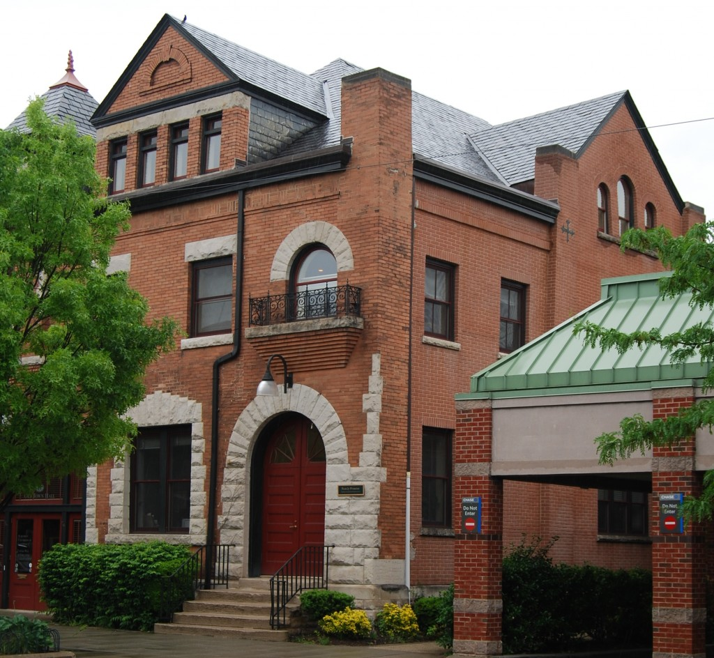

- <a href="https://facebook.com/FamilyPromise" class="icon">Facebook</a>
- <a href="https://twitter.com/fpnational" class="icon">Twitter</a>
- <a href="https://www.instagram.com/family.promise" class="icon">Instagram</a>

<!-- -->

- [Need Help?](../get-help/index.html)
- [Become an Affiliate](../what-we-do/affiliates/become-an-affiliate/index.html)
- [Affiliate Login](https://affiliates.familypromise.org/)
- [Events](../events/index.html)
- [Press](../press/index.html)
- [Contact](index.html)

 

- [Who We Are](../who-we-are/index.html)
  - [Story](../who-we-are/story/index.html)
  - [Purpose](../who-we-are/purpose/index.html)
  - [Team](../who-we-are/team/index.html)
  - [Board](../who-we-are/board/index.html)
  - [Committees & Councils](../who-we-are/committees-councils/index.html)
  - [Partners](../who-we-are/partners/index.html)
- [What We Do](../what-we-do/index.html)
  - [Programs & Services](../what-we-do/programs-services/index.html)
  - [Affiliates](../what-we-do/affiliates/index.html)
  - [FP Union County](../what-we-do/fp-union-county/index.html)
  - [Reports & Financials](../what-we-do/reports-financials/index.html)
- [Latest](../latest/index.html)
- [Get Involved](../get-involved/index.html)
  - [Volunteer](../get-involved/volunteer/index.html)
  - [Become a Partner](../who-we-are/partners/index.html)
  - [Join the Promise Guild](../donate/join-the-promise-guild/index.html)
  - [Create a Fundraiser](https://donate.familypromise.org/my-FP-Fundraiser)
  - [Houses for Change ®](../get-involved/houses-for-change/index.html)
  - [Join Our Team](../get-involved/employment/index.html)
- [Donate](../donate/index.html)

Select Page 

# Contact

## Get in Touch

This is our all-purpose contact form, for anyone interested in reaching out to Family Promise. Are you a family with children experiencing homelessness? We do not provide services here at the National office–our 200+ Affiliates nationwide do that. You can access the website and contact information for the Affiliate nearest your location by clicking the “Need Help?” link at the top of this page. If you would prefer to contact the National office, please fill out the entire form below.

## CONTACT US

- ### Thank you for your submission!

  Your message has been sent to the appropriate department. We will review your submission and respond as soon as we can.

- Subject / Department\*
  ----VolunteeringAffiliatesPartnershipsDonationsMedia InquiriesGeneral / Other

- First Name\*

- Last Name\*

- Email\*

- Phone

- Address
   Street Address  Address Line 2  City  ----AlabamaAlaskaArizonaArkansasCaliforniaColoradoConnecticutDelawareDistrict of ColumbiaFloridaGeorgiaHawaiiIdahoIllinoisIndianaIowaKansasKentuckyLouisianaMaineMarylandMassachusettsMichiganMinnesotaMississippiMissouriMontanaNebraskaNevadaNew HampshireNew JerseyNew MexicoNew YorkNorth CarolinaNorth DakotaOhioOklahomaOregonPennsylvaniaRhode IslandSouth CarolinaSouth DakotaTennesseeTexasUtahVermontVirginiaWashingtonWest VirginiaWisconsinWyomingArmed Forces AmericasArmed Forces EuropeArmed Forces Pacific State  ZIP Code 

- How did you hear about us?
  ----Through a friendI'm a volunteerSocial MediaNews StoryCharity NavigatorWorkplaceOther

- Message\*

-

-

- CAPTCHA

## FAQ

Before contacting us, maybe we’ve already answered your question. Here are a few common questions and answers.

### Is Family Promise a homeless shelter?

Yes…and so much more.

We began thirty years ago as the Interfaith Hospitality Network and our core program was shelter. But over the years, as we have added new Affiliates, and existing Affiliates matured, we have continued developing a broad array of programs to serve low-income families and families experiencing homelessness. In 2003, we changed our name to Family Promise, more reflective of our ever-broadening scope. The name speaks to the promise we make to every family we serve, but also to the promise that is inherent in every family.

Our model comprises prevention & diversion initiatives for families who are at risk of experiencing homelessness; food, shelter, and case management for those who are experiencing homelessness; and stabilization programs to ensure that the independence of the families who have secured housing after leaving the program is sustainable.

Today, we are the leading national organization addressing family homelessness.

### How can I volunteer?

Volunteers play an essential role in helping families experiencing homelessness attain sustainable independence. Each year, 200,000 compassionate volunteers help Family Promise serve more than 100,000 children and adults.

[Click here to get started on the path of volunteering](https://volunteer.familypromise.org/). There you’ll be able to indicate your preferred location(s) and volunteer activities. After that, you will be connected to an Affiliate that matches your interests and provided additional details.

### Do you only serve the homeless population?

In our shelters, by definition, those we serve are experiencing homelessness. However, since our work also focuses on the prevention of homelessness, and the stabilization of people at risk or who have experienced homelessness, many of the people we serve would not be defined as homeless at the time at which we serve them. That is the point—if you treat homelessness as a spectrum and can support families and individuals before and after they experience homelessness, you can effect permanent change.

Or read our full [**FAQ**](family-promise-faqs/index.html).

## Family Promise

71 Summit Ave.,  
Summit, NJ 07901

(908) 273-1100

# Find Your Affiliate

Enter your zip code or address to find the Family Promise Affiliates in your area.

Location

<a href="../what-we-do/affiliates/index.html" class="et_pb_button et_pb_button_0 hover-darken et_pb_bg_layout_dark">Learn More About Our Affiliates</a>

<a href="https://affiliates.familypromise.org/" class="et_pb_button et_pb_button_1 hover-darken et_pb_bg_layout_dark">Log In to the Affiliates Community Site</a>

1.  #### [Family Promise Week](../event/family-promise-week-2021/index.html)

    October 24 - October 31

[View All Events &gt;](../events/index.html)

### Make A DOnation

Your gift to Family Promise helps us prevent and end family homelessness in over 200 communities across the U.S.

- First Name

- Last Name

- Amount

- Phone

  This field is for validation purposes and should be left unchanged.

### JOIN THE LIST

Join our mailing list to keep up with all things Family Promise from family stories to events and more!

- First Name\*

- Last Name\*

- Email Address\*

- Phone

  This field is for validation purposes and should be left unchanged.

- <a href="https://facebook.com/FamilyPromise" class="icon">Facebook</a>
- <a href="https://twitter.com/fpnational" class="icon">Twitter</a>
- <a href="https://www.instagram.com/family.promise" class="icon">Instagram</a>

Our mission is to help families experiencing homelessness and low-income families achieve sustainable independence through a community-based response.

- [Who We Are](../who-we-are/index.html)
- [What We Do](../what-we-do/index.html)
- [Latest](../latest/index.html)
- [Get Involved](../get-involved/index.html)
- [Donate](../donate/index.html)
- [Events](../events/index.html)
- [Store](http://family-promise-store.myshopify.com/)
- [Need Help?](../get-help/index.html)
- [Press](../press/index.html)
- [Infographics](../press/infographics/index.html)
- [Contact](index.html)

© 2004 - 2020 Family Promise.  All Rights Reserved.  501(c)3 Nonprofit.  [EIN: 52-1591461](../financials/index.html)

[Privacy Policies](../privacy-policy/index.html)      [Terms of Use](../terms-of-use/index.html)

- <a href="http://www.facebook.com/sharer.php?u=https%3A%2F%2Ffamilypromise.org%2Fcontact%2F&amp;t=Contact" class="et_social_share"><em></em> </a>
- <a href="http://twitter.com/share?text=Contact&amp;url=https%3A%2F%2Ffamilypromise.org%2Fcontact%2F&amp;via=@fpnational" class="et_social_share"><em></em> </a>
- <a href="http://www.linkedin.com/shareArticle?mini=true&amp;url=https%3A%2F%2Ffamilypromise.org%2Fcontact%2F&amp;title=Contact" class="et_social_share"><em></em> </a>
- <a href="https://mail.google.com/mail/u/0/?view=cm&amp;fs=1&amp;su=Contact&amp;body=https%3A%2F%2Ffamilypromise.org%2Fcontact%2F&amp;ui=2&amp;tf=1" class="et_social_share"><em></em> </a>

Share This

- <a href="http://www.facebook.com/sharer.php?u=https%3A%2F%2Ffamilypromise.org%2Fcontact%2F&amp;t=Contact" class="et_social_share"><em></em></a>
  Facebook

  

- <a href="http://twitter.com/share?text=Contact&amp;url=https%3A%2F%2Ffamilypromise.org%2Fcontact%2F&amp;via=@fpnational" class="et_social_share"><em></em></a>
  Twitter

  

- <a href="http://www.linkedin.com/shareArticle?mini=true&amp;url=https%3A%2F%2Ffamilypromise.org%2Fcontact%2F&amp;title=Contact" class="et_social_share"><em></em></a>
  LinkedIn

  

- <a href="https://mail.google.com/mail/u/0/?view=cm&amp;fs=1&amp;su=Contact&amp;body=https%3A%2F%2Ffamilypromise.org%2Fcontact%2F&amp;ui=2&amp;tf=1" class="et_social_share"><em></em></a>
  Gmail

  
