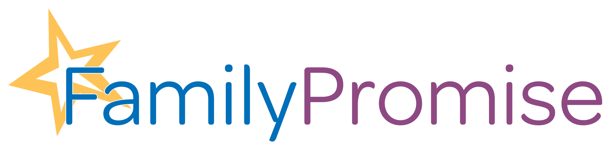
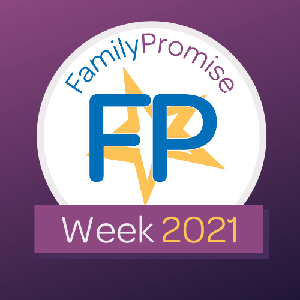

- <a href="https://facebook.com/FamilyPromise" class="icon">Facebook</a>
- <a href="https://twitter.com/fpnational" class="icon">Twitter</a>
- <a href="https://www.instagram.com/family.promise" class="icon">Instagram</a>

<!-- -->

- [Need Help?](../../get-help/index.html)
- [Become an Affiliate](../../what-we-do/affiliates/become-an-affiliate/index.html)
- [Affiliate Login](https://affiliates.familypromise.org/)
- [Events](../../events/index.html)
- [Press](../../press/index.html)
- [Contact](../../contact/index.html)

 

- [Who We Are](../../who-we-are/index.html)
  - [Story](../../who-we-are/story/index.html)
  - [Purpose](../../who-we-are/purpose/index.html)
  - [Team](../../who-we-are/team/index.html)
  - [Board](../../who-we-are/board/index.html)
  - [Committees & Councils](../../who-we-are/committees-councils/index.html)
  - [Partners](../../who-we-are/partners/index.html)
- [What We Do](../../what-we-do/index.html)
  - [Programs & Services](../../what-we-do/programs-services/index.html)
  - [Affiliates](../../what-we-do/affiliates/index.html)
  - [FP Union County](../../what-we-do/fp-union-county/index.html)
  - [Reports & Financials](../../what-we-do/reports-financials/index.html)
- [Latest](../../latest/index.html)
- [Get Involved](../../get-involved/index.html)
  - [Volunteer](../../get-involved/volunteer/index.html)
  - [Become a Partner](../../who-we-are/partners/index.html)
  - [Join the Promise Guild](../../donate/join-the-promise-guild/index.html)
  - [Create a Fundraiser](https://donate.familypromise.org/my-FP-Fundraiser)
  - [Houses for Change ®](../../get-involved/houses-for-change/index.html)
  - [Join Our Team](../../get-involved/employment/index.html)
- [Donate](../../donate/index.html)

Select Page 

[« All Events](../../events/index.html)

# Family Promise Week

## October 24 - October 31

- [« Night Without a Bed](../night-without-a-bed/index.html)
-

### Join us virtually from Oct 24 – 31, 2021!

Family Promise Week is a week-long national campaign led by Family Promise national and including our Affiliates nationwide. Affiliates run events and awareness campaigns across the country that engage their local communities. More information on this year’s programming will be available soon.

<a href="https://www.google.com/calendar/event?action=TEMPLATE&amp;text=Family+Promise+Week&amp;dates=20211024/20211101&amp;details=Join+us+virtually+from+Oct+24+%26%238211%3B+31%2C+2021%21%0AFamily+Promise+Week+is+a+week-long+national+campaign+led+by+Family+Promise+national+and+including+our+Affiliates+nationwide.+Affiliates+run+events+and+awareness+campaigns+across+the+country+that+engage+their+local+communities.+More+information+on+this+year%26%238217%3Bs+programming+will+be+available+soon.+%0A&amp;location&amp;trp=false&amp;sprop=website:https://familypromise.org&amp;ctz=America%2FNew_York" class="tribe-events-gcal tribe-events-button" title="Add to Google Calendar">+ Google Calendar</a><a href="indexedf3.html?ical=1" class="tribe-events-ical tribe-events-button" title="Download .ics file">+ iCal Export</a>

## Details

Start:  
October 24

End:  
October 31

- [« Night Without a Bed](../night-without-a-bed/index.html)
-

### Make A DOnation

Your gift to Family Promise helps us prevent and end family homelessness in over 200 communities across the U.S.

- First Name

- Last Name

- Amount

- Phone

  This field is for validation purposes and should be left unchanged.

### JOIN THE LIST

Join our mailing list to keep up with all things Family Promise from family stories to events and more!

- First Name\*

- Last Name\*

- Email Address\*

- Phone

  This field is for validation purposes and should be left unchanged.

- <a href="https://facebook.com/FamilyPromise" class="icon">Facebook</a>
- <a href="https://twitter.com/fpnational" class="icon">Twitter</a>
- <a href="https://www.instagram.com/family.promise" class="icon">Instagram</a>

Our mission is to help families experiencing homelessness and low-income families achieve sustainable independence through a community-based response.

- [Who We Are](../../who-we-are/index.html)
- [What We Do](../../what-we-do/index.html)
- [Latest](../../latest/index.html)
- [Get Involved](../../get-involved/index.html)
- [Donate](../../donate/index.html)
- [Events](../../events/index.html)
- [Store](http://family-promise-store.myshopify.com/)
- [Need Help?](../../get-help/index.html)
- [Press](../../press/index.html)
- [Infographics](../../press/infographics/index.html)
- [Contact](../../contact/index.html)

© 2004 - 2020 Family Promise.  All Rights Reserved.  501(c)3 Nonprofit.  [EIN: 52-1591461](../../financials/index.html)

[Privacy Policies](../../privacy-policy/index.html)      [Terms of Use](../../terms-of-use/index.html)
