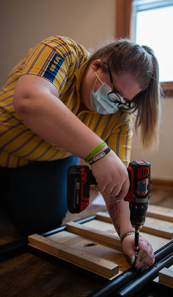
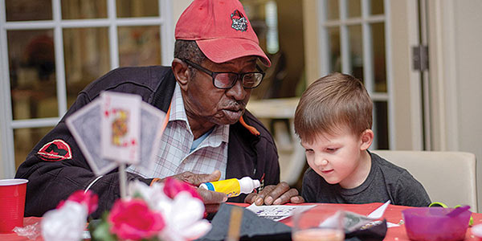
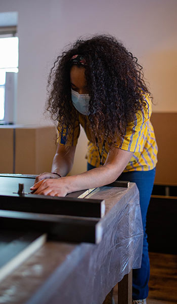

- <a href="https://facebook.com/FamilyPromise" class="icon">Facebook</a>
- <a href="https://twitter.com/fpnational" class="icon">Twitter</a>
- <a href="https://www.instagram.com/family.promise" class="icon">Instagram</a>

<!-- -->

- [Need Help?](../../get-help/index.html)
- [Become an Affiliate](../../what-we-do/affiliates/become-an-affiliate/index.html)
- [Affiliate Login](https://affiliates.familypromise.org/)
- [Events](../../events/index.html)
- [Press](../../press/index.html)
- [Contact](../../contact/index.html)

 

- [Who We Are](../../who-we-are/index.html)
  - [Story](../../who-we-are/story/index.html)
  - [Purpose](../../who-we-are/purpose/index.html)
  - [Team](../../who-we-are/team/index.html)
  - [Board](../../who-we-are/board/index.html)
  - [Committees & Councils](../../who-we-are/committees-councils/index.html)
  - [Partners](../../who-we-are/partners/index.html)
- [What We Do](../../what-we-do/index.html)
  - [Programs & Services](../../what-we-do/programs-services/index.html)
  - [Affiliates](../../what-we-do/affiliates/index.html)
  - [FP Union County](../../what-we-do/fp-union-county/index.html)
  - [Reports & Financials](../../what-we-do/reports-financials/index.html)
- [Latest](../../latest/index.html)
- [Get Involved](../index.html)
  - [Volunteer](index.html)
  - [Become a Partner](../../who-we-are/partners/index.html)
  - [Join the Promise Guild](../../donate/join-the-promise-guild/index.html)
  - [Create a Fundraiser](https://donate.familypromise.org/my-FP-Fundraiser)
  - [Houses for Change ®](../houses-for-change/index.html)
  - [Join Our Team](../employment/index.html)
- [Donate](../../donate/index.html)

Select Page 

# Volunteer

<a href="../index.html" class="post post-page" title="Go to Get Involved.">Get Involved</a>

## GET INVOLVED

At Family Promise, volunteers are the backbone of all of our programs. For three decades, volunteers have made meals, provided companionship, read stories, and offered compassion and support. Family Promise offers many exciting opportunities to use your skills for impact through virtual, in-person, and corporate volunteering. For more information on getting involved, [visit our volunteer portal](https://volunteer.familypromise.org/).

<a href="https://volunteer.familypromise.org/" class="et_pb_button et_pb_custom_button_icon et_pb_button_0 hover-lighten et_pb_bg_layout_light">Sign up through our Volunteer Portal</a>

<a href="volunteer-with-fpuc/index.html" class="et_pb_button et_pb_custom_button_icon et_pb_button_1 hover-lighten et_pb_bg_layout_light">Explore Volunteer Opportunities in Union County, NJ</a>

### Volunteer FAQs

### How much time do I need to commit?

That depends on how much time you can give and the type of volunteer opportunity that interests you. Evening hosting is just a few hours and is perfect for volunteers with busy schedules. For those with a bit more time, our ‘done in a day’ projects, like gardening at a Day Center and helping at a special event, work well. Whereas volunteering to teach financial literacy and technology skills is best for volunteers who are capable of a longer time commitment.

### Can I volunteer once or do I have to make an ongoing commitment?

Family Promise volunteers can have a lasting impact on a family’s life without making a huge time commitment. One-time volunteer opportunities – such as helping at a special event or participating in a supply drive – exist and work well for those with full schedules. There are also plenty of opportunities for volunteers who are available to make a more long-term, regular commitment.

### Will I receive volunteer training?

Family Promise wants every volunteer to feel comfortable, so we do offer training. Volunteers directly working with our families are required to go through an orientation. Additional training, tailored to the specific volunteer project, will also be provided.

### Can I volunteer with my family?

We offer opportunities for entire families to volunteer. For example, families often enjoy volunteering in the evenings when they can share a meal with the guest families and children can enjoy some play time together.

### Are there opportunities to volunteer with my co-workers?

There are opportunities for you to volunteer with a group of colleagues or even with just a single co-worker. When you are matched with an Affiliate, the volunteer coordinator will help you identify a project that works best for your team.  For more information on national-level corporate volunteer programs, contact [Amber Young](../../contact/index6f66.html?subject=volunteering).

### What are the hours during which volunteers can help?

Family Promise offers volunteer opportunities during the day, in the evening, and on weekends. Scheduling depends on the type of volunteer activity. For example, volunteers providing homework help will do so in the evenings or on the weekends. And volunteers assisting at our office may do so during regular business hours.

### Do you offer virtual volunteer opportunities?

Yes, virtual volunteers are welcome. Virtual volunteers can help with resume and interview assistance, public relations, fundraising, and even some administrative tasks.

### Are the projects listed here the only volunteer opportunities?

This website provides an overview of the ways in which you can volunteer your time to help children and families. Once you are connected with one of our Affiliates, you will be able to explore other opportunities to contribute your time and talents.

### Make A DOnation

Your gift to Family Promise helps us prevent and end family homelessness in over 200 communities across the U.S.

- First Name

- Last Name

- Amount

- Comments

  This field is for validation purposes and should be left unchanged.

### JOIN THE LIST

Join our mailing list to keep up with all things Family Promise from family stories to events and more!

- First Name\*

- Last Name\*

- Email Address\*

- Comments

  This field is for validation purposes and should be left unchanged.

- <a href="https://facebook.com/FamilyPromise" class="icon">Facebook</a>
- <a href="https://twitter.com/fpnational" class="icon">Twitter</a>
- <a href="https://www.instagram.com/family.promise" class="icon">Instagram</a>

Our mission is to help families experiencing homelessness and low-income families achieve sustainable independence through a community-based response.

- [Who We Are](../../who-we-are/index.html)
- [What We Do](../../what-we-do/index.html)
- [Latest](../../latest/index.html)
- [Get Involved](../index.html)
- [Donate](../../donate/index.html)
- [Events](../../events/index.html)
- [Store](http://family-promise-store.myshopify.com/)
- [Need Help?](../../get-help/index.html)
- [Press](../../press/index.html)
- [Infographics](../../press/infographics/index.html)
- [Contact](../../contact/index.html)

© 2004 - 2020 Family Promise.  All Rights Reserved.  501(c)3 Nonprofit.  [EIN: 52-1591461](../../financials/index.html)

[Privacy Policies](../../privacy-policy/index.html)      [Terms of Use](../../terms-of-use/index.html)

- <a href="http://www.facebook.com/sharer.php?u=https%3A%2F%2Ffamilypromise.org%2Fget-involved%2Fvolunteer%2F&amp;t=Volunteer" class="et_social_share"><em></em> </a>
- <a href="http://twitter.com/share?text=Volunteer&amp;url=https%3A%2F%2Ffamilypromise.org%2Fget-involved%2Fvolunteer%2F&amp;via=@fpnational" class="et_social_share"><em></em> </a>
- <a href="http://www.linkedin.com/shareArticle?mini=true&amp;url=https%3A%2F%2Ffamilypromise.org%2Fget-involved%2Fvolunteer%2F&amp;title=Volunteer" class="et_social_share"><em></em> </a>
- <a href="https://mail.google.com/mail/u/0/?view=cm&amp;fs=1&amp;su=Volunteer&amp;body=https%3A%2F%2Ffamilypromise.org%2Fget-involved%2Fvolunteer%2F&amp;ui=2&amp;tf=1" class="et_social_share"><em></em> </a>

Share This

- <a href="http://www.facebook.com/sharer.php?u=https%3A%2F%2Ffamilypromise.org%2Fget-involved%2Fvolunteer%2F&amp;t=Volunteer" class="et_social_share"><em></em></a>
  Facebook

  

- <a href="http://twitter.com/share?text=Volunteer&amp;url=https%3A%2F%2Ffamilypromise.org%2Fget-involved%2Fvolunteer%2F&amp;via=@fpnational" class="et_social_share"><em></em></a>
  Twitter

  

- <a href="http://www.linkedin.com/shareArticle?mini=true&amp;url=https%3A%2F%2Ffamilypromise.org%2Fget-involved%2Fvolunteer%2F&amp;title=Volunteer" class="et_social_share"><em></em></a>
  LinkedIn

  

- <a href="https://mail.google.com/mail/u/0/?view=cm&amp;fs=1&amp;su=Volunteer&amp;body=https%3A%2F%2Ffamilypromise.org%2Fget-involved%2Fvolunteer%2F&amp;ui=2&amp;tf=1" class="et_social_share"><em></em></a>
  Gmail

  
