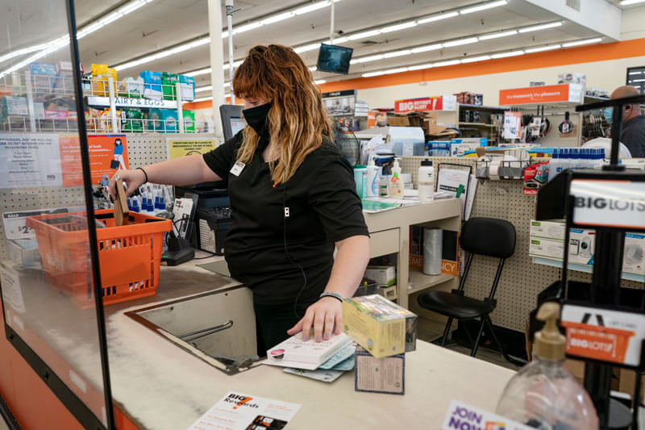
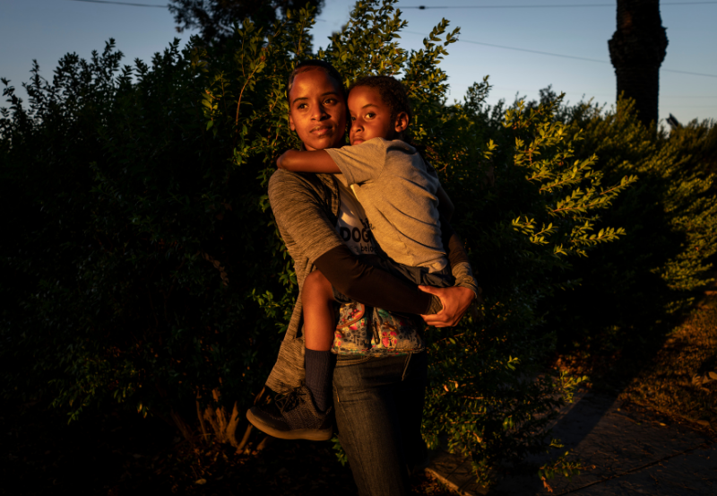

-   <a href="https://facebook.com/FamilyPromise" class="icon">Facebook</a>
-   <a href="https://twitter.com/fpnational" class="icon">Twitter</a>
-   <a href="https://www.instagram.com/family.promise" class="icon">Instagram</a>

<!-- -->

-   [Need Help?](../get-help/index.html)
-   [Become an Affiliate](../what-we-do/affiliates/become-an-affiliate/index.html)
-   [Affiliate Login](https://affiliates.familypromise.org/)
-   [Events](../events/index.html)
-   [Press](index.html)
-   [Contact](../contact/index.html)

 

-   [Who We Are](../who-we-are/index.html)
    -   [Story](../who-we-are/story/index.html)
    -   [Purpose](../who-we-are/purpose/index.html)
    -   [Team](../who-we-are/team/index.html)
    -   [Board](../who-we-are/board/index.html)
    -   [Committees & Councils](../who-we-are/committees-councils/index.html)
    -   [Partners](../who-we-are/partners/index.html)
-   [What We Do](../what-we-do/index.html)
    -   [Programs & Services](../what-we-do/programs-services/index.html)
    -   [Affiliates](../what-we-do/affiliates/index.html)
    -   [FP Union County](../what-we-do/fp-union-county/index.html)
    -   [Reports & Financials](../what-we-do/reports-financials/index.html)
-   [Latest](../latest/index.html)
-   [Get Involved](../get-involved/index.html)
    -   [Volunteer](../get-involved/volunteer/index.html)
    -   [Become a Partner](../who-we-are/partners/index.html)
    -   [Join the Promise Guild](../donate/join-the-promise-guild/index.html)
    -   [Create a Fundraiser](https://donate.familypromise.org/my-FP-Fundraiser)
    -   [Houses for Change ®](../get-involved/houses-for-change/index.html)
    -   [Join Our Team](../get-involved/employment/index.html)
-   [Donate](../donate/index.html)

Select Page 

Press
=====

At Family Promise, we spend every day talking with families who have experienced or are at risk of homelessness. We believe that sharing their stories is essential to spreading awareness about family homelessness in the United States. Want to learn more? Check out our recent media coverage below.

Need to speak with an expert on family homelessness? We can connect you with staff at our national office or one of our 200+ Affiliates across the United States.

**Please contact:**

Katie Coughlin, Marketing & Media Manager

908-273-1100, ext. 115

[Send Katie a Message here](../contact/index.html)

 

**Want to learn more about family homelessness in America?**

You can view our [Press Kit](https://old.familypromise.org/wp-content/uploads/2020/09/Family-Promise-Press-Kit-September-2020-1.pdf).

### Recent News Coverage

[**‘This community is not prepared’: Eviction moratorium extension delays inevitable pain for tenants, landlords**](https://www.savannahnow.com/story/news/2021/08/05/eviction-moratorium-extended-biden-white-house-saving-hundreds-savannah-ga-households/8030555002/) – Savannah Now  
*August 5, 2021*

[**Conroe family finds fresh hope in new Habitat house**](https://www.chron.com/neighborhood/moco/news/article/Conroe-family-finds-fresh-hope-in-hew-Habitat-16354925.php) – The Houston Chronicle  
*July 31, 2021*

[**Family Promise CEO on eviction moratorium expiring: We’re expecting a ‘real uptick’ in homelessness**](https://news.yahoo.com/family-promise-ceo-eviction-moratorium-161200572.html) – Yahoo! News  
*July 30, 2021*

**[Family Promise of Spokane opens new shelter to help families with infants](https://www.kxly.com/family-promise-of-spokane-opens-new-shelter-to-help-families-with-infants/)** – KXLY  
*July 21. 2021*

[**‘This is the first time I’ve had my own home’: Family goes from homeless to housed**](https://www.kxly.com/this-is-the-first-time-ive-had-my-own-home-family-goes-from-homeless-to-housed/) – KXLY  
*July 6, 2021*

[**Night Without a Bed aims to spotlight homelessness**](houstonchronicle.com/neighborhood/moco/news/article/Night-Without-a-Bed-aims-to-spotlight-16268971.html) – The Houston Chronicle  
*June 23, 2021*

[**A couch is not a home: Where the hidden homeless get housing vouchers**](https://www.csmonitor.com/USA/Society/2021/0604/A-couch-is-not-a-home-Where-the-hidden-homeless-get-housing-vouchers) – Christian Science Monitor  
*June 4, 2021*

[**NIGHT WITHOUT A BED: Family Promise hosts event to raise awareness**](https://www.thedailytimes.com/community/night-without-a-bed-family-promise-hosts-event-to-raise-awareness/article_d4a521d9-cc92-511b-9459-b8449452769b.html) – The Daily Times  
*June 3, 2021*

[**Unemployed in America: ‘It’s Gotten So Much More Expensive to Be Homeless’**](https://www.esquire.com/news-politics/a36521663/unemployed-in-america-latrish-oseko-and-daughter/) – Esquire  
*May 25, 2021*

[**One nurse’s journey from homelessness to inspiring career**](https://www.today.com/video/one-nurse-s-journey-from-homelessness-to-inspiring-career-111498309762) – TODAY  
*May 7, 2021*

### Recent Press Releases

**[National Organization, Experts Sounds the Alarm About July 31 End of Eviction Moratorium](../latest/eviction-moratorium-end/index.html)**  
*July 26, 2021*

**[Help Us Move In (HUMI) Awards Challenge Grants to 13 Family Promise Affiliates](../latest/help-us-move-in-2/index.html)  
***July 7, 2021***  
**

**[Family Promise Publishes 2020 Annual Impact Report](../latest/2020-annual-impact-report/index.html)  
***July 6, 2021*

**[Family Promise Endorses the Family Stability and Opportunity Vouchers Act 2021](../latest/family-stability-and-opportunity-vouchers/index.html)  
***June 21, 2021*

**[Participate in Night Without a Bed!](../latest/night-without-a-bed-pillow-fight/index.html)  
***June 8, 2021*

**[Join Us for Night Without a Bed on June 26th!](../latest/night-without-a-bed-4/index.html)  
***June 3, 2021*

**[Family Promise Innovation Summit Inspires Attendees With Speeches from Sen. Cory Booker, Amanda Andere, and More](../latest/innovation-summit-2/index.html)  
***May 14, 2021*

**[Family Promise – Belk Partnership Empowers Women-Led Households](../latest/belk-partnership-empowers-women/index.html)  
***May 10, 2021*

**[Family Promise Receives Two Hermes Awards for Creative Efforts](../latest/hermes-awards/index.html)  
***May 7, 2021*

**[IKEA Donates $25K Worth of Furniture to Family Promise](../latest/ikea-2/index.html)  
***May 3, 2021***  
**

**[Family Promise Receives $250,000 from New Jersey Pandemic Relief Fund to Further Homelessness Prevention Efforts Across New Jersey](../latest/new-jersey-pandemic-relief/index.html)  
***April 28, 2021*

**[Family Promise Statement on the Derek Chauvin Trial Verdict](../latest/statement/index.html)  
***April 20, 2021*

**[Family Promise Giving Day Will Raise Awareness and Funds to Keep Low-Income Families Housed](../latest/family-promise-giving-day-2/index.html)  
***April 15, 2021*

**[Family Promise One of Only 71 Nonprofits in the United States to Earn a Perfect Score from Charity Navigator](../latest/charity-navigator-3/index.html)  
***April 12, 2021*

**[A Statement from Family Promise’s Racial Justice Council on Violence Experienced by the Asian Community](../latest/racial-justice-council-statement/index.html)***  
April 5, 2021*

**[Clayton and Family Promise Announce Continued Partnership to Prevent and End Family Homelessness Across the U.S.](../latest/clayton-2021/index.html)  
***March 26, 2021*

**[Family Promise Announces Amanda Andere as Innovation Summit Keynote Speaker](../latest/amanda-andere/index.html)*****  
**March 20, 2021*

[**Experts Optimistic About American Rescue Plan, But Warn that Many Low-Income Families Across America are Still at Risk of Homelessness**](../the-latest/press-releases/american-rescue-plan/index.html)*  
March 19, 2021*

[**IKEA U.S. Launches ‘A Place Called Home’ to Further COVID-19 Relief Efforts in Partnership with Family Promise**](../latest/ikea/index.html)  
*March 11, 2021*

[**Announcing Family Promise Giving Day: April 21, 2021**](../the-latest/press-releases/family-promise-giving-day/index.html)  
*February 26, 2021*

[**Family Promise Selected By Stand Together Foundation as One of the Most Transformative Nonprofits in the Country**](../the-latest/press-releases/stand-together-foundation/index.html)  
*February 3, 2021*

[**Kiddie Academy Donates $25,000 to Family Promise**](../the-latest/press-releases/kiddie-academy/index.html)*  
January 26, 2021*

[**Family Promise Announces and Celebrates 2021 Board of Trustees**](../the-latest/press-releases/board-2021/index.html)*  
January 14, 2021*

[**Announcing the Future Begins at Home: Prevention Innovation Grant**](../the-latest/press-releases/prevention-grants/index.html)  
*December 22, 2020*

[**Family Promise Receives $10,000 Grant from NBPA Foundation**](../the-latest/press-releases/nbpa-foundation/index.html)  
*December 2, 2020*

[**Belk October Charity Day Sale Raises $226,000 for Family Promise**](../the-latest/press-releases/belk-charity-day-sale/index.html)*  
November 5, 2020*

[**Family Promise Receives Grant from Worldwide ERC Foundation for Workf0orce Mobility**](../the-latest/press-releases/charitable-gift/index.html)  
*October 22, 2020*

[**Paul Feig, Director of ‘Bridesmaids’ and Founder of Artingstall’s Gin, Highlights Family Promise During Watch Party**](../the-latest/press-releases/bridesmaids/index.html)  
*October 6, 2020*

[**National Family Promise Network Comes Together at Virtual Innovation Summit**](../the-latest/press-releases/innovation-summit/index.html)  
*October 2, 2020*

[**Family Promise and PetSmart Charities Renew Pets with a Promise Program**](../the-latest/press-releases/pets-with-a-promise/index.html)  
*September 22, 2020*

[**Clayton Donates New Home to Family Promise of the Midlands to Serve Families Experiencing Homelessness**](../the-latest/press-releases/family-promise-of-the-midlands/index.html)  
*September 16, 2020*

### Recent Press Conferences

Watch our March 2021 [Press Conference on Pandemic Housing Policies](../the-latest/press-releases/american-rescue-plan/index.html).

Watch our October 2020 [Press Conference on the State of Family Homelessness in America](../the-latest/virtual-conference/index.html).

### Make A DOnation

Your gift to Family Promise helps us prevent and end family homelessness in over 200 communities across the U.S.

-   First Name

-   Last Name

-   Amount

-   Comments

    This field is for validation purposes and should be left unchanged.

### JOIN THE LIST

Join our mailing list to keep up with all things Family Promise from family stories to events and more!

-   First Name\*

-   Last Name\*

-   Email Address\*

-   Comments

    This field is for validation purposes and should be left unchanged.

-   <a href="https://facebook.com/FamilyPromise" class="icon">Facebook</a>
-   <a href="https://twitter.com/fpnational" class="icon">Twitter</a>
-   <a href="https://www.instagram.com/family.promise" class="icon">Instagram</a>

Our mission is to help families experiencing homelessness and low-income families achieve sustainable independence through a community-based response.

-   [Who We Are](../who-we-are/index.html)
-   [What We Do](../what-we-do/index.html)
-   [Latest](../latest/index.html)
-   [Get Involved](../get-involved/index.html)
-   [Donate](../donate/index.html)
-   [Events](../events/index.html)
-   [Store](http://family-promise-store.myshopify.com/)
-   [Need Help?](../get-help/index.html)
-   [Press](index.html)
-   [Infographics](infographics/index.html)
-   [Contact](../contact/index.html)

© 2004 - 2020 Family Promise.  All Rights Reserved.  501(c)3 Nonprofit.  [EIN: 52-1591461](../financials/index.html)

[Privacy Policies](../privacy-policy/index.html)      [Terms of Use](../terms-of-use/index.html)

-   <a href="http://www.facebook.com/sharer.php?u=https%3A%2F%2Ffamilypromise.org%2Fpress%2F&amp;t=Press" class="et_social_share"><em></em> </a>
-   <a href="http://twitter.com/share?text=Press&amp;url=https%3A%2F%2Ffamilypromise.org%2Fpress%2F&amp;via=@fpnational" class="et_social_share"><em></em> </a>
-   <a href="http://www.linkedin.com/shareArticle?mini=true&amp;url=https%3A%2F%2Ffamilypromise.org%2Fpress%2F&amp;title=Press" class="et_social_share"><em></em> </a>
-   <a href="https://mail.google.com/mail/u/0/?view=cm&amp;fs=1&amp;su=Press&amp;body=https%3A%2F%2Ffamilypromise.org%2Fpress%2F&amp;ui=2&amp;tf=1" class="et_social_share"><em></em> </a>

Share This

-   <a href="http://www.facebook.com/sharer.php?u=https%3A%2F%2Ffamilypromise.org%2Fpress%2F&amp;t=Press" class="et_social_share"><em></em></a>
    Facebook

    
-   <a href="http://twitter.com/share?text=Press&amp;url=https%3A%2F%2Ffamilypromise.org%2Fpress%2F&amp;via=@fpnational" class="et_social_share"><em></em></a>
    Twitter

    
-   <a href="http://www.linkedin.com/shareArticle?mini=true&amp;url=https%3A%2F%2Ffamilypromise.org%2Fpress%2F&amp;title=Press" class="et_social_share"><em></em></a>
    LinkedIn

    
-   <a href="https://mail.google.com/mail/u/0/?view=cm&amp;fs=1&amp;su=Press&amp;body=https%3A%2F%2Ffamilypromise.org%2Fpress%2F&amp;ui=2&amp;tf=1" class="et_social_share"><em></em></a>
    Gmail

    
