-   <a href="https://facebook.com/FamilyPromise" class="icon">Facebook</a>
-   <a href="https://twitter.com/fpnational" class="icon">Twitter</a>
-   <a href="https://www.instagram.com/family.promise" class="icon">Instagram</a>

<!-- -->

-   [Need Help?](../../get-help/index.html)
-   [Become an Affiliate](../../what-we-do/affiliates/become-an-affiliate/index.html)
-   [Affiliate Login](https://affiliates.familypromise.org/)
-   [Events](../../events/index.html)
-   [Press](../index.html)
-   [Contact](../../contact/index.html)

 

-   [Who We Are](../../who-we-are/index.html)
    -   [Story](../../who-we-are/story/index.html)
    -   [Purpose](../../who-we-are/purpose/index.html)
    -   [Team](../../who-we-are/team/index.html)
    -   [Board](../../who-we-are/board/index.html)
    -   [Committees & Councils](../../who-we-are/committees-councils/index.html)
    -   [Partners](../../who-we-are/partners/index.html)
-   [What We Do](../../what-we-do/index.html)
    -   [Programs & Services](../../what-we-do/programs-services/index.html)
    -   [Affiliates](../../what-we-do/affiliates/index.html)
    -   [FP Union County](../../what-we-do/fp-union-county/index.html)
    -   [Reports & Financials](../../what-we-do/reports-financials/index.html)
-   [Latest](../../latest/index.html)
-   [Get Involved](../../get-involved/index.html)
    -   [Volunteer](../../get-involved/volunteer/index.html)
    -   [Become a Partner](../../who-we-are/partners/index.html)
    -   [Join the Promise Guild](../../donate/join-the-promise-guild/index.html)
    -   [Create a Fundraiser](https://donate.familypromise.org/my-FP-Fundraiser)
    -   [Houses for Change ®](../../get-involved/houses-for-change/index.html)
    -   [Join Our Team](../../get-involved/employment/index.html)
-   [Donate](../../donate/index.html)

Select Page 

Infographics
============

<a href="../index.html" class="post post-page" title="Go to Press.">Press</a>

Feel free to use our collection of informative infographics.  Click any thumbnail to view the full version, and “right click” and “save image as” to download the image to your computer.

[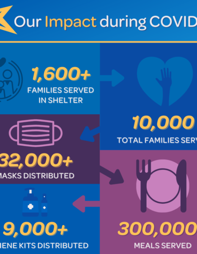 ](../../wp-content/uploads/2021/08/FP-COVID-IMPACT.png "Our Impact During COVID-19")

### Our Impact During COVID-19

Learn more about what we’ve achieved during the COVID-19 Pandemic.

[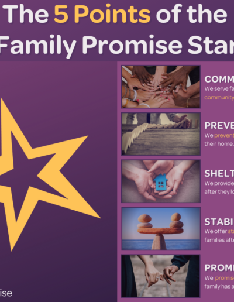 ](../../wp-content/uploads/2021/08/The-5-points-of-FP-star.png "The 5 Points of the Family Promise Star")

### The 5 Points of the Family Promise Star

Learn about the meaning of the Family Promise Star.

[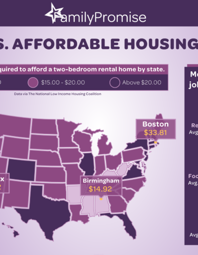 ](../../wp-content/uploads/2021/08/Affordable-Housing-A1-scaled-1.png "The U.S. Affordable Housing Crisis")

### The U.S. Affordable Housing Crisis

The cost of housing is rising faster than wages in the U.S.

[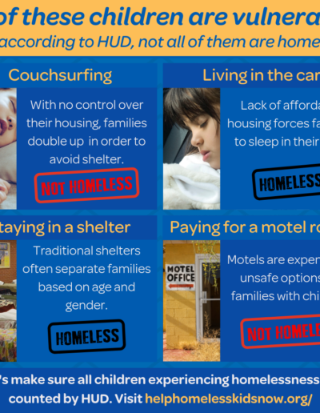 ](../../wp-content/uploads/2021/08/HCYA-infographic-1.png "HUD Definition of Homelessness")

### HUD Definition of Homelessness

HUD’s current definition of homelessness is missing some of the most vulnerable children.

[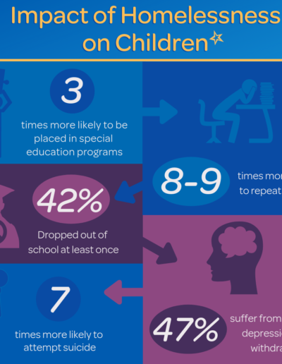 ](../../wp-content/uploads/2021/08/COST-OF-YOUTH-HOMELESSNESS.png "Impact of Homelessness on Children")

### Impact of Homelessness on Children

Homelessness has significant impacts on children.

[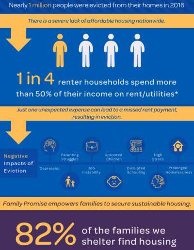 ](../../wp-content/uploads/2021/08/FINAL-AMERICAS-EVICTION-CRISIS.png "America's Eviction Crisis")

### America’s Eviction Crisis

Nearly 1 million people were evicted from their homes in 2016.

[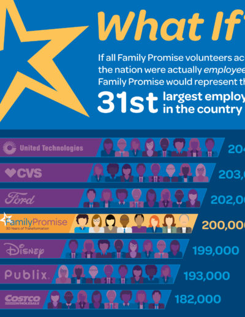 ](../../wp-content/uploads/2021/08/What-If-Infographic_2019.jpg "What If?")

### What If?

Family Promise engages 200,000 volunteers nationwide.

[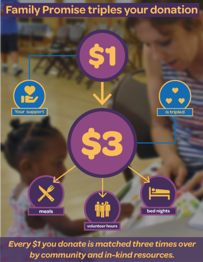 ](../../wp-content/uploads/2021/08/3-1-infographic-NEW-DESIGN-png.png "We Triple Your Donation")

### We Triple Your Donation

Any money donated to Family Promise returns $3 in goods and services.

[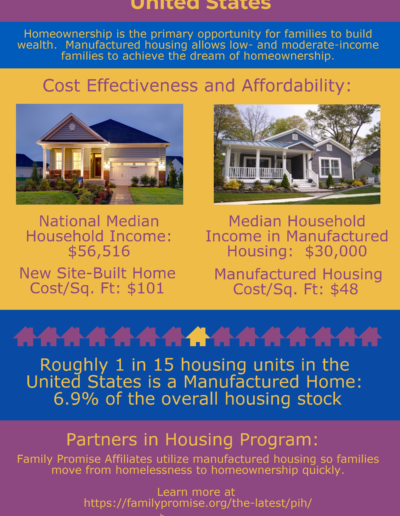 ](../../wp-content/uploads/2021/08/pih-8.png "Affordable Housing")

### Affordable Housing

Lack of affordable housing is, by far, the primary cause of families becoming homeless. Manufactured housing is an affordable option for low-and moderate-income families. Family Promise’s Partners in Housing program creates a path for families from homelessness to homeownership.

[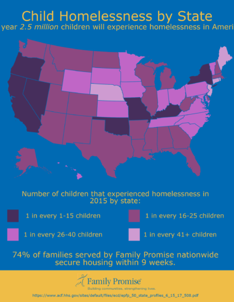 ](../../wp-content/uploads/2021/08/Child-Homelessness-Map.png "Child Homelessness by State")

### Child Homelessness by State

Nearly half of children served by emergency/transitional housing providers in 2015 were age 5 or younger, critical developmental years for building the foundation for future learning, behavior, and health. This map shows the critical need for resources and services nationwide.

[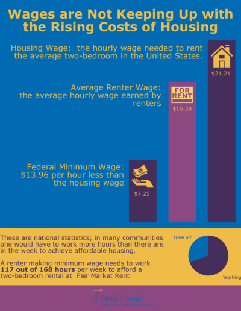 ](../../wp-content/uploads/2021/08/Housing-Wage.png "Rising Housing Costs")

### Rising Housing Costs

Permanent, affordable housing is essential for ending homelessness. It is also the platform from which critical services can be accessed. But the average renter’s wage is not keeping up with the national housing wage. Low income families are paying the price in this unrelenting equation–35% of the homeless population in the U.S. is comprised of families with children.

[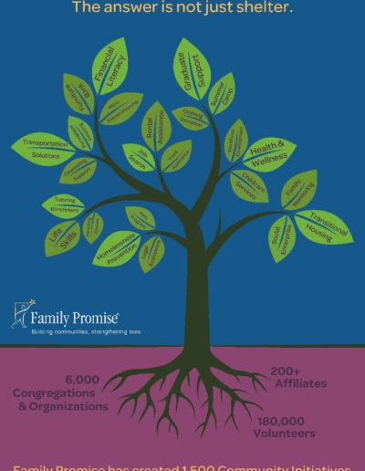 ](../../wp-content/uploads/2021/08/FP_tree_graphic_v5_print-853x1280-1.jpg "Family Promise Tree")

### Family Promise Tree

Family Promise addresses family homelessness comprehensively–through prevention, shelter, and stabilization.

[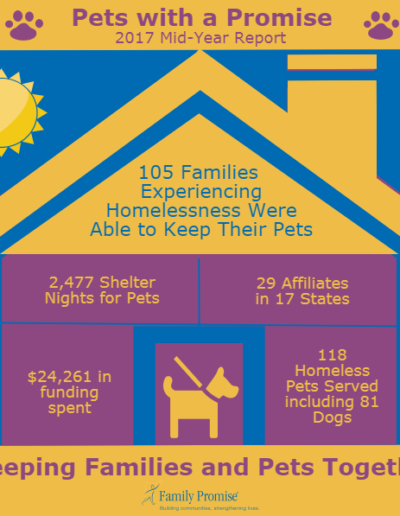 ](../../wp-content/uploads/2021/08/Pets-with-a-Promise.png "Pets-with-a-Promise")

### Pets-with-a-Promise

[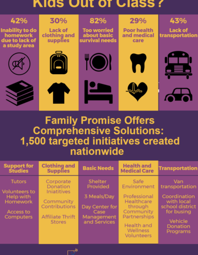 ](../../wp-content/uploads/2021/08/Classroom-Challenges.png "Classroom Challenges")

### Classroom Challenges

Children experiencing homelessness face extraordinary challenges every day.

[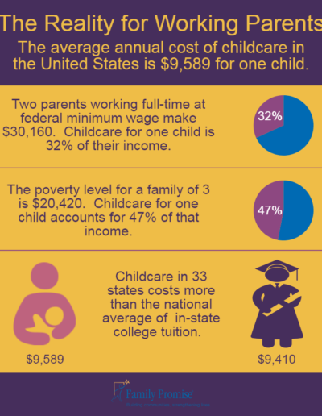 ](../../wp-content/uploads/2021/08/Childcare-Cost.png "Cost of Childcare")

### Cost of Childcare

In most of America, childcare costs more than in-state college tuition.

[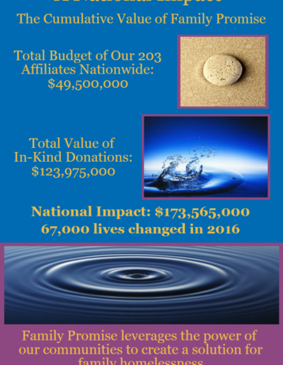 ](../../wp-content/uploads/2021/08/FP-Cumulative-Value.png "Cumulative Value")

### Cumulative Value

Family Promise engages communities nationwide. The cumulative impact is amazing.

[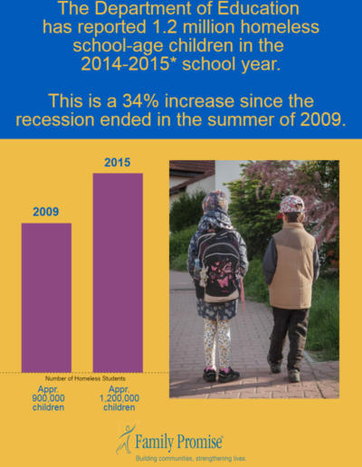 ](../../wp-content/uploads/2021/08/Homeless-Children.png "Homeless Children")

### Homeless Children

The number of school-age homeless children in America continues to rise.

[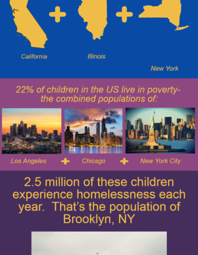 ](../../wp-content/uploads/2021/08/Homeless-Children-Pops.png "How Many Children are Homeless?")

### How Many Children are Homeless?

Millions of children’s lives in this country are defined by poverty and homelessness.

[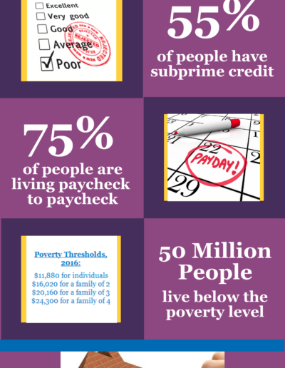 ](../../wp-content/uploads/2021/08/new-5c-20piktoc_18427723.png "Risk of Homelessness")

### Risk of Homelessness

With no safety net, homelessness can be one misfortune away.

[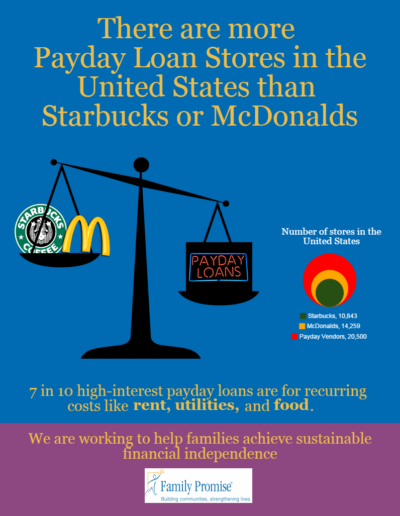 ](../../wp-content/uploads/2021/08/Payday-Loans.png "Payday Loans")

### Payday Loans

Inadequate incomes have made payday loans a booming business.

[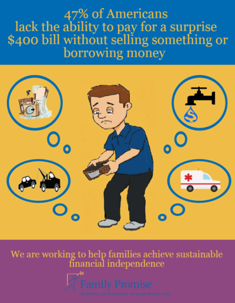 ](../../wp-content/uploads/2021/08/Surprise-Bill.png "Surprise Bill")

### Surprise Bill

Nearly half of America simply can’t afford an unexpected expense.

### Make A DOnation

Your gift to Family Promise helps us prevent and end family homelessness in over 200 communities across the U.S.

-   First Name

-   Last Name

-   Amount

-   Phone

    This field is for validation purposes and should be left unchanged.

### JOIN THE LIST

Join our mailing list to keep up with all things Family Promise from family stories to events and more!

-   First Name\*

-   Last Name\*

-   Email Address\*

-   Email

    This field is for validation purposes and should be left unchanged.

-   <a href="https://facebook.com/FamilyPromise" class="icon">Facebook</a>
-   <a href="https://twitter.com/fpnational" class="icon">Twitter</a>
-   <a href="https://www.instagram.com/family.promise" class="icon">Instagram</a>

Our mission is to help families experiencing homelessness and low-income families achieve sustainable independence through a community-based response.

-   [Who We Are](../../who-we-are/index.html)
-   [What We Do](../../what-we-do/index.html)
-   [Latest](../../latest/index.html)
-   [Get Involved](../../get-involved/index.html)
-   [Donate](../../donate/index.html)
-   [Events](../../events/index.html)
-   [Store](http://family-promise-store.myshopify.com/)
-   [Need Help?](../../get-help/index.html)
-   [Press](../index.html)
-   [Infographics](index.html)
-   [Contact](../../contact/index.html)

© 2004 - 2020 Family Promise.  All Rights Reserved.  501(c)3 Nonprofit.  [EIN: 52-1591461](../../financials/index.html)

[Privacy Policies](../../privacy-policy/index.html)      [Terms of Use](../../terms-of-use/index.html)

-   <a href="http://www.facebook.com/sharer.php?u=https%3A%2F%2Ffamilypromise.org%2Fpress%2Finfographics%2F&amp;t=Infographics" class="et_social_share"><em></em> </a>
-   <a href="http://twitter.com/share?text=Infographics&amp;url=https%3A%2F%2Ffamilypromise.org%2Fpress%2Finfographics%2F&amp;via=@fpnational" class="et_social_share"><em></em> </a>
-   <a href="http://www.linkedin.com/shareArticle?mini=true&amp;url=https%3A%2F%2Ffamilypromise.org%2Fpress%2Finfographics%2F&amp;title=Infographics" class="et_social_share"><em></em> </a>
-   <a href="https://mail.google.com/mail/u/0/?view=cm&amp;fs=1&amp;su=Infographics&amp;body=https%3A%2F%2Ffamilypromise.org%2Fpress%2Finfographics%2F&amp;ui=2&amp;tf=1" class="et_social_share"><em></em> </a>

Share This

-   <a href="http://www.facebook.com/sharer.php?u=https%3A%2F%2Ffamilypromise.org%2Fpress%2Finfographics%2F&amp;t=Infographics" class="et_social_share"><em></em></a>
    Facebook

    
-   <a href="http://twitter.com/share?text=Infographics&amp;url=https%3A%2F%2Ffamilypromise.org%2Fpress%2Finfographics%2F&amp;via=@fpnational" class="et_social_share"><em></em></a>
    Twitter

    
-   <a href="http://www.linkedin.com/shareArticle?mini=true&amp;url=https%3A%2F%2Ffamilypromise.org%2Fpress%2Finfographics%2F&amp;title=Infographics" class="et_social_share"><em></em></a>
    LinkedIn

    
-   <a href="https://mail.google.com/mail/u/0/?view=cm&amp;fs=1&amp;su=Infographics&amp;body=https%3A%2F%2Ffamilypromise.org%2Fpress%2Finfographics%2F&amp;ui=2&amp;tf=1" class="et_social_share"><em></em></a>
    Gmail

    
