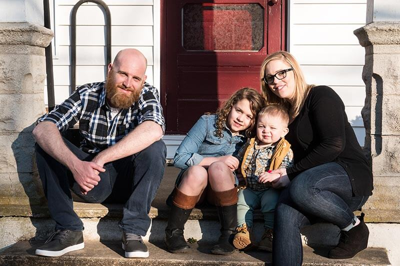
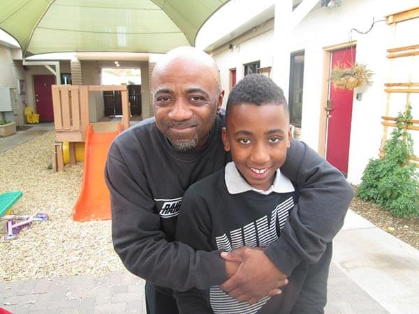
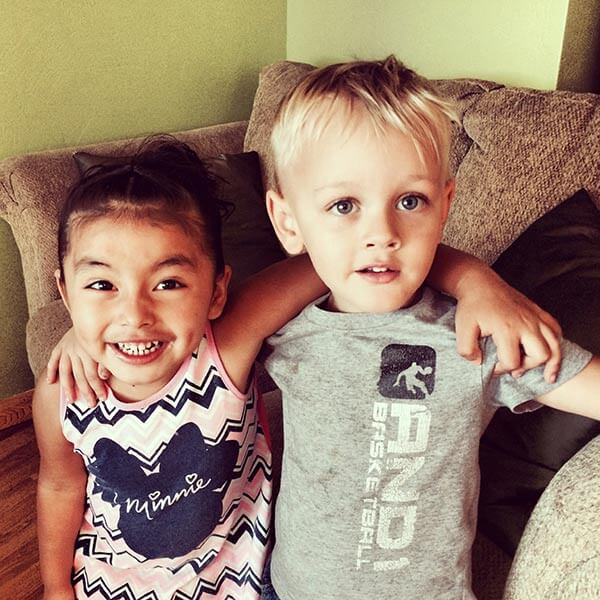
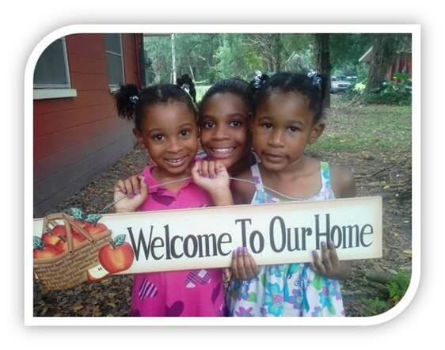
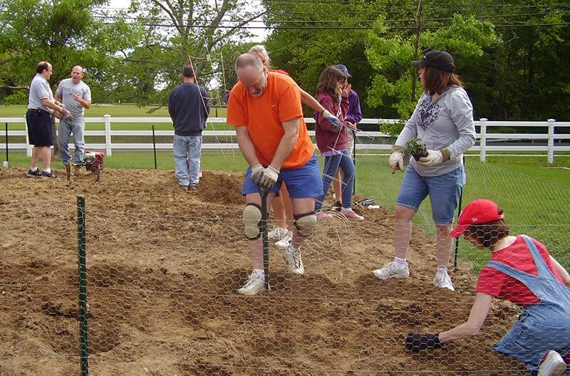

- <a href="https://facebook.com/FamilyPromise" class="icon">Facebook</a>
- <a href="https://twitter.com/fpnational" class="icon">Twitter</a>
- <a href="https://www.instagram.com/family.promise" class="icon">Instagram</a>

<!-- -->

- [Need Help?](../../../get-help/index.html)
- [Become an Affiliate](index.html)
- [Affiliate Login](https://affiliates.familypromise.org/)
- [Events](../../../events/index.html)
- [Press](../../../press/index.html)
- [Contact](../../../contact/index.html)

 

- [Who We Are](../../../who-we-are/index.html)
  - [Story](../../../who-we-are/story/index.html)
  - [Purpose](../../../who-we-are/purpose/index.html)
  - [Team](../../../who-we-are/team/index.html)
  - [Board](../../../who-we-are/board/index.html)
  - [Committees & Councils](../../../who-we-are/committees-councils/index.html)
  - [Partners](../../../who-we-are/partners/index.html)
- [What We Do](../../index.html)
  - [Programs & Services](../../programs-services/index.html)
  - [Affiliates](../index.html)
  - [FP Union County](../../fp-union-county/index.html)
  - [Reports & Financials](../../reports-financials/index.html)
- [Latest](../../../latest/index.html)
- [Get Involved](../../../get-involved/index.html)
  - [Volunteer](../../../get-involved/volunteer/index.html)
  - [Become a Partner](../../../who-we-are/partners/index.html)
  - [Join the Promise Guild](../../../donate/join-the-promise-guild/index.html)
  - [Create a Fundraiser](https://donate.familypromise.org/my-FP-Fundraiser)
  - [Houses for Change ®](../../../get-involved/houses-for-change/index.html)
  - [Join Our Team](../../../get-involved/employment/index.html)
- [Donate](../../../donate/index.html)

Select Page 

# Become an Affiliate

<a href="../../index.html" class="post post-page" title="Go to What We Do.">What We Do</a>

/ <a href="../index.html" class="post post-page" title="Go to Affiliates.">Affiliates</a>

Family Promise is the leading national organization preventing and ending family homelessness. Our approach involves prevention services before families become homeless, shelter to help families experiencing homelessness access housing, and stabilization programs once families have secured housing.

Family Promise has a proven strategy for creating Affiliates. The transformative outreach for civic groups, faith communities, and corporations alike is a highly successful solution to preventing and ending homelessness. Affiliates may provide Prevention, Shelter, Stabilization, and/or Housing services to their community.

To begin the process of becoming a Family Promise Affiliate, please follow these next steps:

[Contact us](../../../contact/indexdcd0.html?subject=affiliates) to start the process. We will work with you to understand the need in your community and the current resources that exist for children and their families. We engage your community through virtual and in-person meetings and build local leadership. Family Promise provides extensive technical assistance, materials, and in some cases, access to grants and in-kind donations.

Launching an Affiliate happens in two ways. Affiliates develop either as a new nonprofit or as an existing nonprofit transitioning into a Family Promise Affiliate. To learn more about Affiliate Development, please contact the Director of Affiliate Expansion, Carolyn Gordon at 908-374-1100 x 148 or using the [Contact Form](#contact-form) below.

### Family Promise Programs You Can Launch

##### **Prevention**

Preventing families from being evicted and entering homelessness is an essential element of the Family Promise mission and the most cost-effective way to proactively address this crisis. Prevention costs a fraction of what sheltering a family costs.

Prevention includes formal shelter diversion programs that provide rental assistance and landlord mediation and utilize a community- based approach that keep families housed.

##### \*\* \*\*

##### **Shelter**

The shelter program is a cost-effective and efficient response to family homelessness because it leverages existing community resources, engages volunteers, includes case management, and can be implemented without major start-up costs. There are multiple models of shelter at Family Promise:

- - The rotational shelter engages a network of community partners to host families at a different location each week.
  - The static site does not rotate, and volunteers provide hospitality at the site.
  - The hybrid model is a combination of the rotational and static site.
  - The scattered site model leverages multiple locations such as apartments, motel rooms or multiple congregational spaces as temporary shelter for families.

##### \*\* \*\*

##### **Stabilization**

Stabilization supports families exiting shelter to secure and maintain housing. The goal is not simply getting families into housing; it is keeping them in housing. Key to this is tapping into the diverse resources our volunteer pool and partnerships provide.

Through programs such as tenancy preparation, financial capabilities and virtual career pathway training, Affiliates create the basis for stability that lifts families from poverty and permits them to aspire to the future every family deserves.

##### \*\* \*\*

##### **Housing**

Family Promise Housing programs seek to empower families to attain stable housing and rebuild their lives. In 2020, more than 60% of Family Promise Affiliates offered at least one type of housing program including permanent supportive housing, affordable housing, and bride apartments. By doing so, Affiliates have had a transformative impact.

## **Family Promise Support to Affiliates in 2020**



## $3.85 Million

in Capacity Building



## $2+ Million

in Direct Grants to Affiliates



## $2+ Million

In-Kind Donations to Affiliates

The reason our Affiliate has achieved so many goals is that we are part of a much larger sum.  The presence of the national movement has won us respect in our city for the work we do. We are strengthened by our ability to reach for guidance from a national team and the collect team of Affiliates.

- EXECUTIVE DIRECTOR

I have worked for a number of national and international profits and none of them have had as supportive of a national office as Family Promise.

- EXECUTIVE DIRECTOR

###

### Why Choose Family Promise?

#####

##### 1. National Reach

Family Promise is in 43 states with 200 Affiliates. Nationally, we engage more than 200,000 volunteers. The National office facilitates partnerships for donations and discounts. Affiliates receive items such as goods, volunteers, professional services, insurance, technology and more. Support and networking opportunities provided through retreats and National Conferences, National media exposure, branding support, and support for national and local advocacy.

##### 2. Services and Solutions

Family Promise offers customizable materials and resources including documents, templates, and guides for programming. A no-cost platform for national fundraising campaigns. Infographics, social media templates, and a photo library. Strategic Planning and fundraising training facilitation. Affiliates can still create programming and tools that fit their local needs.

##### 3. Best Practices

Family Promise 30+ years’ experience of operating unique and highly successful programs.  
Family Promise is a highly effective model for ending family homelessness with over 80% of families securing long-term housing in an average of 9 weeks. Family Promise operates along a continuum and provides training for Prevention, Shelter Diversion, Shelter, Stabilization, Housing, and Trauma-Informed/Resilience-Oriented Care.

##### 4. Grant Opportunities

Family Promise National provides funding to Affiliates for certain programs that align with the overall vision of preventing and ending family homelessness.

• In 2020, over $2 million of direct assistance was provided to Affiliates  
• Wide range of financial, in-kind, and volunteer support via dozens of national corporate partners

##### 5. Support to Become an Affiliate

Family Promise supports communities interested in launching a new Family Promise Affiliate. Each community is different, and the Family Promise model is flexible to meet each community’s needs. Family Promise will assist in conducting a needs assessment to ensure the need and support for Family Promise exists in the community. The Family Promise team will host community meetings and work with community leaders to grow from initial idea to operational nonprofit.

## CONTACT US

 For more information on Starting a Family Promise Affiliate, contact Carolyn Gordon, Director of Affiliate Expansion, at 908-273-1100 x 148 or use this form:

- ### Thank you for your submission!

  Your message has been sent to the appropriate department. We will review your submission and respond as soon as we can.

- Subject / Department\*
  ----VolunteeringAffiliatesPartnershipsDonationsMedia InquiriesGeneral / Other

- First Name\*

- Last Name\*

- Email\*

- Phone

- Address
   Street Address  Address Line 2  City  ----AlabamaAlaskaArizonaArkansasCaliforniaColoradoConnecticutDelawareDistrict of ColumbiaFloridaGeorgiaHawaiiIdahoIllinoisIndianaIowaKansasKentuckyLouisianaMaineMarylandMassachusettsMichiganMinnesotaMississippiMissouriMontanaNebraskaNevadaNew HampshireNew JerseyNew MexicoNew YorkNorth CarolinaNorth DakotaOhioOklahomaOregonPennsylvaniaRhode IslandSouth CarolinaSouth DakotaTennesseeTexasUtahVermontVirginiaWashingtonWest VirginiaWisconsinWyomingArmed Forces AmericasArmed Forces EuropeArmed Forces Pacific State  ZIP Code 

- How did you hear about us?
  ----Through a friendI'm a volunteerSocial MediaNews StoryCharity NavigatorWorkplaceOther

- Message\*

-

-

- CAPTCHA

### Make A DOnation

Your gift to Family Promise helps us prevent and end family homelessness in over 200 communities across the U.S.

- First Name

- Last Name

- Amount

- Comments

  This field is for validation purposes and should be left unchanged.

### JOIN THE LIST

Join our mailing list to keep up with all things Family Promise from family stories to events and more!

- First Name\*

- Last Name\*

- Email Address\*

- Phone

  This field is for validation purposes and should be left unchanged.

- <a href="https://facebook.com/FamilyPromise" class="icon">Facebook</a>
- <a href="https://twitter.com/fpnational" class="icon">Twitter</a>
- <a href="https://www.instagram.com/family.promise" class="icon">Instagram</a>

Our mission is to help families experiencing homelessness and low-income families achieve sustainable independence through a community-based response.

- [Who We Are](../../../who-we-are/index.html)
- [What We Do](../../index.html)
- [Latest](../../../latest/index.html)
- [Get Involved](../../../get-involved/index.html)
- [Donate](../../../donate/index.html)
- [Events](../../../events/index.html)
- [Store](http://family-promise-store.myshopify.com/)
- [Need Help?](../../../get-help/index.html)
- [Press](../../../press/index.html)
- [Infographics](../../../press/infographics/index.html)
- [Contact](../../../contact/index.html)

© 2004 - 2020 Family Promise.  All Rights Reserved.  501(c)3 Nonprofit.  [EIN: 52-1591461](../../../financials/index.html)

[Privacy Policies](../../../privacy-policy/index.html)      [Terms of Use](../../../terms-of-use/index.html)

- <a href="http://www.facebook.com/sharer.php?u=https%3A%2F%2Ffamilypromise.org%2Fwhat-we-do%2Faffiliates%2Fbecome-an-affiliate%2F&amp;t=Become%20an%20Affiliate" class="et_social_share"><em></em> </a>
- <a href="http://twitter.com/share?text=Become%20an%20Affiliate&amp;url=https%3A%2F%2Ffamilypromise.org%2Fwhat-we-do%2Faffiliates%2Fbecome-an-affiliate%2F&amp;via=@fpnational" class="et_social_share"><em></em> </a>
- <a href="http://www.linkedin.com/shareArticle?mini=true&amp;url=https%3A%2F%2Ffamilypromise.org%2Fwhat-we-do%2Faffiliates%2Fbecome-an-affiliate%2F&amp;title=Become%20an%20Affiliate" class="et_social_share"><em></em> </a>
- <a href="https://mail.google.com/mail/u/0/?view=cm&amp;fs=1&amp;su=Become%20an%20Affiliate&amp;body=https%3A%2F%2Ffamilypromise.org%2Fwhat-we-do%2Faffiliates%2Fbecome-an-affiliate%2F&amp;ui=2&amp;tf=1" class="et_social_share"><em></em> </a>

Share This

- <a href="http://www.facebook.com/sharer.php?u=https%3A%2F%2Ffamilypromise.org%2Fwhat-we-do%2Faffiliates%2Fbecome-an-affiliate%2F&amp;t=Become%20an%20Affiliate" class="et_social_share"><em></em></a>
  Facebook

  

- <a href="http://twitter.com/share?text=Become%20an%20Affiliate&amp;url=https%3A%2F%2Ffamilypromise.org%2Fwhat-we-do%2Faffiliates%2Fbecome-an-affiliate%2F&amp;via=@fpnational" class="et_social_share"><em></em></a>
  Twitter

  

- <a href="http://www.linkedin.com/shareArticle?mini=true&amp;url=https%3A%2F%2Ffamilypromise.org%2Fwhat-we-do%2Faffiliates%2Fbecome-an-affiliate%2F&amp;title=Become%20an%20Affiliate" class="et_social_share"><em></em></a>
  LinkedIn

  

- <a href="https://mail.google.com/mail/u/0/?view=cm&amp;fs=1&amp;su=Become%20an%20Affiliate&amp;body=https%3A%2F%2Ffamilypromise.org%2Fwhat-we-do%2Faffiliates%2Fbecome-an-affiliate%2F&amp;ui=2&amp;tf=1" class="et_social_share"><em></em></a>
  Gmail

  
