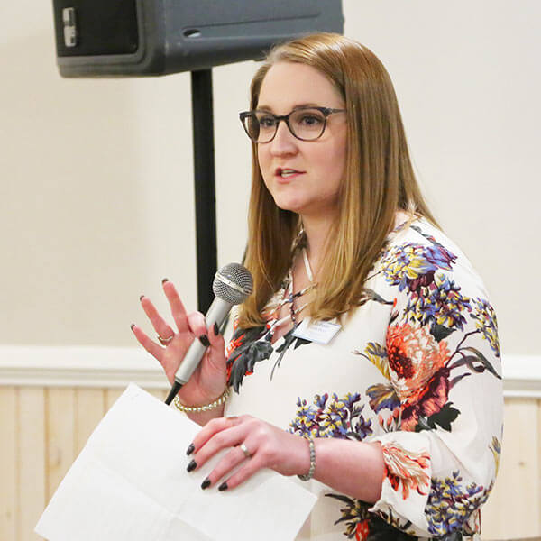

- <a href="https://facebook.com/FamilyPromise" class="icon">Facebook</a>
- <a href="https://twitter.com/fpnational" class="icon">Twitter</a>
- <a href="https://www.instagram.com/family.promise" class="icon">Instagram</a>

<!-- -->

- [Need Help?](../../get-help/index.html)
- [Become an Affiliate](become-an-affiliate/index.html)
- [Affiliate Login](https://affiliates.familypromise.org/)
- [Events](../../events/index.html)
- [Press](../../press/index.html)
- [Contact](../../contact/index.html)

 

- [Who We Are](../../who-we-are/index.html)
  - [Story](../../who-we-are/story/index.html)
  - [Purpose](../../who-we-are/purpose/index.html)
  - [Team](../../who-we-are/team/index.html)
  - [Board](../../who-we-are/board/index.html)
  - [Committees & Councils](../../who-we-are/committees-councils/index.html)
  - [Partners](../../who-we-are/partners/index.html)
- [What We Do](../index.html)
  - [Programs & Services](../programs-services/index.html)
  - [Affiliates](index.html)
  - [FP Union County](../fp-union-county/index.html)
  - [Reports & Financials](../reports-financials/index.html)
- [Latest](../../latest/index.html)
- [Get Involved](../../get-involved/index.html)
  - [Volunteer](../../get-involved/volunteer/index.html)
  - [Become a Partner](../../who-we-are/partners/index.html)
  - [Join the Promise Guild](../../donate/join-the-promise-guild/index.html)
  - [Create a Fundraiser](https://donate.familypromise.org/my-FP-Fundraiser)
  - [Houses for Change ®](../../get-involved/houses-for-change/index.html)
  - [Join Our Team](../../get-involved/employment/index.html)
- [Donate](../../donate/index.html)

Select Page 

# Affiliates

<a href="../index.html" class="post post-page" title="Go to What We Do.">What We Do</a>

Family Promise is the leading national organization preventing and ending family homelessness. Our approach to this crisis involves prevention services before families become homeless, shelter and professional staff support to help families experiencing homelessness access housing and resources, and stabilization programs once families have secured housing.

This holistic solution empowers the families we serve to achieve sustainable independence. It is our aspiration to change the future for 1 million children by 2030 and we will accomplish this goal via the efforts of our 200+ Family Promise Affiliates and 200,000 volunteers.

Family Promise Affiliates offer Prevention, Emergency Shelter, and Stabilization programming.

<a href="locations/index.html" class="et_pb_button et_pb_custom_button_icon et_pb_button_0 hover-lighten et_pb_bg_layout_light">Find Affiliate Locations</a>

<a href="https://affiliates.familypromise.org/" class="et_pb_button et_pb_custom_button_icon et_pb_button_1 hover-lighten et_pb_bg_layout_light">Log In to the Affiliates Community Website</a>

## VOLUNTEER RESOURCES

### ViSIT OUR Volunteer PORTAL

Ready to get involved? Family Promise Affiliates across the U.S. offer volunteer opportunities for individuals and groups, in-person and virtually. Visit our Volunteer Portal to find your local Family Promise Affiliate.

### Volunteer FAQs

At Family Promise, volunteers are the backbone of all of our programs. For three decades, volunteers have made meals, provided companionship, read stories, and offered compassion and support. Family Promise offers many exciting opportunities to use your skills for impact through virtual, in-person, and corporate volunteering.

## Interested in BECOMING an Affiliate?

Family Promise has a proven strategy for forming Affiliates. The transformative outreach for faith communities, civic groups, and corporations alike is a highly successful solution to preventing and ending homelessness. Affiliates may provide Prevention, Shelter, or Stabilization services to the community.

The initial step is a needs assessment to understand the resources and gaps for families with children in your community. After that, we engage your community through meetings and build local leadership. Family Promise will work intensively with your community as the program develops.

<a href="become-an-affiliate/index.html" class="et_pb_button et_pb_custom_button_icon et_pb_button_2 hover-lighten et_pb_bg_layout_light">Learn More About Becoming an Affiliate</a>

### Make A DOnation

Your gift to Family Promise helps us prevent and end family homelessness in over 200 communities across the U.S.

- First Name

- Last Name

- Amount

- Comments

  This field is for validation purposes and should be left unchanged.

### JOIN THE LIST

Join our mailing list to keep up with all things Family Promise from family stories to events and more!

- First Name\*

- Last Name\*

- Email Address\*

- Phone

  This field is for validation purposes and should be left unchanged.

- <a href="https://facebook.com/FamilyPromise" class="icon">Facebook</a>
- <a href="https://twitter.com/fpnational" class="icon">Twitter</a>
- <a href="https://www.instagram.com/family.promise" class="icon">Instagram</a>

Our mission is to help families experiencing homelessness and low-income families achieve sustainable independence through a community-based response.

- [Who We Are](../../who-we-are/index.html)
- [What We Do](../index.html)
- [Latest](../../latest/index.html)
- [Get Involved](../../get-involved/index.html)
- [Donate](../../donate/index.html)
- [Events](../../events/index.html)
- [Store](http://family-promise-store.myshopify.com/)
- [Need Help?](../../get-help/index.html)
- [Press](../../press/index.html)
- [Infographics](../../press/infographics/index.html)
- [Contact](../../contact/index.html)

© 2004 - 2020 Family Promise.  All Rights Reserved.  501(c)3 Nonprofit.  [EIN: 52-1591461](../../financials/index.html)

[Privacy Policies](../../privacy-policy/index.html)      [Terms of Use](../../terms-of-use/index.html)

- <a href="http://www.facebook.com/sharer.php?u=https%3A%2F%2Ffamilypromise.org%2Fwhat-we-do%2Faffiliates%2F&amp;t=Affiliates" class="et_social_share"><em></em> </a>
- <a href="http://twitter.com/share?text=Affiliates&amp;url=https%3A%2F%2Ffamilypromise.org%2Fwhat-we-do%2Faffiliates%2F&amp;via=@fpnational" class="et_social_share"><em></em> </a>
- <a href="http://www.linkedin.com/shareArticle?mini=true&amp;url=https%3A%2F%2Ffamilypromise.org%2Fwhat-we-do%2Faffiliates%2F&amp;title=Affiliates" class="et_social_share"><em></em> </a>
- <a href="https://mail.google.com/mail/u/0/?view=cm&amp;fs=1&amp;su=Affiliates&amp;body=https%3A%2F%2Ffamilypromise.org%2Fwhat-we-do%2Faffiliates%2F&amp;ui=2&amp;tf=1" class="et_social_share"><em></em> </a>

Share This

- <a href="http://www.facebook.com/sharer.php?u=https%3A%2F%2Ffamilypromise.org%2Fwhat-we-do%2Faffiliates%2F&amp;t=Affiliates" class="et_social_share"><em></em></a>
  Facebook

  

- <a href="http://twitter.com/share?text=Affiliates&amp;url=https%3A%2F%2Ffamilypromise.org%2Fwhat-we-do%2Faffiliates%2F&amp;via=@fpnational" class="et_social_share"><em></em></a>
  Twitter

  

- <a href="http://www.linkedin.com/shareArticle?mini=true&amp;url=https%3A%2F%2Ffamilypromise.org%2Fwhat-we-do%2Faffiliates%2F&amp;title=Affiliates" class="et_social_share"><em></em></a>
  LinkedIn

  

- <a href="https://mail.google.com/mail/u/0/?view=cm&amp;fs=1&amp;su=Affiliates&amp;body=https%3A%2F%2Ffamilypromise.org%2Fwhat-we-do%2Faffiliates%2F&amp;ui=2&amp;tf=1" class="et_social_share"><em></em></a>
  Gmail

  
