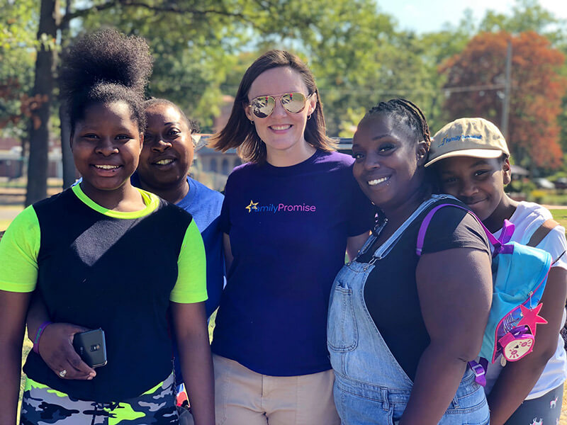
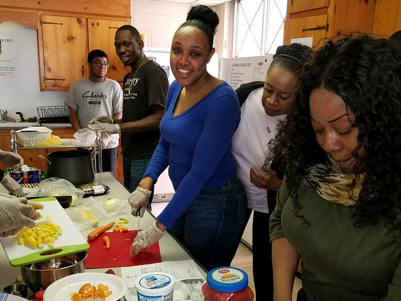
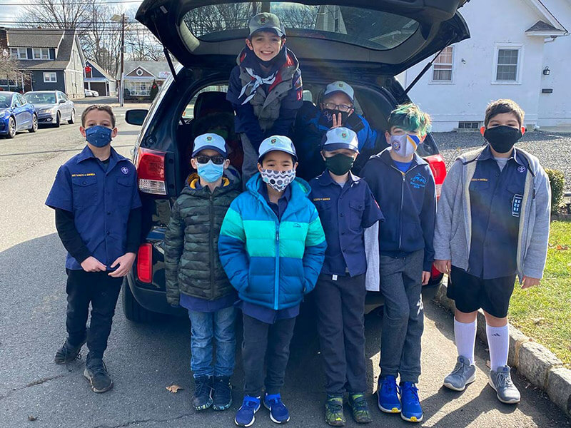
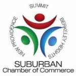

-   <a href="https://facebook.com/FamilyPromise" class="icon">Facebook</a>
-   <a href="https://twitter.com/fpnational" class="icon">Twitter</a>
-   <a href="https://www.instagram.com/family.promise" class="icon">Instagram</a>

<!-- -->

-   [Need Help?](../../get-help/index.html)
-   [Become an Affiliate](../affiliates/become-an-affiliate/index.html)
-   [Affiliate Login](https://affiliates.familypromise.org/)
-   [Events](../../events/index.html)
-   [Press](../../press/index.html)
-   [Contact](../../contact/index.html)

 

-   [Who We Are](../../who-we-are/index.html)
    -   [Story](../../who-we-are/story/index.html)
    -   [Purpose](../../who-we-are/purpose/index.html)
    -   [Team](../../who-we-are/team/index.html)
    -   [Board](../../who-we-are/board/index.html)
    -   [Committees & Councils](../../who-we-are/committees-councils/index.html)
    -   [Partners](../../who-we-are/partners/index.html)
-   [What We Do](../index.html)
    -   [Programs & Services](../programs-services/index.html)
    -   [Affiliates](../affiliates/index.html)
    -   [FP Union County](index.html)
    -   [Reports & Financials](../reports-financials/index.html)
-   [Latest](../../latest/index.html)
-   [Get Involved](../../get-involved/index.html)
    -   [Volunteer](../../get-involved/volunteer/index.html)
    -   [Become a Partner](../../who-we-are/partners/index.html)
    -   [Join the Promise Guild](../../donate/join-the-promise-guild/index.html)
    -   [Create a Fundraiser](https://donate.familypromise.org/my-FP-Fundraiser)
    -   [Houses for Change ®](../../get-involved/houses-for-change/index.html)
    -   [Join Our Team](../../get-involved/employment/index.html)
-   [Donate](../../donate/index.html)

Select Page 

FP Union County
===============

<a href="../index.html" class="post post-page" title="Go to What We Do.">What We Do</a>

Family Promise Union County (FPUC) is the flagship program of the national office and the first Affiliate established in the national network.

The need for shelter and comprehensive support services in Union County only increased during the pandemic. In 2020, Union County:

-   -   Launched the second year of a shelter diversion initiative supported by the Union County Commissioners
    -   Delivered over 7,500 nights of shelter
    -   Secured permanent and temporary housing for families
    -   Served over 10,000 meals
    -   Offered back-rent assistance to prevent homelessness and forward-going rent to move families out of homelessness
    -   Worked with over 100 landlords in Union County
    -   Engaged volunteers to provide services in financial capabilities, health and wellness, tutoring and more!

FPUC provides meaningful opportunities for people to make a difference in the lives of families in their community and empowers families to maintain employment, housing, and hope.

 

[](bridge-to-success/index.html)

### [Bridge to Success](bridge-to-success/index.html)

FPUC’s Bridge to Success program creates opportunities for families to reclaim their independence. It provides comprehensive services targeted at helping them rebuild their lives and focus on the future.  
READ MORE &gt;

[](https://volunteer.familypromise.org/)

### [FPUC Volunteer Training](https://volunteer.familypromise.org/)

Join us at one of our volunteer events to learn more about Family Promise and how you can get involved.  Upcoming dates to be added soon.  
READ MORE &gt;

### Volunteer Opportunities with FPUC

Congregations and Community Partners
------------------------------------

### HOST CONGREGATIONS

-   **First Baptist Church-Elizabeth (Day Center)**
-   Calvary Episcopal–Summit
-   Central Presbyterian–Summit
-   Christ Church–Summit
-   Church of the Little Flower–Berkeley Heights
-   Congregation Ohr Shalom/SJCC–Summit
-   Faith Lutheran–New Providence
-   First United Methodist Church–Westfield
-   Immaculate Heart of Mary–Scotch Plains
-   St. Andrew’s Episcopal–New Providence
-   St. James–Springfield
-   St. John’s Lutheran–Summit
-   St. Michael–Cranford
-   Summit United Methodist Church
-   Temple Emanu-El–Westfield
-   Temple Sholom–Scotch Plains
-   Temple Sinai–Summit
-   Willow Grove Presbyterian–Scotch Plains

### SUPPORT CONGREGATIONS

-   Church of Jesus Christ of Latter-day Saints–Scotch Plains
-   Church of Jesus Christ of Latter-day Saints–Short Hills
-   Community Presbyterian Church of Mountainside
-   Congregation Beth Israel–Scotch Plains
-   Connecticut Farms Presbyterian Church–Union
-   Fanwood Presbyterian Church–Fanwood
-   First Baptist of Westfield
-   First United Methodist Church–Scotch Plains
-   Fountain Baptist–Summit
-   Holy Trinity–Westfield
-   Kingdom Life Cathedral–Scotch Plains
-   Oasis Church–Scotch Plains
-   Our Lady of Lourdes–Mountainside
-   Our Lady of Peace–New Providence
-   St. Bartholomew the Apostle–Scotch Plains
-   St. Luke and All Saints Episcopal–Union
-   St. Paul’s Episcopal–Westfield
-   St. Teresa of Avila–Summit
-   Temple Sha’arey Shalom–Springfield
-   Terrill Road Baptist–Scotch Plains
-   Union Village United Methodist Church–Warren
-   Westminster Presbyterian–Berkeley Heights

### COMMUNITY PARTNERS

-   Atlantic Health
-   Bridgeway
-   Catholic Charities
-   Center for Women Career Closet
-   Central Presbyterian Lena Willis Mission Endowment Fund
-   City of Elizabeth
-   Community Access Unlimited
-   Community Health Law Project
-   Elizabeth Coalition
-   Furniture Assist
-   Homefirst
-   Jewish Family Services
-   Joyal Capital Management
-   Junior League of Summit
-   Keller Williams Realty
-   Knights of Columbus
-   Legal Services
-   Liquid Church
-   Menstrual Products for NJ
-   Moms for Moms
-   Overlook Hospital
-   Prevention Links
-   PROCEED
-   Salvation Army
-   St. Joseph’s
-   Summit High School Family Promise Club
-   Summit Police Department
-   Summit YMCA
-   Support the Girls
-   UC Human Services
-   UC Social Services
-   United Way
-   Urban League
-   WalMart
-   YMCA
-   YWCA

FPUC Staff
----------

Claire Boylan, Rental Assistance Coordinator  
Geleen Donovan, Executive Director  
Risé Grady, Case Manager  
Amy Jones, Manager of Volunteer Engagement  
Sara Naparstek, Housing Coordinator  
Robbin Sims, Day Center Assistant

Contact Us
----------

First Baptist Church  
402 Union Avenue  
Elizabeth, NJ 07208

Phone: (908) 289-7300

### Make A DOnation

Your gift to Family Promise helps us prevent and end family homelessness in over 200 communities across the U.S.

-   First Name

-   Last Name

-   Amount

-   Comments

    This field is for validation purposes and should be left unchanged.

### JOIN THE LIST

Join our mailing list to keep up with all things Family Promise from family stories to events and more!

-   First Name\*

-   Last Name\*

-   Email Address\*

-   Name

    This field is for validation purposes and should be left unchanged.

-   <a href="https://facebook.com/FamilyPromise" class="icon">Facebook</a>
-   <a href="https://twitter.com/fpnational" class="icon">Twitter</a>
-   <a href="https://www.instagram.com/family.promise" class="icon">Instagram</a>

Our mission is to help families experiencing homelessness and low-income families achieve sustainable independence through a community-based response.

-   [Who We Are](../../who-we-are/index.html)
-   [What We Do](../index.html)
-   [Latest](../../latest/index.html)
-   [Get Involved](../../get-involved/index.html)
-   [Donate](../../donate/index.html)
-   [Events](../../events/index.html)
-   [Store](http://family-promise-store.myshopify.com/)
-   [Need Help?](../../get-help/index.html)
-   [Press](../../press/index.html)
-   [Infographics](../../press/infographics/index.html)
-   [Contact](../../contact/index.html)

© 2004 - 2020 Family Promise.  All Rights Reserved.  501(c)3 Nonprofit.  [EIN: 52-1591461](../../financials/index.html)

[Privacy Policies](../../privacy-policy/index.html)      [Terms of Use](../../terms-of-use/index.html)

-   <a href="http://www.facebook.com/sharer.php?u=https%3A%2F%2Ffamilypromise.org%2Fwhat-we-do%2Ffp-union-county%2F&amp;t=FP%20Union%20County" class="et_social_share"><em></em> </a>
-   <a href="http://twitter.com/share?text=FP%20Union%20County&amp;url=https%3A%2F%2Ffamilypromise.org%2Fwhat-we-do%2Ffp-union-county%2F&amp;via=@fpnational" class="et_social_share"><em></em> </a>
-   <a href="http://www.linkedin.com/shareArticle?mini=true&amp;url=https%3A%2F%2Ffamilypromise.org%2Fwhat-we-do%2Ffp-union-county%2F&amp;title=FP%20Union%20County" class="et_social_share"><em></em> </a>
-   <a href="https://mail.google.com/mail/u/0/?view=cm&amp;fs=1&amp;su=FP%20Union%20County&amp;body=https%3A%2F%2Ffamilypromise.org%2Fwhat-we-do%2Ffp-union-county%2F&amp;ui=2&amp;tf=1" class="et_social_share"><em></em> </a>

Share This

-   <a href="http://www.facebook.com/sharer.php?u=https%3A%2F%2Ffamilypromise.org%2Fwhat-we-do%2Ffp-union-county%2F&amp;t=FP%20Union%20County" class="et_social_share"><em></em></a>
    Facebook

    
-   <a href="http://twitter.com/share?text=FP%20Union%20County&amp;url=https%3A%2F%2Ffamilypromise.org%2Fwhat-we-do%2Ffp-union-county%2F&amp;via=@fpnational" class="et_social_share"><em></em></a>
    Twitter

    
-   <a href="http://www.linkedin.com/shareArticle?mini=true&amp;url=https%3A%2F%2Ffamilypromise.org%2Fwhat-we-do%2Ffp-union-county%2F&amp;title=FP%20Union%20County" class="et_social_share"><em></em></a>
    LinkedIn

    
-   <a href="https://mail.google.com/mail/u/0/?view=cm&amp;fs=1&amp;su=FP%20Union%20County&amp;body=https%3A%2F%2Ffamilypromise.org%2Fwhat-we-do%2Ffp-union-county%2F&amp;ui=2&amp;tf=1" class="et_social_share"><em></em></a>
    Gmail

    
