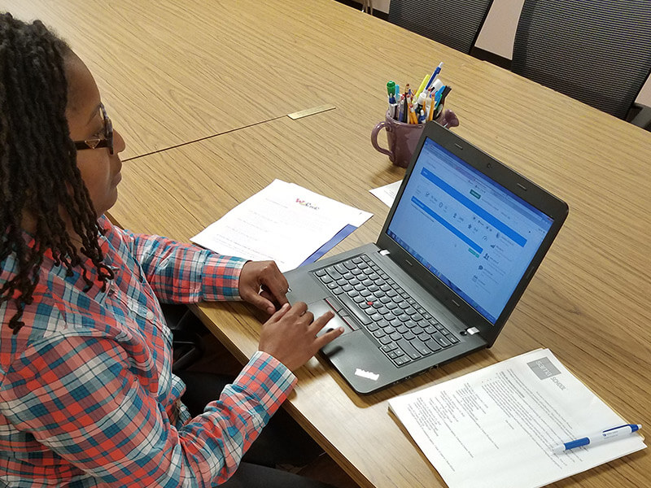
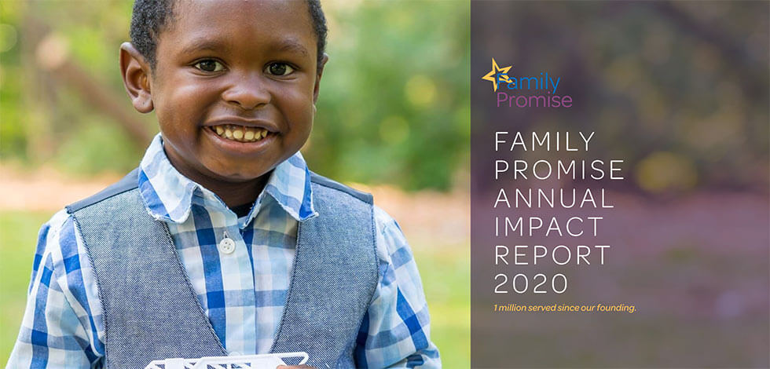

- <a href="https://facebook.com/FamilyPromise" class="icon">Facebook</a>
- <a href="https://twitter.com/fpnational" class="icon">Twitter</a>
- <a href="https://www.instagram.com/family.promise" class="icon">Instagram</a>

<!-- -->

- [Need Help?](../get-help/index.html)
- [Become an Affiliate](affiliates/become-an-affiliate/index.html)
- [Affiliate Login](https://affiliates.familypromise.org/)
- [Events](../events/index.html)
- [Press](../press/index.html)
- [Contact](../contact/index.html)

 

- [Who We Are](../who-we-are/index.html)
  - [Story](../who-we-are/story/index.html)
  - [Purpose](../who-we-are/purpose/index.html)
  - [Team](../who-we-are/team/index.html)
  - [Board](../who-we-are/board/index.html)
  - [Committees & Councils](../who-we-are/committees-councils/index.html)
  - [Partners](../who-we-are/partners/index.html)
- [What We Do](index.html)
  - [Programs & Services](programs-services/index.html)
  - [Affiliates](affiliates/index.html)
  - [FP Union County](fp-union-county/index.html)
  - [Reports & Financials](reports-financials/index.html)
- [Latest](../latest/index.html)
- [Get Involved](../get-involved/index.html)
  - [Volunteer](../get-involved/volunteer/index.html)
  - [Become a Partner](../who-we-are/partners/index.html)
  - [Join the Promise Guild](../donate/join-the-promise-guild/index.html)
  - [Create a Fundraiser](https://donate.familypromise.org/my-FP-Fundraiser)
  - [Houses for Change ®](../get-involved/houses-for-change/index.html)
  - [Join Our Team](../get-involved/employment/index.html)
- [Donate](../donate/index.html)

Select Page 

# What We Do

#### Family Promise is the nation’s leading organization working to prevent and end family homelessness. Our holistic, community-based approach to helping families achieve stability makes us unique. Over 200 Family Promise Affiliates, located throughout the country, do this by providing prevention services before families reach crisis, shelter when they become homeless, and stabilization programs once they have secured housing to ensure they remain independent. Our Aspiration is to change the lives of 1 million children by 2030.   

## PROGRAMS & SERVICES

Family Promise recognizes that family homelessness and poverty are complex issues that require comprehensive, innovative solutions. Solving homelessness is not just about housing. Our holistic approach to the crisis of family homelessness includes three key areas of focus: prevention, shelter, and stabilization.

- Homelessness Prevention
- Diversion from Shelter
- Shelter
- Stabilization
- Community Services

<a href="programs-services/index.html" class="et_pb_button et_pb_custom_button_icon et_pb_button_0 hover-lighten et_pb_bg_layout_light">LEARN MORE ABOUT OUR PROGRAMS &amp; SERVICES</a>

## AFFILIATES

### AFFILIATE INFORMATION

Learn more about the work of our Affiliates.   Check out our Affiliates Volunteer FAQ and other informative resources.

### AFFILIATES PORTAL

We have a dedicated online community for our Affiliates to connect and share resources.  Log in and get more information about joining us here.

### FIND AN AFFILIATE

Use our map search feature to find Affiliates around the country.

## FAMILY PROMISE UNION COUNTY

### FP Union COunty

Family Promise Union County (FPUC) is overseen by the national Family Promise office.

### BRIDGE TO SUCCESS

Bridge to Success provides tailored support and necessities to families as circumstances arise to help them rebuild their lives.

## REPORTS & FINANCIALS

At Family Promise, we know how important it is that our donors, volunteers, partners, and guests have trust in us. We are proud to have received 8 consecutive 4-star ratings from Charity Navigator, their top designation for nonprofits. We welcome you to review our financial documents and annual impact reports.

<a href="reports-financials/index.html" class="et_pb_button et_pb_custom_button_icon et_pb_button_1 hover-lighten et_pb_bg_layout_light">View Our Reports &amp; Financials</a>

### Make A DOnation

Your gift to Family Promise helps us prevent and end family homelessness in over 200 communities across the U.S.

- First Name

- Last Name

- Amount

- Comments

  This field is for validation purposes and should be left unchanged.

### JOIN THE LIST

Join our mailing list to keep up with all things Family Promise from family stories to events and more!

- First Name\*

- Last Name\*

- Email Address\*

- Comments

  This field is for validation purposes and should be left unchanged.

- <a href="https://facebook.com/FamilyPromise" class="icon">Facebook</a>
- <a href="https://twitter.com/fpnational" class="icon">Twitter</a>
- <a href="https://www.instagram.com/family.promise" class="icon">Instagram</a>

Our mission is to help families experiencing homelessness and low-income families achieve sustainable independence through a community-based response.

- [Who We Are](../who-we-are/index.html)
- [What We Do](index.html)
- [Latest](../latest/index.html)
- [Get Involved](../get-involved/index.html)
- [Donate](../donate/index.html)
- [Events](../events/index.html)
- [Store](http://family-promise-store.myshopify.com/)
- [Need Help?](../get-help/index.html)
- [Press](../press/index.html)
- [Infographics](../press/infographics/index.html)
- [Contact](../contact/index.html)

© 2004 - 2020 Family Promise.  All Rights Reserved.  501(c)3 Nonprofit.  [EIN: 52-1591461](../financials/index.html)

[Privacy Policies](../privacy-policy/index.html)      [Terms of Use](../terms-of-use/index.html)

- <a href="http://www.facebook.com/sharer.php?u=https%3A%2F%2Ffamilypromise.org%2Fwhat-we-do%2F&amp;t=What%20We%20Do" class="et_social_share"><em></em> </a>
- <a href="http://twitter.com/share?text=What%20We%20Do&amp;url=https%3A%2F%2Ffamilypromise.org%2Fwhat-we-do%2F&amp;via=@fpnational" class="et_social_share"><em></em> </a>
- <a href="http://www.linkedin.com/shareArticle?mini=true&amp;url=https%3A%2F%2Ffamilypromise.org%2Fwhat-we-do%2F&amp;title=What%20We%20Do" class="et_social_share"><em></em> </a>
- <a href="https://mail.google.com/mail/u/0/?view=cm&amp;fs=1&amp;su=What%20We%20Do&amp;body=https%3A%2F%2Ffamilypromise.org%2Fwhat-we-do%2F&amp;ui=2&amp;tf=1" class="et_social_share"><em></em> </a>

Share This

- <a href="http://www.facebook.com/sharer.php?u=https%3A%2F%2Ffamilypromise.org%2Fwhat-we-do%2F&amp;t=What%20We%20Do" class="et_social_share"><em></em></a>
  Facebook

  

- <a href="http://twitter.com/share?text=What%20We%20Do&amp;url=https%3A%2F%2Ffamilypromise.org%2Fwhat-we-do%2F&amp;via=@fpnational" class="et_social_share"><em></em></a>
  Twitter

  

- <a href="http://www.linkedin.com/shareArticle?mini=true&amp;url=https%3A%2F%2Ffamilypromise.org%2Fwhat-we-do%2F&amp;title=What%20We%20Do" class="et_social_share"><em></em></a>
  LinkedIn

  

- <a href="https://mail.google.com/mail/u/0/?view=cm&amp;fs=1&amp;su=What%20We%20Do&amp;body=https%3A%2F%2Ffamilypromise.org%2Fwhat-we-do%2F&amp;ui=2&amp;tf=1" class="et_social_share"><em></em></a>
  Gmail

  
