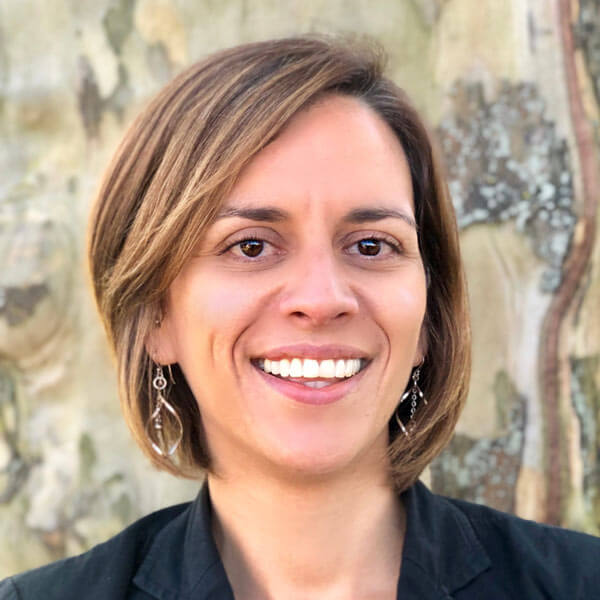
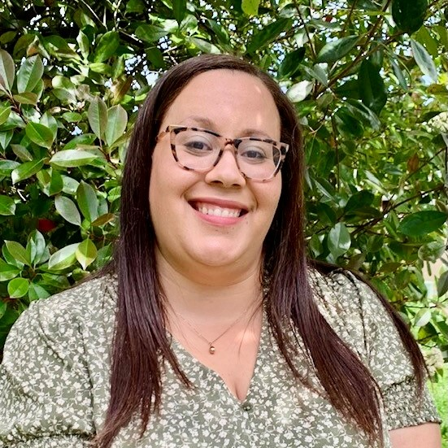

- <a href="https://facebook.com/FamilyPromise" class="icon">Facebook</a>
- <a href="https://twitter.com/fpnational" class="icon">Twitter</a>
- <a href="https://www.instagram.com/family.promise" class="icon">Instagram</a>

<!-- -->

- [Need Help?](../../get-help/index.html)
- [Become an Affiliate](../../what-we-do/affiliates/become-an-affiliate/index.html)
- [Affiliate Login](https://affiliates.familypromise.org/)
- [Events](../../events/index.html)
- [Press](../../press/index.html)
- [Contact](../../contact/index.html)

 

- [Who We Are](../index.html)
  - [Story](../story/index.html)
  - [Purpose](../purpose/index.html)
  - [Team](../team/index.html)
  - [Board](../board/index.html)
  - [Committees & Councils](index.html)
  - [Partners](../partners/index.html)
- [What We Do](../../what-we-do/index.html)
  - [Programs & Services](../../what-we-do/programs-services/index.html)
  - [Affiliates](../../what-we-do/affiliates/index.html)
  - [FP Union County](../../what-we-do/fp-union-county/index.html)
  - [Reports & Financials](../../what-we-do/reports-financials/index.html)
- [Latest](../../latest/index.html)
- [Get Involved](../../get-involved/index.html)
  - [Volunteer](../../get-involved/volunteer/index.html)
  - [Become a Partner](../partners/index.html)
  - [Join the Promise Guild](../../donate/join-the-promise-guild/index.html)
  - [Create a Fundraiser](https://donate.familypromise.org/my-FP-Fundraiser)
  - [Houses for Change ®](../../get-involved/houses-for-change/index.html)
  - [Join Our Team](../../get-involved/employment/index.html)
- [Donate](../../donate/index.html)

Select Page 

# Committees & Councils

<a href="../index.html" class="post post-page" title="Go to Who We Are.">Who We Are</a>

[Team](../team/index.html) [Board](../board/index.html) <a href="index.html" class="active">Committees &amp; Councils</a>

Our committees and councils work with staff to provide an expansion of opportunities and resources and magnify the work of the organization. The committees engage diverse stakeholders including board members, Affiliate leaders, volunteers, and graduates.

## AFFILIATE COUNCIL

The Family Promise Affiliate Council is comprised of a diverse and talented group of Affiliate leaders. These Executive Directors will assist in developing the programs, policies, and procedures that enable Affiliates to best empower families and mobilize volunteers, both now and in the years to come. As with the Guest Advisory Council, we believe this constituent engagement is critical to our aspirations to be the leader on the issue of family homelessness.

JOE ADER  
[Family Promise Spokane](https://www.familypromiseofspokane.org/)  
_Spokane, WA_

---

KATRINA BOSTICK  
[Family Promise of the Coastal Empire](https://www.familypromisece.org/)  
_Savannah, GA_

---

SUE CROSSLEY  
[Family Promise MetroWest](http://www.familypromisemetrowest.org/)  
_Natick, MA_

---

LISA DONNOT  
[Family Promise of Yellowstone Valley](https://www.familypromiseyv.org/)  
_Billings, MT_

---

MARSHA EICHELBERGER  
[Family Promise of Montco, PA](https://www.i-fha.org/)  
_Ambler, PA_

---

JENNIFER FAGENBAUM  
[Family Promise of South Sarasota County](https://familypromisessc.org/)  
_Venice, FL_

---

LISA FOSTER  
[Family Promise of Davie County](https://familypromisedc.org/)  
_Mocksville, NC_

---

RACHEL HAND  
[Family Promise North Shore Boston](https://www.familypromisensb.org/)  
_Beverly, MA_

---

JENNY HULL  
[Family Promise of Lycoming County](https://www.familypromiselycoming.org/)  
_Williamsport, PA_

---

CAROLINE LAMAR  
[Family Promise of Blount County](https://blountfamilypromise.org/)  
_Maryville, TN_

---

JAYNE MORASKI  
[Family Promise of Gainesville](https://www.familypromisegvl.org/)  
_Gainesville, FL_

---

JOE NETTISHEIM  
[Family Promise of Waukesha County](https://familypromisewaukesha.org/)  
_Wales, WI_

---

ANDREW NISHIMOTO  
[Family Promise of the South Bay](https://www.familypromiseosb.org/)  
_Torrance, CA_

---

DANA ORTIZ  
[Family Promise of Lawrence](https://lawrencefamilypromise.org/)_  
Lawrence, KS_

---

TARA PAGLIARINI  
[Family Promise of Brevard](http://familypromiseofbrevard.org/)  
_Rockledge, FL_

---

T.J. PUTMAN  
[Family Promise of the Mid-Willamette Valley](https://familypromisemwv.org/)  
_Salem, OR_

---

JULIE RANDALL  
[Family Promise of Hendricks County](https://familypromisehendrickscounty.org/)  
_Plainfield, IN_

---

CHERYL SCHUCH  
[Family Promise of Grand Rapids](https://www.familypromisegr.org/)  
_Grand Rapids, MI_

---

## GUEST ADVISORY COUNCIL

The Family Promise Guest Advisory Council (GAC) is comprised of graduate guests of Affiliates across the country. The GAC is drawn upon for advocacy efforts, public relations, the development of initiatives, and the formation of policy for Affiliates.

### Rebecca Esparza

### Rebecca Esparza

As a former graduate of Family Promise of Lawrence (KS), homelessness became a defining moment in the restoration process of her life. Since her time with Family Promise, Rebecca has received her social work degree from the University of Kansas and is currently pursuing her MSW. Her goal is to use her experience and education to move forward the cause of social justice for at-risk people.

> “I want to help others with whom I have shared experiences. I believe that the most valuable asset given to me by Family Promise is the relationships that continue to exist, the mentorship that still takes place, and the help I have received in many areas of my life when I have needed it. I want to pay it forward.”

### Syri Gerstner

### Syri Gerstner

Syri leads the Graduate program at Family Promise of Greater Phoenix (AZ). She is a member of the Board of Directors and the CQI committee for Save the Family.

She and her two young daughters were previous guests in 2012, when she and her girls lost their apartment. With the grace of God and the helping hand up from Family Promise, she was able to grab a foothold on normalcy, complete her college degree, and purchase a home her children could call their own. Topping it all off, by joining the team that called her and her children “family” in 2014, they have come full circle.

> “By becoming a Family Promise employee, volunteering at other organizations throughout the Valley, and stepping into the Guest Advisory Council, I’ve had the chance to give back to the community. Family Promise was the next logical step in my life evolving for the better and for my hopes of changing other lives in the process.”

### Tammi Hart

### Tammi Hart

Tammi is a member of the Board of Directors and the Congregational Relations committee for GAIHN, our Affiliate in Greenville, South Carolina. She works for Day & Zimmerman, ECM as their Employee Concerns Program Representative.

She and her family were previous guests of GAIHN ten years ago when she and her three children were without a place to lay their heads. Thanks to the hospitality provided by GAIHN’s congregations and their highly experienced staff, Tammi’s family was given a place to stay and the resources they needed to find a home to call their own.

“Giving back to GAIHN and Family Promise by volunteering my time to both organizations was the least I could do. Becoming a member of the Guest Advisory Council (GAC) is the latest step in my efforts to ensure Family Promise and its Affiliates continue to be successful advocates for homeless families for years to come.”

### Sarah Jackson &lt;br /&gt;(In Memorium)

### Sarah Jackson &lt;br /&gt;(In Memorium)

Sarah was a 2011 graduate of Family Promise of Gwinnett County (GA). She was the mother of four wonderful girls ages 5, 7, 8, and 16. Sarah was a career advisor for the Workforce Innovation and Opportunity Act Program.

She recently served on the board for Family Promise of Gwinnett as treasurer. Sarah frequently spoke at congregations throughout Gwinnett County about the impact of Family Promise.

Sarah Jackson died on September 7, 2020. She had profound impact as a member of the GAC and we miss her and cherish her memory.

> “Family Promise was life-changing for me and my daughters, as it gave me the time to regain stability for my family and reminded me daily that God is ALWAYS there. As a GAC member, I hope to give back to the program which means so much to me and to have a platform to share my experiences in a way that will help other families and Affiliates.”

### Hope Johnson

### Hope Johnson

Hope is a 2010 graduate of Family Promise Hunterdon County (NJ). She was forced to stop working due to a health issue and, as a result, she and Olivia, her one-year-old daughter found themselves without a home.

Through hard work and perseverance, Hope is now a solutions manager at a Verizon wireless corporate store. She has welcomed a new baby, James, to the family. She volunteers both with the national office as well as her local Affiliate. Hope currently lives in Alexandria, New Jersey.

> “I believe that Family Promise has given me an opportunity to make a better life for myself and children. I believe giving back to others is the sincerest way of thanking them. Becoming a part of the Advisory Council is a chance to give back to others the way Family Promise gave to me.”

### Yusuf Kalule

### Yusuf Kalule

Yusuf is a graduate of Family Promise Metrowest (MA), and currently sits on two board committees for the Affiliate. He works for McKesson Technologies as a credentialing specialist and also works part time as a caregiver.

An immigrant from Uganda, Yusuf and his family found themselves homeless when they arrived in the United States. They found Family Promise through some new friends who were members of a host congregation, asked for help and Metrowest took them in.

> “When we joined Family Promise, we saw hope and transformation coming our way immediately. We are successful today because Family Promise gave us a new start in this great country! I am a GAC member because I strongly believe that my experience and the lessons I have learned from Family Promise could change another family’s life that might be in a place where I have been before.”

### Theresa Pinger

### Theresa Pinger

Theresa continues to give back to her Affiliate in different ways. She volunteers, creates affirmation posters for Affiliate coordinators, and fundraises for Christmas gifts and opportunities for other guest families.

> “Family Promise has changed my life continuously over the past three years. Thanks to this organization, I have grown to be an advocate for youth and families facing homelessness, but I have also grown to be a more open-minded and understanding individual overall. As a GAC member, I hope that I am able to give back to Family Promise, as well as help others understand the reality and urgency of the problem of homelessness in the United States.”

## RACIAL JUSTICE COUNCIL

It is impossible to separate systemic and structural racism from the reality that people of color, and Black people in particular, are disproportionately affected by homelessness and poverty.The Family Promise Racial Justice Council was formed to ensure we address racial equity issues in our work at all levels. The Council is comprised of Family Promise community members from across the country.

### Nora Ali

#### Former Board Vice-Chair, Family Promise of Greater Denver

### Nora Ali

> “I joined the Racial Justice Council to provide tools and strategies for the Family Promise community to engage in issues involving racial and ethnic diversity so that we can provide the best care for our families and make them feel at home.”

### Jeff Armstrong

#### Executive Director, Family Promise of the Midlands

### Jeff Armstrong

> “The Racial Justice Council provides a platform to have real discussions, and take the necessary actions in Family Promise’s fight for equitable opportunities for all. It has been a personal mission to use my voice to be a cultural broker. As someone who experienced poverty and racism at a young age, I am thankful that the RJC exists to improve outcomes for the families we serve, and to educate all of our stakeholders on the importance of racial justice.”

### Marissa Commey

#### Manager of Community Engagement, Family Promise of Hawaii

### Marissa Commey

> “I joined the Racial Justice Council because I saw that Family Promise was committed to continuing the work of truly being an anti-racist organization. I hope to contribute and learn from the RJC and our community at large so we can all be more compassionate, connected, and impactful in our service.”

### E’tienne Easley

#### Director of Development, Family Promise of Greater Chattanooga

### E’tienne Easley

> “It is my hope in working with the Racial Justice Council that I help to create an equitable community among Family Promise Affiliates that will extend into the communities we serve. To do this work, I want to disseminate relative information that will heighten awareness, increase knowledge, and address structural racism living within the attitudes, institutions, and structures built to dehumanize and permanently silence African Americans and people of color.”

### Claas Ehlers

#### Chief Executive Officer, Family Promise

### Claas Ehlers

> “Structural racism underlies homelessness in the United States. We have to address it in every initiative we take, in the way we work, in the messages we give. The RJC is a foundational step toward Family Promise orienting anti-racism in its work.”

### Carolyn Gordon

#### Director of Affiliate Expansion, Family Promise

### Carolyn Gordon

> “Our work of serving families experiencing homelessness is inextricably linked with racial justice. I look forward to elevating the racial equity work of Family Promise and providing guidance, resources, and tools to Affiliates. We will create space in which Black families, staff, and volunteers have power that improves the outcomes for all families served.”

### Nakeshia Hedrick

#### Executive Director, Family Promise of Greater Lafayette

### Nakeshia Hedrick

> “I am committed to helping Family Promise hold true to its community-based approach in addressing difficult but important topics like, poverty, homelessness, and racial injustice. As a part of the RJC, I hope to offer insight, voice, fact, and action to address the ugly truths of injustice and inequity that disproportionately and adversely affect Black, Indigenous, and people of color.”

### Vera Johnson

#### Executive Director, Fort Bend Family Promise

### Vera Johnson

> “With my work commitment on the Racial Justice Council, I hope to equip and engage members, leaders, staff, partners and myself with the skills, tools, strategies, resources and relationships to be effective leaders and advocates in the fight for racial justice. I want to collaborate and learn from the wisdom of racial justice pioneers and learn from scholar grass root programs that have the common goal towards a solution of nondiscriminatory conduct of people of all races, resulting in equitable opportunities and outcomes for all.”

### Armilla Moore

#### Executive Director, Family Promise of Pickens County

### Armilla Moore

> “So many people are afraid to talk about race in the workplace. This can impact relationships between leadership and employees. No matter how difficult the conversation is, we have to talk. When we have the conversations, we can identify the issues and begin to make change. Family Promise’s Racial Justice Committee takes on the tough issues. By sharing experiences and views, we can find ways to help people be brave, have the tough conversations, and positively influence our future as a diverse organization.”

### Gwen Papenfuse

#### Client Engagement Associate, Family Promise

### Gwen Papenfuse

> “As a member of the Racial Justice Council, I hope to contribute to an equitable workplace for all of our affiliate staff. I hope to encourage changes in Family Promise in all areas of the country to support our staff, board members, and guests of Color. I hope to encourage affiliates to continue their DEIA journeys as a constant journey and not just as a start and end assignment. I am looking forward to the inspiring and hopeful conversations that the RJC can have to amend the changes needed.”

### Mitchell Petit-Frere

#### Creative Content Manager, Family Promise

### Mitchell Petit-Frere

> “Black Americans only make up 13% of the U.S. population but account for nearly 40% of the country’s homeless population. This is the result of centuries of racism. I hope my work on the Racial Justice Council helps educate Family Promise community members nationwide on the role systemic racism plays in the lives of the non-white families we serve.”

### Amber Young

#### Director of Volunteer Engagement, Family Promise

### Amber Young

> “As a member of the Racial Justice Council, I hope to support the Black families we serve by openly discussing racial inequality and actively taking steps towards combating systemic racism. The RJC is committed to providing guidance and support to Family Promise as they continue on their DEIA journey.”

> It is my hope in working with the Racial Justice Council that I help to create an equitable community among Family Promise Affiliates that will extend into the communities we serve.

-E'tienne Easley

## NEXT GENERATION COMMITTEE

Millennials have surpassed baby boomers as the largest adult generation, and Generation Z is the largest generation overall in the country. Often characterized as social and passionate about values with a need for their voices to be heard, today’s youth are vital to the future of the nonprofit world. Recognizing their potential impact in the battle against family homelessness, Family Promise’s Next Generation Committee is raising awareness of this crisis within its peer group and beyond and engaging younger audiences with Family Promise.

### Nora Ali

#### Denver, CO

Former Board Vice-Chair, Family Promise of Greater Denver

B.A. Johns Hopkins University; J.D. Cornell Law School

### Zoë Barnswell

#### Greenwich, CT

Software Engineer, JP Morgan Chase & Co.

B.A. Princeton University

### Maureen Cooke

#### New York, NY

Communications Professional

B.A. Boston College

### Julia Dowling

#### New York, NY

Brand and Growth Strategy Consultant

B.A. University of Richmond

### Lisa Foster

#### Davie County, NC

Executive Director, Family Promise of Davie County

B.A. North Carolina State University; M.S.W. & M.P.H. University of Georgia

### Hannah Isenhart

#### Boston, MA

Student and Volunteer

Tufts University, Class of 2021

### Peter Palombo

#### Chatham, NJ

Student and Volunteer

Marist College, Class of 2023

### Brett Rojas

#### Madison, NJ

Investment Banking Analyst B.S.

Tufts University

##### From the Family Promise National Board:

### Joshua Barer

#### Mendham, NJ

Managing Director, Barer & Son Capital

B.S. Harvard University

### Dan Tinkoff

#### Summit, NJ

Senior Partner, McKinsey & Co.

B.A. Rutgers University, M.A. Drew University

> Young people want creative, enduring ways to give back. The NextGen Committee will help sustain Family Promise and make its work even more meaningful.

—Nora Ali

##### From the Family Promise National Staff:

### Katie Coughlin

#### Princeton Junction, NJ

Marketing & Media Manager, Family Promise

B.A. Wagner College

### Cassidy O'Lear

#### Towaco, NJ

Brand and Marketing Associate

B.A. University of Connecticut

### Mitchell Petit-Frere

#### Parsippany, NJ

Creative Content Manager, Family Promise

B.A. & M.A. Saint John’s University

### Amber Young

#### New York, NY

Director of Volunteer Engagement

B.A. Hofstra University; M.S. Eastern University

## INTERESTED IN LEADERSHIP?

Do you have expertise in one of the above areas and a passion for ending family homelessness. Reach out to us for more info on joining our committees and councils. 

<a href="../../contact/index2cef.html?subject=general" class="et_pb_button et_pb_button_0 et_pb_bg_layout_light">CONTACT US ABOUT LEADERSHIP OPPORTUNITIES</a>

### Make A DOnation

Your gift to Family Promise helps us prevent and end family homelessness in over 200 communities across the U.S.

- First Name

- Last Name

- Amount

- Email

  This field is for validation purposes and should be left unchanged.

### JOIN THE LIST

Join our mailing list to keep up with all things Family Promise from family stories to events and more!

- First Name\*

- Last Name\*

- Email Address\*

- Phone

  This field is for validation purposes and should be left unchanged.

- <a href="https://facebook.com/FamilyPromise" class="icon">Facebook</a>
- <a href="https://twitter.com/fpnational" class="icon">Twitter</a>
- <a href="https://www.instagram.com/family.promise" class="icon">Instagram</a>

Our mission is to help families experiencing homelessness and low-income families achieve sustainable independence through a community-based response.

- [Who We Are](../index.html)
- [What We Do](../../what-we-do/index.html)
- [Latest](../../latest/index.html)
- [Get Involved](../../get-involved/index.html)
- [Donate](../../donate/index.html)
- [Events](../../events/index.html)
- [Store](http://family-promise-store.myshopify.com/)
- [Need Help?](../../get-help/index.html)
- [Press](../../press/index.html)
- [Infographics](../../press/infographics/index.html)
- [Contact](../../contact/index.html)

© 2004 - 2020 Family Promise.  All Rights Reserved.  501(c)3 Nonprofit.  [EIN: 52-1591461](../../financials/index.html)

[Privacy Policies](../../privacy-policy/index.html)      [Terms of Use](../../terms-of-use/index.html)

- <a href="http://www.facebook.com/sharer.php?u=https%3A%2F%2Ffamilypromise.org%2Fwho-we-are%2Fcommittees-councils%2F&amp;t=Committees%20%26%20Councils" class="et_social_share"><em></em> </a>
- <a href="http://twitter.com/share?text=Committees%20%26%20Councils&amp;url=https%3A%2F%2Ffamilypromise.org%2Fwho-we-are%2Fcommittees-councils%2F&amp;via=@fpnational" class="et_social_share"><em></em> </a>
- <a href="http://www.linkedin.com/shareArticle?mini=true&amp;url=https%3A%2F%2Ffamilypromise.org%2Fwho-we-are%2Fcommittees-councils%2F&amp;title=Committees%20%26%20Councils" class="et_social_share"><em></em> </a>
- <a href="https://mail.google.com/mail/u/0/?view=cm&amp;fs=1&amp;su=Committees%20%26%20Councils&amp;body=https%3A%2F%2Ffamilypromise.org%2Fwho-we-are%2Fcommittees-councils%2F&amp;ui=2&amp;tf=1" class="et_social_share"><em></em> </a>

Share This

- <a href="http://www.facebook.com/sharer.php?u=https%3A%2F%2Ffamilypromise.org%2Fwho-we-are%2Fcommittees-councils%2F&amp;t=Committees%20%26%20Councils" class="et_social_share"><em></em></a>
  Facebook

  

- <a href="http://twitter.com/share?text=Committees%20%26%20Councils&amp;url=https%3A%2F%2Ffamilypromise.org%2Fwho-we-are%2Fcommittees-councils%2F&amp;via=@fpnational" class="et_social_share"><em></em></a>
  Twitter

  

- <a href="http://www.linkedin.com/shareArticle?mini=true&amp;url=https%3A%2F%2Ffamilypromise.org%2Fwho-we-are%2Fcommittees-councils%2F&amp;title=Committees%20%26%20Councils" class="et_social_share"><em></em></a>
  LinkedIn

  

- <a href="https://mail.google.com/mail/u/0/?view=cm&amp;fs=1&amp;su=Committees%20%26%20Councils&amp;body=https%3A%2F%2Ffamilypromise.org%2Fwho-we-are%2Fcommittees-councils%2F&amp;ui=2&amp;tf=1" class="et_social_share"><em></em></a>
  Gmail

  
