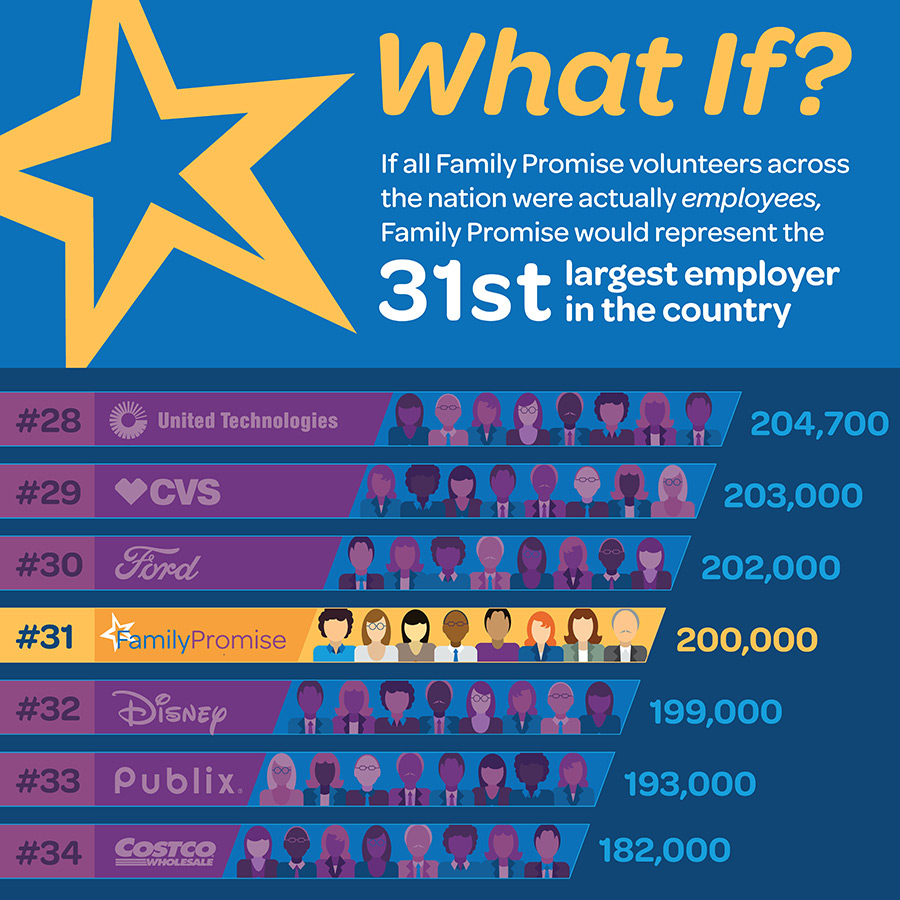
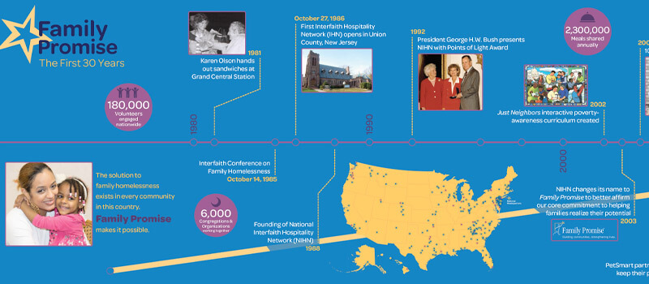
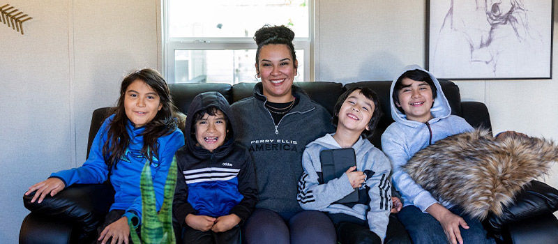
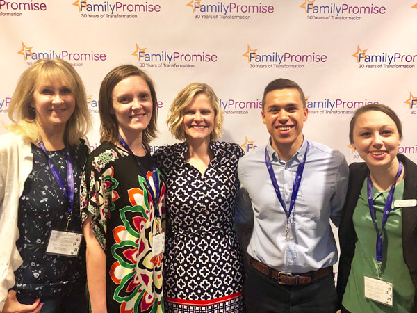
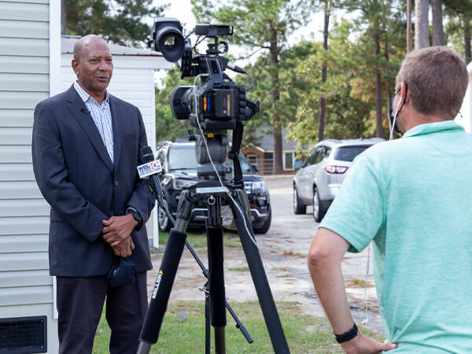
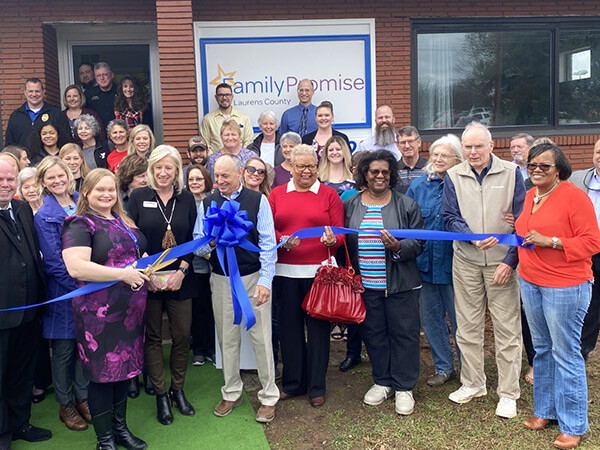

- <a href="https://facebook.com/FamilyPromise" class="icon">Facebook</a>
- <a href="https://twitter.com/fpnational" class="icon">Twitter</a>
- <a href="https://www.instagram.com/family.promise" class="icon">Instagram</a>

<!-- -->

- [Need Help?](../get-help/index.html)
- [Become an Affiliate](../what-we-do/affiliates/become-an-affiliate/index.html)
- [Affiliate Login](https://affiliates.familypromise.org/)
- [Events](../events/index.html)
- [Press](../press/index.html)
- [Contact](../contact/index.html)

 

- [Who We Are](index.html)
  - [Story](story/index.html)
  - [Purpose](purpose/index.html)
  - [Team](team/index.html)
  - [Board](board/index.html)
  - [Committees & Councils](committees-councils/index.html)
  - [Partners](partners/index.html)
- [What We Do](../what-we-do/index.html)
  - [Programs & Services](../what-we-do/programs-services/index.html)
  - [Affiliates](../what-we-do/affiliates/index.html)
  - [FP Union County](../what-we-do/fp-union-county/index.html)
  - [Reports & Financials](../what-we-do/reports-financials/index.html)
- [Latest](../latest/index.html)
- [Get Involved](../get-involved/index.html)
  - [Volunteer](../get-involved/volunteer/index.html)
  - [Become a Partner](partners/index.html)
  - [Join the Promise Guild](../donate/join-the-promise-guild/index.html)
  - [Create a Fundraiser](https://donate.familypromise.org/my-FP-Fundraiser)
  - [Houses for Change ®](../get-involved/houses-for-change/index.html)
  - [Join Our Team](../get-involved/employment/index.html)
- [Donate](../donate/index.html)

Select Page 

# Who We Are

#### When Family Promise began, it was a local response to a problem in Union County, New Jersey. Thirty years later, we are a national movement involving more than 200,000 volunteers which served more than 177,000 people in 2020.

But the core of what we do is still local—partnerships within a city or county changing lives. Family Promise makes that possible by developing and supporting Affiliates that address family homelessness right in their own community.

Over the past three decades, Family Promise has continued to expand our scope and our reach. Today, we comprise more than 200 Affiliates across 43 states and are the leading national nonprofit addressing the issue of family homelessness.

## OUR STORY

Family Promise was founded in 1986 by Karen Olson. In the three decades since, we have grown from a rotational shelter program in Union County, New Jersey, to a national network that serves families nationwide through multiple shelter, prevention, and stabilization programs.

<a href="story/index.html" class="et_pb_button et_pb_custom_button_icon et_pb_button_0 hover-darken et_pb_bg_layout_light">Discover Our Story</a>

## OUR PURPOSE

Family Promise allows communities to develop comprehensive, holistic solutions for families facing homelessness. Families come to us in crisis; our approach of coordinated compassion helps them rebuild their lives with new skills and ongoing support to prepare them for a successful future.

<a href="purpose/index.html" class="et_pb_button et_pb_custom_button_icon et_pb_button_1 hover-darken et_pb_bg_layout_light">Learn About Our Purpose</a>

## OUR PEOPLE

### TEAM

Our dynamic team is passionate about solving the issue of family homelessness. We strive to elevate voices of families with lived experience.

### BOARD

Our national board bears influence as community leaders and professionals representing numerous companies nationally with expertise in diverse fields.

### COMMITTEES & COUNCILS

Our committees and councils work with staff to provide an expansion of opportunities and resources and magnify the work of the organization.

## OUR PARTNERS

Our partners offer resources and people power to change the future for families in America. Authentic partnerships involve meaningful philanthropy, in-kind donations, and employee engagement. Together, we create homelessness prevention programs, transitional housing, single family homes, and most important of all: community.

<a href="partners/index.html" class="et_pb_button et_pb_custom_button_icon et_pb_button_2 hover-lighten et_pb_bg_layout_light">View Our Partners</a>

### Make A DOnation

Your gift to Family Promise helps us prevent and end family homelessness in over 200 communities across the U.S.

- First Name

- Last Name

- Amount

- Phone

  This field is for validation purposes and should be left unchanged.

### JOIN THE LIST

Join our mailing list to keep up with all things Family Promise from family stories to events and more!

- First Name\*

- Last Name\*

- Email Address\*

- Phone

  This field is for validation purposes and should be left unchanged.

- <a href="https://facebook.com/FamilyPromise" class="icon">Facebook</a>
- <a href="https://twitter.com/fpnational" class="icon">Twitter</a>
- <a href="https://www.instagram.com/family.promise" class="icon">Instagram</a>

Our mission is to help families experiencing homelessness and low-income families achieve sustainable independence through a community-based response.

- [Who We Are](index.html)
- [What We Do](../what-we-do/index.html)
- [Latest](../latest/index.html)
- [Get Involved](../get-involved/index.html)
- [Donate](../donate/index.html)
- [Events](../events/index.html)
- [Store](http://family-promise-store.myshopify.com/)
- [Need Help?](../get-help/index.html)
- [Press](../press/index.html)
- [Infographics](../press/infographics/index.html)
- [Contact](../contact/index.html)

© 2004 - 2020 Family Promise.  All Rights Reserved.  501(c)3 Nonprofit.  [EIN: 52-1591461](../financials/index.html)

[Privacy Policies](../privacy-policy/index.html)      [Terms of Use](../terms-of-use/index.html)

- <a href="http://www.facebook.com/sharer.php?u=https%3A%2F%2Ffamilypromise.org%2Fwho-we-are%2F&amp;t=Who%20We%20Are" class="et_social_share"><em></em> </a>
- <a href="http://twitter.com/share?text=Who%20We%20Are&amp;url=https%3A%2F%2Ffamilypromise.org%2Fwho-we-are%2F&amp;via=@fpnational" class="et_social_share"><em></em> </a>
- <a href="http://www.linkedin.com/shareArticle?mini=true&amp;url=https%3A%2F%2Ffamilypromise.org%2Fwho-we-are%2F&amp;title=Who%20We%20Are" class="et_social_share"><em></em> </a>
- <a href="https://mail.google.com/mail/u/0/?view=cm&amp;fs=1&amp;su=Who%20We%20Are&amp;body=https%3A%2F%2Ffamilypromise.org%2Fwho-we-are%2F&amp;ui=2&amp;tf=1" class="et_social_share"><em></em> </a>

Share This

- <a href="http://www.facebook.com/sharer.php?u=https%3A%2F%2Ffamilypromise.org%2Fwho-we-are%2F&amp;t=Who%20We%20Are" class="et_social_share"><em></em></a>
  Facebook

  

- <a href="http://twitter.com/share?text=Who%20We%20Are&amp;url=https%3A%2F%2Ffamilypromise.org%2Fwho-we-are%2F&amp;via=@fpnational" class="et_social_share"><em></em></a>
  Twitter

  

- <a href="http://www.linkedin.com/shareArticle?mini=true&amp;url=https%3A%2F%2Ffamilypromise.org%2Fwho-we-are%2F&amp;title=Who%20We%20Are" class="et_social_share"><em></em></a>
  LinkedIn

  

- <a href="https://mail.google.com/mail/u/0/?view=cm&amp;fs=1&amp;su=Who%20We%20Are&amp;body=https%3A%2F%2Ffamilypromise.org%2Fwho-we-are%2F&amp;ui=2&amp;tf=1" class="et_social_share"><em></em></a>
  Gmail

  
