-   <a href="https://facebook.com/FamilyPromise" class="icon">Facebook</a>
-   <a href="https://twitter.com/fpnational" class="icon">Twitter</a>
-   <a href="https://www.instagram.com/family.promise" class="icon">Instagram</a>

<!-- -->

-   [Need Help?](../../get-help/index.html)
-   [Become an Affiliate](../../what-we-do/affiliates/become-an-affiliate/index.html)
-   [Affiliate Login](https://affiliates.familypromise.org/)
-   [Events](../../events/index.html)
-   [Press](../../press/index.html)
-   [Contact](../../contact/index.html)

 

-   [Who We Are](../index.html)
    -   [Story](../story/index.html)
    -   [Purpose](../purpose/index.html)
    -   [Team](../team/index.html)
    -   [Board](../board/index.html)
    -   [Committees & Councils](../committees-councils/index.html)
    -   [Partners](index.html)
-   [What We Do](../../what-we-do/index.html)
    -   [Programs & Services](../../what-we-do/programs-services/index.html)
    -   [Affiliates](../../what-we-do/affiliates/index.html)
    -   [FP Union County](../../what-we-do/fp-union-county/index.html)
    -   [Reports & Financials](../../what-we-do/reports-financials/index.html)
-   [Latest](../../latest/index.html)
-   [Get Involved](../../get-involved/index.html)
    -   [Volunteer](../../get-involved/volunteer/index.html)
    -   [Become a Partner](index.html)
    -   [Join the Promise Guild](../../donate/join-the-promise-guild/index.html)
    -   [Create a Fundraiser](https://donate.familypromise.org/my-FP-Fundraiser)
    -   [Houses for Change ®](../../get-involved/houses-for-change/index.html)
    -   [Join Our Team](../../get-involved/employment/index.html)
-   [Donate](../../donate/index.html)

Select Page 

Partners
========

<a href="../index.html" class="post post-page" title="Go to Who We Are.">Who We Are</a>

We believe that preventing and ending family homelessness requires a community response. Our partners are a key part of that solution and provide needed resources to make achieving our mission possible.
-------------------------------------------------------------------------------------------------------------------------------------------------------------------------------------------------------------------------------------------------

INTERESTED IN PARTNERING WITH US?
---------------------------------

We love to work with other corporations and organizations. To learn more about partnership opportunities with Family Promise, please use our contact form.

<a href="../../contact/index2086.html?subject=partnerships" class="et_pb_button et_pb_custom_button_icon et_pb_button_0 hover-darken et_pb_bg_layout_light">CONTACT US ABOUT BECOMING A PARTNER</a>

STAR PREMIER PARTNERS
---------------------

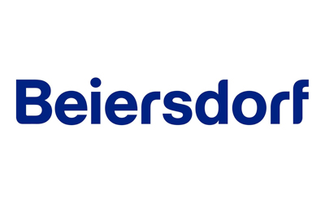

### Beiersdorf

### Beiersdorf

Family Promise and Beiersdorf have partnered to ensure that families remain healthy, safe, and housed. During the COVID-19 pandemic, the families we serve needed the support of the community more than ever. Beiersdorf's support ensures we are there whenever families need us.

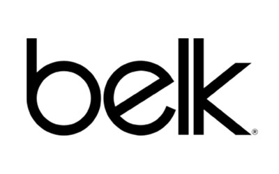

### Belk

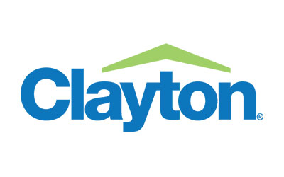

### Clayton

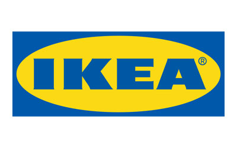

### IKEA

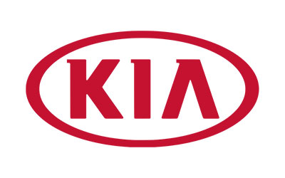

### KIA Motors USA

### KIA Motors USA

[KIA Motors USA](https://www.kia.com/us/en) and Family Promise work together as part of KIA's initiative to provide support for youth experiencing homelessness across the United States.

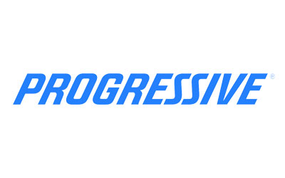

### Progressive

### Progressive

Progressive is working with Family Promise to ensure that the families we serve find stable housing where they can feel at home. Through multiple initiatives like Night Without a Bed and Home is Where the Art is, Progressive is ensuring families have successful and happy futures.

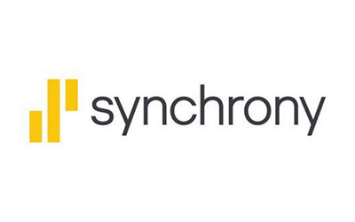

### Synchrony

### Synchrony

[Synchrony](https://www.mysynchrony.com/) has partnered with Family Promise to launch a new $1.2 million shelter diversion initiative aimed to help families combat homelessness. Shelter diversion helps end homelessness by prioritizing housing-based intervention, preserving community resources for those who need it most, and preventing the stress and trauma of shelter where other options exist.

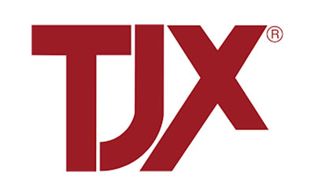

### TJX

### TJX

[TJX](https://www.tjx.com/) has supported a variety of Family Promise initiatives, including as a key fundraising partner for our COVID-19 Pandemic Relief efforts,which included helping to ensure that Family Promise Affiliates across the United States had what they needed to provide safe shelter, prevention, and stabilization services to low-income families and children.

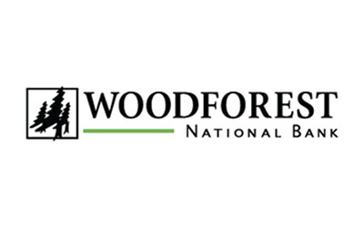

### Woodforest National Bank

CORPORATE PARTNERS
------------------

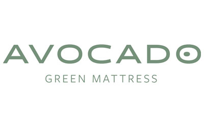

### Avocado Green Mattress

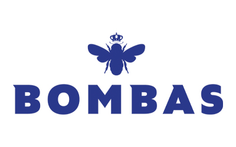

### Avocado Green Mattress

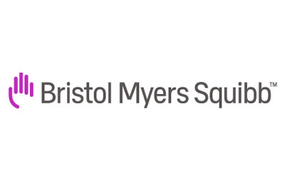

### Bristol Myers Squibb

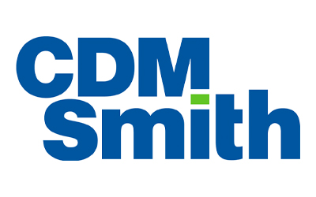

### Bristol Myers Squibb

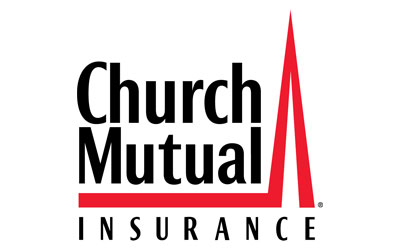

### Church Mutual

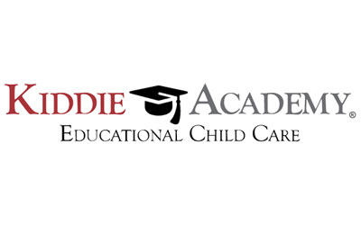

### Kiddie Academy

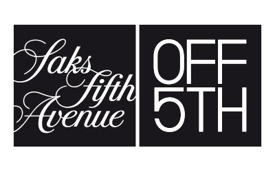

### eSalon

CORPORATE SUPPORTERS
--------------------

20 Gates Management

American Airlines – Professional Women in Aviation

Ashley HomeStore

Blue Sky Real Estate

Bigger Pockets, Inc.

Capital One Bank

Cabot Creamery

Capgemini

eSalon

Forever 21

Harp Design Co.

JPMorgan Chase & Co.

Lyft

Mattress Firm

Moe’s Southwest Grill

Monkey Bunks

Motel 6

Peerless Beverage Company

R. Seelaus & Co., Inc.

NONPROFIT PARTNERS
------------------

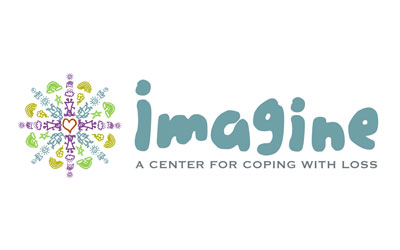

### Imagine: A Center for Coping with Loss

### Imagine: A Center for Coping with Loss

Homelessness brings a profound sense of loss and, with it, comes trauma and grief. Recognizing that, our Union County program partnered with Imagine, A Center for Coping with Loss, to develop a “Living With Loss: Healing From Homelessness” workshop to help guests work through that trauma and train volunteers to facilitate the process. The curriculum promotes empathetic learning about the trauma we all experience throughout our journeys, which can lead us to deeper human connections.

The innovative workshop was profiled in the [New York Times](https://www.nytimes.com/2017/12/03/nyregion/dealing-with-the-grief-that-accompanies-homelessness.html?fbclid=IwAR2n_aqqilm_8EgZ3y7Jdu2t7p3u2ppP15fBSztKZrx7vHpPa7SisvslmSc).

The partnership is now being rolled out to Affiliates and their communities nationwide.

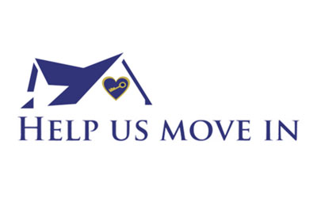

### Help Us Move In

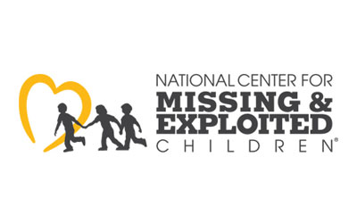

### The National Center for Missing & Exploited Children

### The National Center for Missing & Exploited Children

The mission of the National Center for Missing & Exploited Children is to help find missing children, reduce child sexual exploitation, and prevent child victimization. Since 1984, NCMEC has served as the national clearinghouse and resource center for families, victims, private organizations, law enforcement and the public on issues relating to missing and sexually exploited children.

Family Promise is proud to partner with NCMEC to provide families experiencing homelessness and the professionals who serve them with information and access to reporting mechanisms, training to help identify missing and/or exploited children, and prevention education resources. This includes:

-   Training for Family Promise employees and volunteers to ensure they have access to information and are able to identify missing and/or exploited children who may be in their care;
-   Access to the NCMEC registry for intake;
-   Co-branded child IDs for distribution to families;
-   Select child safety resources to Family Promise for distribution to employees.

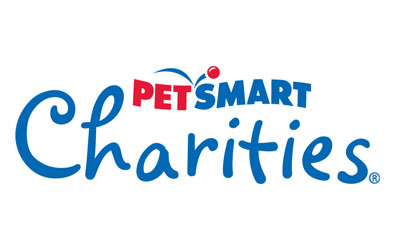

### PetSmart Charities

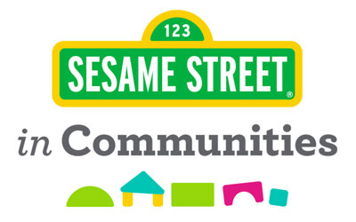

### Sesame Street in Communities

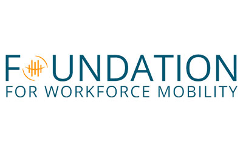

### The Worldwide ERC Foundation for Workforce Mobility

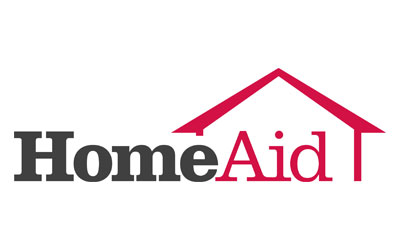

### HomeAid

### HomeAid

HomeAid is a leading national nonprofit provider of housing for families and individuals experiencing homelessness. Through their 17 chapters in 12 states, HomeAid has completed more than 450 housing projects at a value of more than $210 million. More than 250,000 people have been provided shelter over the past 27 years.

Family Promise and HomeAid share a mission of transforming the lives of families experiencing homelessness through community outreach. Our partnership allows Family Promise Affiliates nationwide to be considered for HomeAid building projects in communities where the two organizations share a presence as well as create opportunities to explore expansion in new markets. It gives our Affiliates a greater ability to connect with local builders to create housing solutions for their families.

Family Promise and HomeAid have worked together on projects in markets nationwide. Current and future projects include new and renovated Day Centers, transitional and permanent housing facilities, and joint efforts to raise funds and procure materials.

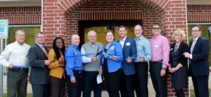

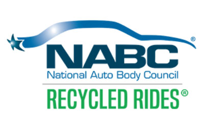

### NABC Recycled Rides

### NABC Recycled Rides

NABC Recycled Rides™ is a nationwide community service project of the National Auto Body Council in which insurers, collision repairers, paint suppliers, and others collaborate to repair and donate vehicles to Family Promise guest families and Affiliates, as well as other deserving service organizations.

In the Recycled Rides program, insurance companies donate the vehicles, parts, and paint, manufacturers donate the materials, and local auto body shops donate the labor. By facilitating connections between auto body shops and our Affiliates, Family Promise will help ensure that vehicles go to deserving families.

This organization has been an incredible partner for Affiliates, providing nearly 250 vehicles over the past few years for families in our programs.

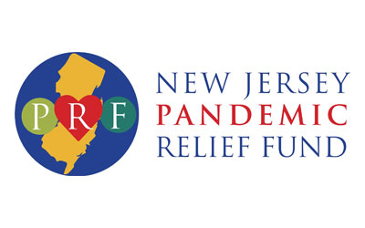

### New Jersey Pandemic Relief Fund

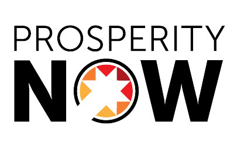

### Prosperity Now

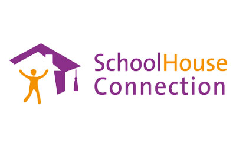

### Schoolhouse Connection

### Schoolhouse Connection

SchoolHouse Connection (SHC) is a national organization promoting success for children and youth experiencing homelessness, from birth through higher education. SHC engages in strategic advocacy and provides technical assistance in partnership with early care and education professionals (including school district homeless liaisons and state coordinators), young people, service providers, advocates, and local communities.

SchoolHouse Connection helps Affiliates connect with school McKinney-Vento liaisons, advises on federal and state policy affecting homeless children, and provides scholarships and leadership opportunities for youth.

They are an Affiliate resource for:

-   Questions about the law (compliance, policy, practice) regarding early childhood, pre-K and higher education;
-   Assistance in connecting to local school districts and state departments of education;
-   Reporting on challenges and successes with local policy implementation of federal laws and funding.

### Make A DOnation

Your gift to Family Promise helps us prevent and end family homelessness in over 200 communities across the U.S.

-   First Name

-   Last Name

-   Amount

-   Phone

    This field is for validation purposes and should be left unchanged.

### JOIN THE LIST

Join our mailing list to keep up with all things Family Promise from family stories to events and more!

-   First Name\*

-   Last Name\*

-   Email Address\*

-   Comments

    This field is for validation purposes and should be left unchanged.

-   <a href="https://facebook.com/FamilyPromise" class="icon">Facebook</a>
-   <a href="https://twitter.com/fpnational" class="icon">Twitter</a>
-   <a href="https://www.instagram.com/family.promise" class="icon">Instagram</a>

Our mission is to help families experiencing homelessness and low-income families achieve sustainable independence through a community-based response.

-   [Who We Are](../index.html)
-   [What We Do](../../what-we-do/index.html)
-   [Latest](../../latest/index.html)
-   [Get Involved](../../get-involved/index.html)
-   [Donate](../../donate/index.html)
-   [Events](../../events/index.html)
-   [Store](http://family-promise-store.myshopify.com/)
-   [Need Help?](../../get-help/index.html)
-   [Press](../../press/index.html)
-   [Infographics](../../press/infographics/index.html)
-   [Contact](../../contact/index.html)

© 2004 - 2020 Family Promise.  All Rights Reserved.  501(c)3 Nonprofit.  [EIN: 52-1591461](../../financials/index.html)

[Privacy Policies](../../privacy-policy/index.html)      [Terms of Use](../../terms-of-use/index.html)

-   <a href="http://www.facebook.com/sharer.php?u=https%3A%2F%2Ffamilypromise.org%2Fwho-we-are%2Fpartners%2F&amp;t=Partners" class="et_social_share"><em></em> </a>
-   <a href="http://twitter.com/share?text=Partners&amp;url=https%3A%2F%2Ffamilypromise.org%2Fwho-we-are%2Fpartners%2F&amp;via=@fpnational" class="et_social_share"><em></em> </a>
-   <a href="http://www.linkedin.com/shareArticle?mini=true&amp;url=https%3A%2F%2Ffamilypromise.org%2Fwho-we-are%2Fpartners%2F&amp;title=Partners" class="et_social_share"><em></em> </a>
-   <a href="https://mail.google.com/mail/u/0/?view=cm&amp;fs=1&amp;su=Partners&amp;body=https%3A%2F%2Ffamilypromise.org%2Fwho-we-are%2Fpartners%2F&amp;ui=2&amp;tf=1" class="et_social_share"><em></em> </a>

Share This

-   <a href="http://www.facebook.com/sharer.php?u=https%3A%2F%2Ffamilypromise.org%2Fwho-we-are%2Fpartners%2F&amp;t=Partners" class="et_social_share"><em></em></a>
    Facebook

    
-   <a href="http://twitter.com/share?text=Partners&amp;url=https%3A%2F%2Ffamilypromise.org%2Fwho-we-are%2Fpartners%2F&amp;via=@fpnational" class="et_social_share"><em></em></a>
    Twitter

    
-   <a href="http://www.linkedin.com/shareArticle?mini=true&amp;url=https%3A%2F%2Ffamilypromise.org%2Fwho-we-are%2Fpartners%2F&amp;title=Partners" class="et_social_share"><em></em></a>
    LinkedIn

    
-   <a href="https://mail.google.com/mail/u/0/?view=cm&amp;fs=1&amp;su=Partners&amp;body=https%3A%2F%2Ffamilypromise.org%2Fwho-we-are%2Fpartners%2F&amp;ui=2&amp;tf=1" class="et_social_share"><em></em></a>
    Gmail

    
