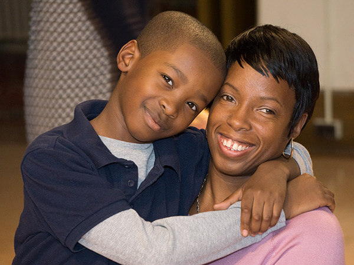
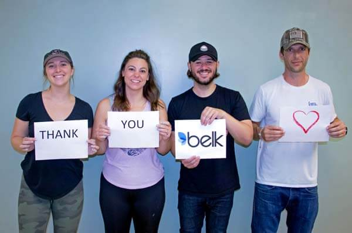
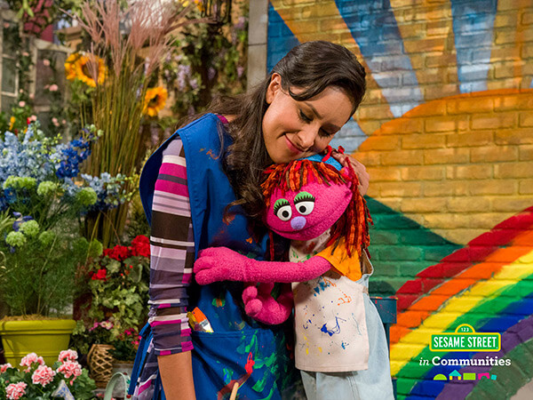
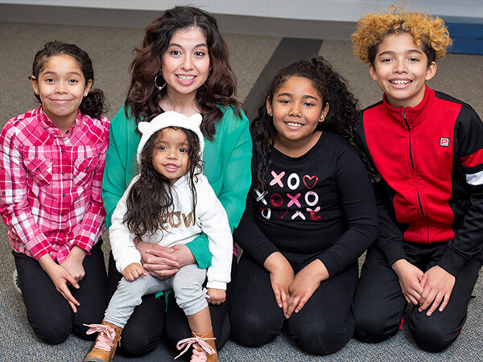
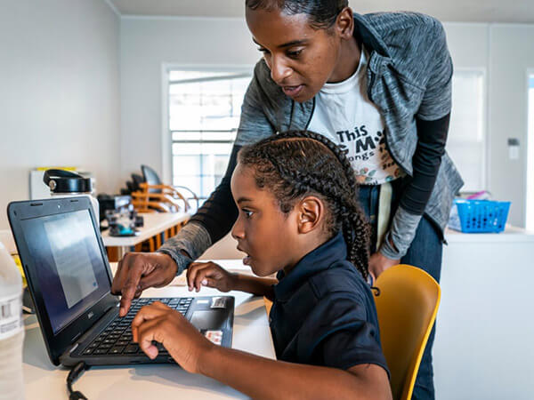
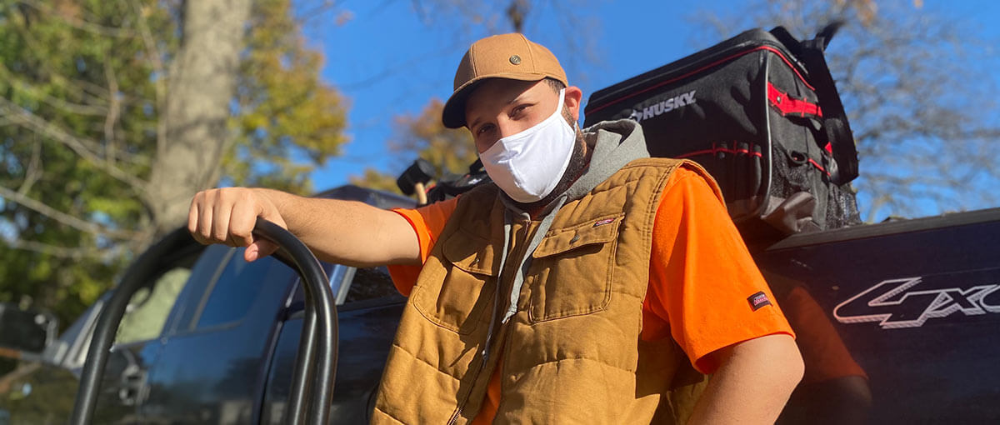

- <a href="https://facebook.com/FamilyPromise" class="icon">Facebook</a>
- <a href="https://twitter.com/fpnational" class="icon">Twitter</a>
- <a href="https://www.instagram.com/family.promise" class="icon">Instagram</a>

<!-- -->

- [Need Help?](../../get-help/index.html)
- [Become an Affiliate](../../what-we-do/affiliates/become-an-affiliate/index.html)
- [Affiliate Login](https://affiliates.familypromise.org/)
- [Events](../../events/index.html)
- [Press](../../press/index.html)
- [Contact](../../contact/index.html)

 

- [Who We Are](../index.html)
  - [Story](../story/index.html)
  - [Purpose](index.html)
  - [Team](../team/index.html)
  - [Board](../board/index.html)
  - [Committees & Councils](../committees-councils/index.html)
  - [Partners](../partners/index.html)
- [What We Do](../../what-we-do/index.html)
  - [Programs & Services](../../what-we-do/programs-services/index.html)
  - [Affiliates](../../what-we-do/affiliates/index.html)
  - [FP Union County](../../what-we-do/fp-union-county/index.html)
  - [Reports & Financials](../../what-we-do/reports-financials/index.html)
- [Latest](../../latest/index.html)
- [Get Involved](../../get-involved/index.html)
  - [Volunteer](../../get-involved/volunteer/index.html)
  - [Become a Partner](../partners/index.html)
  - [Join the Promise Guild](../../donate/join-the-promise-guild/index.html)
  - [Create a Fundraiser](https://donate.familypromise.org/my-FP-Fundraiser)
  - [Houses for Change ®](../../get-involved/houses-for-change/index.html)
  - [Join Our Team](../../get-involved/employment/index.html)
- [Donate](../../donate/index.html)

Select Page 

# Purpose

<a href="../index.html" class="post post-page" title="Go to Who We Are.">Who We Are</a>

## OUR MISSION

Our mission is to help families experiencing homelessness and low-income families achieve sustainable independence through a community-based response.

### TACKLING THE PROBLEM OF POVERTY

Poverty is a complex problem. It won’t yield to a simple solution. It requires an integrated approach that reaches beyond immediate needs.

We initiate coordinated local efforts that bring communities together to help families experiencing homelessness regain their housing, their independence, and their dignity.

Every year in America, over 3 million children experience homelessness. These children are 8-9 times more likely to repeat a grade, 3 times more likely to be placed in special education programs, and 7 times more likely to attempt suicide. 42% will drop out of school at some point and 47% suffer from anxiety, depression, or withdrawal.

### PROVIDING A WAY TO HELP

Americans are a compassionate people. Enormous numbers of people would help their neighbors in need if they had a way to help. We bring people in need together with people who want to help. We provide the framework that turns compassion into action.

### EMPOWERING COMPASSIONATE INDIVIDUALS

The issue can seem overwhelming and individuals may feel powerless to change the lives of people in poverty. As Family Promise volunteers, more than 200,000 people have found a way.

Working together, they provide temporary housing, meals, and services to more than 125,000 family members annually. They mentor families at-risk of experiencing homelessness. They teach financial literacy. They help find jobs and affordable housing. They create programs to meet specific needs in their communities. And they advocate for public policies that alleviate poverty and promote the economic stability of low-income families.

“I never imagined we’d be in this situation, but Family Promise shattered my stereotype of how homelessness is treated. It’s a whole community of people who are there for you in any way you need, even after you get back on your feet.”

—Family Promise Graduate

## OUR VISION

Our vision is a nation in which every family has a home, a livelihood, and the chance to build a better future.

### STATEMENT ON EQUALITY AND NON-DISCRIMINATION

Family Promise serves families of all compositions. We welcome everyone in the community to be part of the solution to empower families experiencing homelessness and ultimately retain and regain the safety, security, and opportunity that comes with having a home.

### STATEMENT ON RACISM

It is impossible to separate systemic and structural racism from the reality that people of color, and Black people in particular, are disproportionately affected by homelessness and poverty. Family Promise is committed to being an anti-racist organization. We will educate and engage ourselves, our stakeholders, and the community to work towards overcoming racism, so that race no longer defines who has housing.

“That’s what’s so great about Family Promise – they give families more than shelter. They welcome them in and help them focus on healing and moving forward.”

—Family Promise VOLUNTEER

## OUR CORE VALUES 

Family Promise is committed to making sure everything we do is guided by our core values.

## HOSPITALITY

Family Promise is more than shelter—we are hospitality in action. Our 200,000 volunteers nationwide are companions to families, sharing meals, community connections, and compassion so families can focus on achieving their goals.

## EMPATHY

Family Promise provides highly individualized, person-centered, trauma-informed care. Empathy is at the center of all we do, and we take the time to understand all perspectives. This ensures we deliver excellent service to our guests and maintain a productive and enjoyable work environment.

## COMMUNITY

Family Promise builds bridges among neighbors, bringing together existing resources to fulfill our mission. The relationships between family members, volunteers, and staff are transformative and power a national movement of communities committed to solving the crisis of family homelessness.

## DYNAMIC

Family Promise is a dynamic organization, taking a holistic approach to ending family homelessness. Our services, advocacy, and leadership are nimble and future-focused, providing customized and evolving solutions.

## INNOVATIVE

Family Promise is innovative and entrepreneurial. Our 200+ Affiliates create original programs in response to local needs. These grassroots initiatives are replicated in communities of all shapes and sizes across the country.

## EMPOWERMENT

Family Promise empowers all stakeholders – family members, volunteers, donors, community members, businesses, and government officials – to effect change in their communities so families can achieve economic stability and children can access a brighter future.

“People need a support system. That’s what I noticed about Family Promise…They guide people to their financial freedom so they can be successful.”

—Elijah, Family Promise Graduate

### Make A DOnation

Your gift to Family Promise helps us prevent and end family homelessness in over 200 communities across the U.S.

- First Name

- Last Name

- Amount

- Phone

  This field is for validation purposes and should be left unchanged.

### JOIN THE LIST

Join our mailing list to keep up with all things Family Promise from family stories to events and more!

- First Name\*

- Last Name\*

- Email Address\*

- Comments

  This field is for validation purposes and should be left unchanged.

- <a href="https://facebook.com/FamilyPromise" class="icon">Facebook</a>
- <a href="https://twitter.com/fpnational" class="icon">Twitter</a>
- <a href="https://www.instagram.com/family.promise" class="icon">Instagram</a>

Our mission is to help families experiencing homelessness and low-income families achieve sustainable independence through a community-based response.

- [Who We Are](../index.html)
- [What We Do](../../what-we-do/index.html)
- [Latest](../../latest/index.html)
- [Get Involved](../../get-involved/index.html)
- [Donate](../../donate/index.html)
- [Events](../../events/index.html)
- [Store](http://family-promise-store.myshopify.com/)
- [Need Help?](../../get-help/index.html)
- [Press](../../press/index.html)
- [Infographics](../../press/infographics/index.html)
- [Contact](../../contact/index.html)

© 2004 - 2020 Family Promise.  All Rights Reserved.  501(c)3 Nonprofit.  [EIN: 52-1591461](../../financials/index.html)

[Privacy Policies](../../privacy-policy/index.html)      [Terms of Use](../../terms-of-use/index.html)

- <a href="http://www.facebook.com/sharer.php?u=https%3A%2F%2Ffamilypromise.org%2Fwho-we-are%2Fpurpose%2F&amp;t=Purpose" class="et_social_share"><em></em> </a>
- <a href="http://twitter.com/share?text=Purpose&amp;url=https%3A%2F%2Ffamilypromise.org%2Fwho-we-are%2Fpurpose%2F&amp;via=@fpnational" class="et_social_share"><em></em> </a>
- <a href="http://www.linkedin.com/shareArticle?mini=true&amp;url=https%3A%2F%2Ffamilypromise.org%2Fwho-we-are%2Fpurpose%2F&amp;title=Purpose" class="et_social_share"><em></em> </a>
- <a href="https://mail.google.com/mail/u/0/?view=cm&amp;fs=1&amp;su=Purpose&amp;body=https%3A%2F%2Ffamilypromise.org%2Fwho-we-are%2Fpurpose%2F&amp;ui=2&amp;tf=1" class="et_social_share"><em></em> </a>

Share This

- <a href="http://www.facebook.com/sharer.php?u=https%3A%2F%2Ffamilypromise.org%2Fwho-we-are%2Fpurpose%2F&amp;t=Purpose" class="et_social_share"><em></em></a>
  Facebook

  

- <a href="http://twitter.com/share?text=Purpose&amp;url=https%3A%2F%2Ffamilypromise.org%2Fwho-we-are%2Fpurpose%2F&amp;via=@fpnational" class="et_social_share"><em></em></a>
  Twitter

  

- <a href="http://www.linkedin.com/shareArticle?mini=true&amp;url=https%3A%2F%2Ffamilypromise.org%2Fwho-we-are%2Fpurpose%2F&amp;title=Purpose" class="et_social_share"><em></em></a>
  LinkedIn

  

- <a href="https://mail.google.com/mail/u/0/?view=cm&amp;fs=1&amp;su=Purpose&amp;body=https%3A%2F%2Ffamilypromise.org%2Fwho-we-are%2Fpurpose%2F&amp;ui=2&amp;tf=1" class="et_social_share"><em></em></a>
  Gmail

  
