- <a href="https://facebook.com/FamilyPromise" class="icon">Facebook</a>
- <a href="https://twitter.com/fpnational" class="icon">Twitter</a>
- <a href="https://www.instagram.com/family.promise" class="icon">Instagram</a>

<!-- -->

- [Need Help?](../../get-help/index.html)
- [Become an Affiliate](../../what-we-do/affiliates/become-an-affiliate/index.html)
- [Affiliate Login](https://affiliates.familypromise.org/)
- [Events](../../events/index.html)
- [Press](../../press/index.html)
- [Contact](../../contact/index.html)

 

- [Who We Are](../index.html)
  - [Story](index.html)
  - [Purpose](../purpose/index.html)
  - [Team](../team/index.html)
  - [Board](../board/index.html)
  - [Committees & Councils](../committees-councils/index.html)
  - [Partners](../partners/index.html)
- [What We Do](../../what-we-do/index.html)
  - [Programs & Services](../../what-we-do/programs-services/index.html)
  - [Affiliates](../../what-we-do/affiliates/index.html)
  - [FP Union County](../../what-we-do/fp-union-county/index.html)
  - [Reports & Financials](../../what-we-do/reports-financials/index.html)
- [Latest](../../latest/index.html)
- [Get Involved](../../get-involved/index.html)
  - [Volunteer](../../get-involved/volunteer/index.html)
  - [Become a Partner](../partners/index.html)
  - [Join the Promise Guild](../../donate/join-the-promise-guild/index.html)
  - [Create a Fundraiser](https://donate.familypromise.org/my-FP-Fundraiser)
  - [Houses for Change ®](../../get-involved/houses-for-change/index.html)
  - [Join Our Team](../../get-involved/employment/index.html)
- [Donate](../../donate/index.html)

Select Page 

# Story

<a href="../index.html" class="post post-page" title="Go to Who We Are.">Who We Are</a>

## A simple act of compassion set in motion a national movement to end family homelessness.

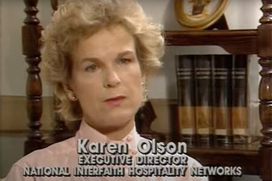

### The Beginning

Karen Olson was rushing to a business meeting when she passed a woman experiencing homelessness on the street. On impulse, Karen bought her a sandwich.The woman, Millie, accepted the sandwich but asked for something more — a chance to be heard. Karen stayed with Millie and listened. What she heard made her understand that homelessness brought profound feelings of diminished self-worth and disconnection from society. Soon after, Karen and her two sons began delivering lunches to people experiencing homelessness on the streets of New York.

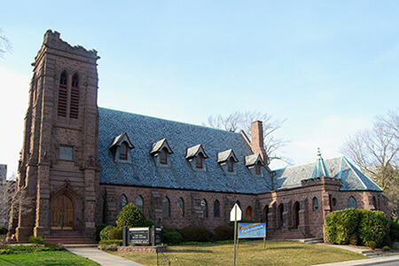

### 1986: The First Network

When Karen learned that homelessness was affecting families right in her own community in New Jersey, she knew she had to do something. But this was much more than giving sandwiches. She brought together people in need and people who wanted to help. Existing community resources could provide shelter, meals, and housing. Volunteers could use their skills, knowledge, and compassion to help their neighbors experiencing homelessness find employment, reconnect with society, and restore their dignity.

She approached the religious community. Congregations offered hospitality space within their buildings. The YMCA provided showers and a family Day Center. A car dealer discounted a van. The first Interfaith Hospitality Network opened on October 27, 1986.

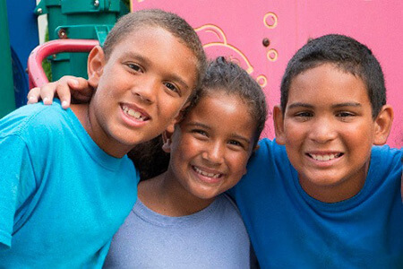

### 1988: The Network Goes National

As word spread, more New Jersey congregations formed a second network. Other congregations were inspired to develop similar programs. In 1988, we formed the National Interfaith Hospitality Network to bring the program nationwide. In addition to shelter, meals, housing, and job-seeking support, our Affiliates began developing programs for transitional housing, childcare, and homelessness prevention. Nationally, we added programs like Just Neighbors and Family Mentoring.

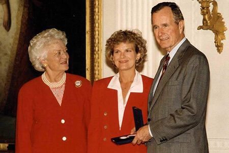

### 1992: Point of Light

Family Promise was awarded one of 21 Points of Light, out of a field of more than 4,500 nominees, by President and Barbara Bush, signifying Family Promise as one of the top volunteer agencies in the country. The award recognizes how one neighbor can help another, and calls upon the nation to take action in service to our fellow citizens.

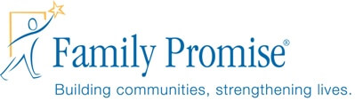

### 2003: We Become Family Promise

We changed our name, from the National Interfaith Hospitality Network to Family Promise, to reflect our broad range of programs and our vision of ending family homelessness. The name refers to the promise, in the sense of commitment, which communities make to families in need. But it also refers to the promise, the potential, inherent in every family.

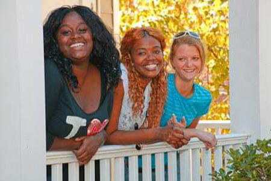

### 2004: 100th Affiliate

Family Promise’s 100th Affiliate opened in Athens, GA, as rapid expansion continued. Family Promise Affiliates, whether in metropolitan hubs, sprawling suburbs, college towns, or rural counties dotted with cornfields and forests, reflect their local communities, providing innovative solutions tailored to specific needs.

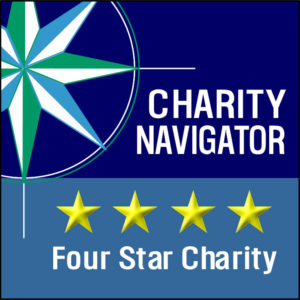

### 2013: 4-star Charity Navigator Rating

Family Promise received the first in its current run of eight consecutive 4-star ratings, demonstrating its commitment to effective governance, careful use of resources, and transparency. Despite a relatively small budget, Family Promise is able to parlay those assets and the commitment of its volunteers into the leading national response to family homelessness.

We also took time in 2013 to celebrate 25 years of changing lives and creating community.

### 2016: 200th Affiliate

Family Promise of Shenandoah County, VA, (FPSC) opened its doors as the 200th Affiliate. Nestled in the mountains of northwest Virginia with several small farming towns, FPSC demonstrated that homelessness is a national issue but a highly local problem. This milestone marked a highly regionalized approach taken by the national organization, ensuring the dissemination of best practices and the continued evolution of the model.

Also in 2016, Founder and President Karen Olson announced her retirement and Claas Ehlers, Director of Affiliate Services, was named as only the second leader in the organization’s history. “I have truly been privileged to spend the past three decades working with so many dedicated, talented and compassionate people to help families across the country realize their true potential and fulfill their promise,” said Olson. “I am thrilled to be turning over the presidency of our organization to Claas Ehlers. He has been with Family Promise for 14 years and his knowledge, commitment and strategic vision make him the ideal choice to lead us into the future.”

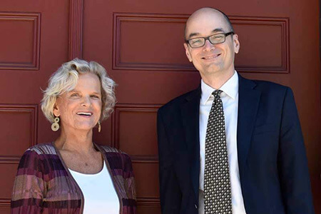

### 2017: C-level Leadership

Family Promise President Claas Ehlers was named Chief Executive Officer as a reflection of the growth and national scope of the organization. Family Promise Board Chair Angela Schroeder spoke to the change: “Claas’s hard work and dedication has been absolutely transformative, as Family Promise has grown rapidly under his stewardship as a national brand, adding corporate and nonprofit partnerships and creating impactful initiatives that place us at the forefront of the fight against family homelessness nationwide.”

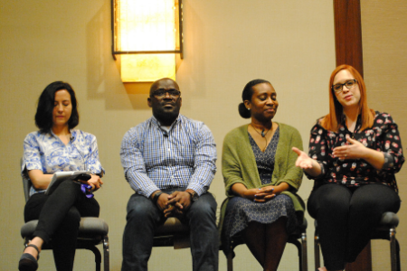

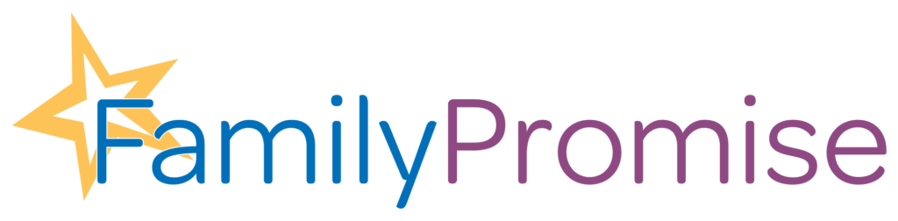

### 2018: Continuing to Grow National Leadership Role and a Brand Refresh

The national conference in 2018 exemplified both Family Promise’s national significance and its responsive governance model. HUD Secretary Ben Carson engaged with representatives from the Guest Advisory Council (GAC) in a challenging and dynamic exchange on the definition of homelessness and HUD’s response to the issue. The GAC, formed in 2016, is an advisory body made of graduates from Affiliate programs and guides the actions of Family Promise’s national leadership.

We also introduced a cleaner, more modern logo, in line with a two-year brand refresh. We retained the iconic star from our old logo.

We recognize the star as the logo’s most important element and a visual touchstone to our organization’s history. The five points of the star represent the five key elements of Family Promise: shelter, prevention, stabilization, community, and promise.

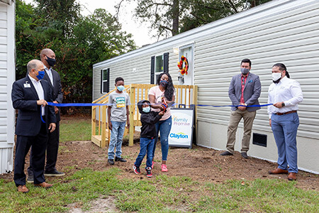

### 2019: A Bold Step into the Future

With the issue of family homelessness remaining at crisis levels, Family Promise engaged in a strategic plan to change the future for 1,000,000 children by 2030.

As part of the plan, we committed ourselves to developing more resources and partnerships and set a focus on expanding the capability and capacity of Affiliates. The number of Affiliates serving more than 500 people a year has more than quadrupled over the past decade and the national network is serving more than 125,000 people a year and engaging 200,000 volunteers nationwide.

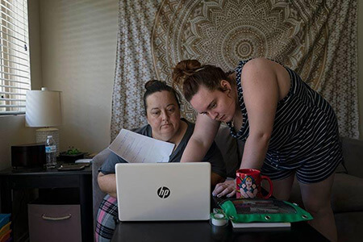

### 2020: COVID-19 Pandemic Sparks Innovation & Growth

In 2020, the entire world was faced with challenges when COVID-19 began spreading rapidly throughout communities. While entire populations quarantined in their homes, it became clear that stable housing was a key component to staying healthy and safe. Family Promise immediately launched a COVID-19 Emergency Relief Campaign which raised funds that allowed the organization to support Affiliates in ensuring their shelter models were prepared for new public health measures. We also greatly increased our prevention and diversion efforts, to ensure that any time we could keep a family safe at home, our Affiliates were prepared to help. Affiliates around the country found innovative ways to serve the many families being impacted by job loss, child care changes, and health crises. Many of these solutions became parts of our programs that will long outlive the pandemic.

During this time, Family Promise also became a go to resource for information on the eviction moratorium, COVID-19 Economic Relief Policies, and the experiences of families across the U.S. We were featured in the media speaking about this issue, including in the New York Times, in The Washington Post, on the TODAY Show, on CNN’s website, and more. [A photo essay in The Guardian](https://www.theguardian.com/us-news/2021/feb/17/california-families-homelessness-pandemic) that followed two families served by Family Promise Affiliates in CA, earned particular attention.

### Make A DOnation

Your gift to Family Promise helps us prevent and end family homelessness in over 200 communities across the U.S.

- First Name

- Last Name

- Amount

- Comments

  This field is for validation purposes and should be left unchanged.

### JOIN THE LIST

Join our mailing list to keep up with all things Family Promise from family stories to events and more!

- First Name\*

- Last Name\*

- Email Address\*

- Name

  This field is for validation purposes and should be left unchanged.

- <a href="https://facebook.com/FamilyPromise" class="icon">Facebook</a>
- <a href="https://twitter.com/fpnational" class="icon">Twitter</a>
- <a href="https://www.instagram.com/family.promise" class="icon">Instagram</a>

Our mission is to help families experiencing homelessness and low-income families achieve sustainable independence through a community-based response.

- [Who We Are](../index.html)
- [What We Do](../../what-we-do/index.html)
- [Latest](../../latest/index.html)
- [Get Involved](../../get-involved/index.html)
- [Donate](../../donate/index.html)
- [Events](../../events/index.html)
- [Store](http://family-promise-store.myshopify.com/)
- [Need Help?](../../get-help/index.html)
- [Press](../../press/index.html)
- [Infographics](../../press/infographics/index.html)
- [Contact](../../contact/index.html)

© 2004 - 2020 Family Promise.  All Rights Reserved.  501(c)3 Nonprofit.  [EIN: 52-1591461](../../financials/index.html)

[Privacy Policies](../../privacy-policy/index.html)      [Terms of Use](../../terms-of-use/index.html)

- <a href="http://www.facebook.com/sharer.php?u=https%3A%2F%2Ffamilypromise.org%2Fwho-we-are%2Fstory%2F&amp;t=Story" class="et_social_share"><em></em> </a>
- <a href="http://twitter.com/share?text=Story&amp;url=https%3A%2F%2Ffamilypromise.org%2Fwho-we-are%2Fstory%2F&amp;via=@fpnational" class="et_social_share"><em></em> </a>
- <a href="http://www.linkedin.com/shareArticle?mini=true&amp;url=https%3A%2F%2Ffamilypromise.org%2Fwho-we-are%2Fstory%2F&amp;title=Story" class="et_social_share"><em></em> </a>
- <a href="https://mail.google.com/mail/u/0/?view=cm&amp;fs=1&amp;su=Story&amp;body=https%3A%2F%2Ffamilypromise.org%2Fwho-we-are%2Fstory%2F&amp;ui=2&amp;tf=1" class="et_social_share"><em></em> </a>

Share This

- <a href="http://www.facebook.com/sharer.php?u=https%3A%2F%2Ffamilypromise.org%2Fwho-we-are%2Fstory%2F&amp;t=Story" class="et_social_share"><em></em></a>
  Facebook

  

- <a href="http://twitter.com/share?text=Story&amp;url=https%3A%2F%2Ffamilypromise.org%2Fwho-we-are%2Fstory%2F&amp;via=@fpnational" class="et_social_share"><em></em></a>
  Twitter

  

- <a href="http://www.linkedin.com/shareArticle?mini=true&amp;url=https%3A%2F%2Ffamilypromise.org%2Fwho-we-are%2Fstory%2F&amp;title=Story" class="et_social_share"><em></em></a>
  LinkedIn

  

- <a href="https://mail.google.com/mail/u/0/?view=cm&amp;fs=1&amp;su=Story&amp;body=https%3A%2F%2Ffamilypromise.org%2Fwho-we-are%2Fstory%2F&amp;ui=2&amp;tf=1" class="et_social_share"><em></em></a>
  Gmail

  
