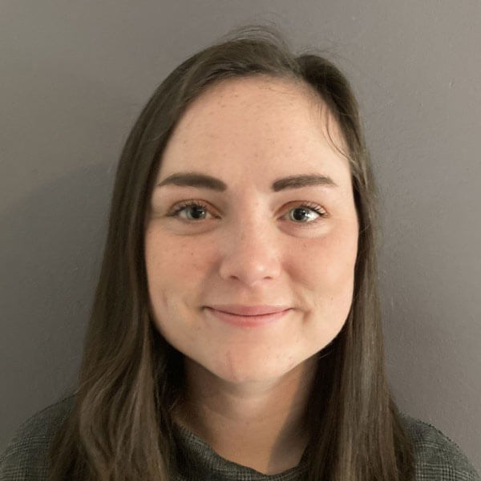
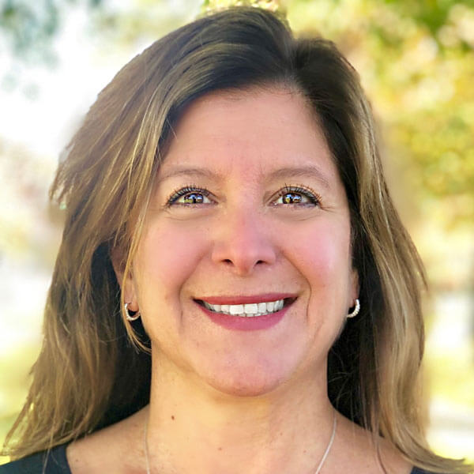
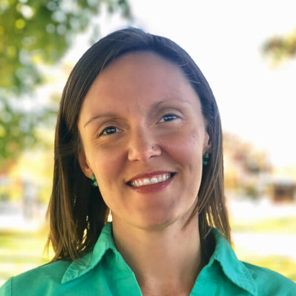
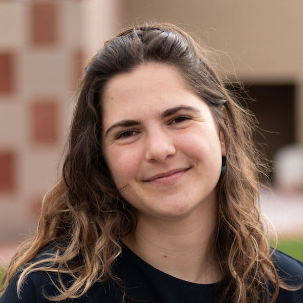
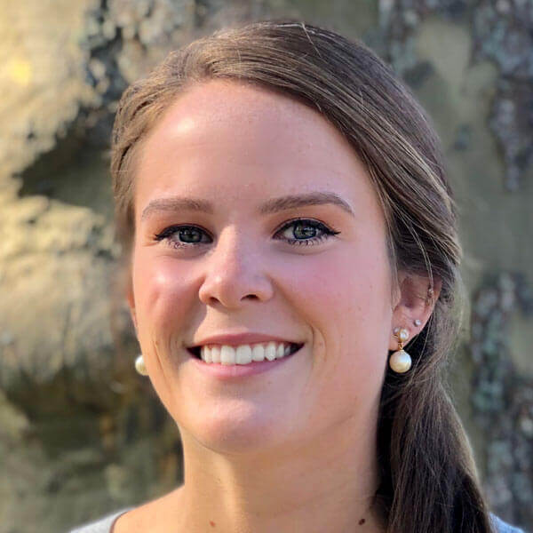
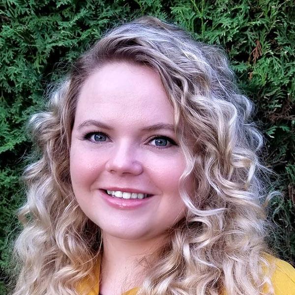
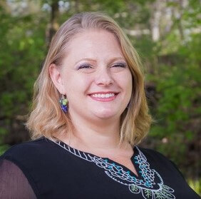
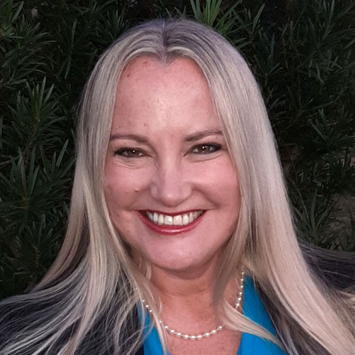

-   <a href="https://facebook.com/FamilyPromise" class="icon">Facebook</a>
-   <a href="https://twitter.com/fpnational" class="icon">Twitter</a>
-   <a href="https://www.instagram.com/family.promise" class="icon">Instagram</a>

<!-- -->

-   [Need Help?](../../get-help/index.html)
-   [Become an Affiliate](../../what-we-do/affiliates/become-an-affiliate/index.html)
-   [Affiliate Login](https://affiliates.familypromise.org/)
-   [Events](../../events/index.html)
-   [Press](../../press/index.html)
-   [Contact](../../contact/index.html)

 

-   [Who We Are](../index.html)
    -   [Story](../story/index.html)
    -   [Purpose](../purpose/index.html)
    -   [Team](index.html)
    -   [Board](../board/index.html)
    -   [Committees & Councils](../committees-councils/index.html)
    -   [Partners](../partners/index.html)
-   [What We Do](../../what-we-do/index.html)
    -   [Programs & Services](../../what-we-do/programs-services/index.html)
    -   [Affiliates](../../what-we-do/affiliates/index.html)
    -   [FP Union County](../../what-we-do/fp-union-county/index.html)
    -   [Reports & Financials](../../what-we-do/reports-financials/index.html)
-   [Latest](../../latest/index.html)
-   [Get Involved](../../get-involved/index.html)
    -   [Volunteer](../../get-involved/volunteer/index.html)
    -   [Become a Partner](../partners/index.html)
    -   [Join the Promise Guild](../../donate/join-the-promise-guild/index.html)
    -   [Create a Fundraiser](https://donate.familypromise.org/my-FP-Fundraiser)
    -   [Houses for Change ®](../../get-involved/houses-for-change/index.html)
    -   [Join Our Team](../../get-involved/employment/index.html)
-   [Donate](../../donate/index.html)

Select Page 

Team
====

<a href="../index.html" class="post post-page" title="Go to Who We Are.">Who We Are</a>

<a href="index.html" class="active">Team</a> [Board](../board/index.html) [Committees & Councils](../committees-councils/index.html)

STAFF
-----

Our dynamic team is passionate about solving the issue of family homelessness. We offer expertise in non-profit best practices, technical assistance, program development, fundraising, and communications so our Affiliates can empower families into sustainable independence. Our flagship program in Union County serves as an incubator of innovation. Raising awareness of the issue and elevating voices of families with lived experience are goals in all we do.  
For general information, please call our main number at (908) 273-1100 or email us at info@familypromise.org. All staff extensions listed below are for our main number.

### Jeanna Beck

Regional Director (South)

### Jeanna Beck

Regional Director (South)

Jeanna Beck is a nonprofit professional who has worked in various fields over the years including mental health, juvenile probation and reunification, higher education, and health and human services. Jeanna studied Psychology at Maryville College and earned her Master of Business Administration degree, which she pursued for the purpose of working for a nonprofit.

Jeanna works with the Affiliate Services team, serving as the Regional Director for the South. She works with developing and operational Affiliates providing guidance, resources, and technical support. Jeanna finds inspiration in working with so many amazing volunteers, staff, and board members who work tirelessly to help children and their families.

Jeanna currently resides in Knoxville, TN, where she spends much of her free time hiking and trail running in the Great Smoky Mountains or surrounding areas during the fall and winter, and stand up paddleboarding during the summer. Jeanna is a tiny house aficionado, staying in them whenever possible during her travels.  
Contact Information

(317) 318-3646

### Maggie Bernhard

Affiliate Services Manager

### Maggie Bernhard

Affiliate Services Manager

Maggie Bernhard is a proud Mule, having studied History and Media & Communication at Muhlenberg College in Allentown, PA. She has stayed involved in the college community beyond her four years and currently serves on the school’s Alumni Board and Young Alumni Council. Maggie earned her Master of Public Administration, with a concentration in Non-Profit Management, from Rutgers-Newark. Prior to her work at Family Promise, Maggie worked in Volunteer Management at Jersey Cares and then New York Cares, both part of the Points of Light Network. At these organizations, Maggie worked to engage corporate and civic groups in volunteer service and train new volunteer leaders. Working with volunteers showed her the impact that one person can make in their community whether painting a room, tutoring a child, or serving a meal.

At Family Promise, Maggie serves as Affiliate Services Manager, which means that she sends lots of emails. Joking aside, Maggie ensures that all [200 Affiliates](../../what-we-do/affiliates/locations/index.html) are engaged and involved with partnerships and resources that National offers. Some of the programs that she manages are Partners in Housing (Manufactured Housing), Pathways to Workplace Success (Workforce Development Videos), Keys to Good Tenancy, and Family Mentoring. She also works with Affiliates to ensure they have the resources and support to meet all standards of Affiliation, such as completing the Annual Census.

In her spare time, you can find Maggie making nerdy crafts, baking cookies, learning about retro video games from her husband, and listening to True Crime podcasts.

ext. 113

### Melissa Biggar

Director of Impact Giving and Communications

### Melissa Biggar

Director of Impact Giving and Communications

Melissa Biggar’s childhood shyness compelled her to hone her writing skills, but once she came out of her shell her family couldn’t shut her up. The result: more than 20 years of communications and client relations experience in both the corporate and nonprofit sectors. With professional interests as eclectic as her iPhone playlist, she has worked in publishing, philanthropic foundations, higher education, and the financial industry. Melissa studied English literature and creative writing at Dickinson College and has participated in several writers’ workshops, including the prestigious Bread Loaf Writers’ Conference in rural Middlebury, VT, where the first chapter to her still-not-published (or written, for that matter) novel was born and where she spent a week without access to a hairdryer, both profound experiences in her adult life.

As Director of Impact Giving and Communications at Family Promise, Melissa does more than count money like a veteran bank teller. She works with a dedicated and talented development and communications team to raise awareness of the crisis of family homelessness and support for families rebuilding their lives. She manages multiple fundraising campaigns, giving societies, and donor communications throughout the year, including Family Promise’s annual appeal and its quarterly newsletter. Her passion for developing innovative, creative, and effective content and her fervent belief in the power of storytelling inform her work, and she [helps Family Promise graduates share their journeys](../../latest/category/voices-of-family-promise/index.html) to demonstrate the transformative and far-reaching impact the organization has on families’ lives while in the program and after.

Melissa was born in New York City, which probably explains her insatiable attraction to The Big Apple, and grew up in New Jersey defying convention by attending only one Bruce Springsteen concert and knowing how to pump her own gas. Most of her writing now involves dollars and sense, but the Great American Novel is hidden somewhere deep inside her waiting for the right time to surface. Melissa loves to travel and has never met a plane ticket she didn’t like. She calls New Jersey home, along with her Puerto Rican rescue dog (who doesn’t speak Spanish or English) and her two American kids (who both speak English but prefer to text).

ext. 121

### Corina Borg

Donor Engagement Manager

### Corina Borg

Donor Engagement Manager

After graduating from Pepperdine University Corina Borg moved to NYC to start her career. She spent 14 years honing her design skills as a buyer for Ralph Lauren in New York City before deciding to focus on her family. She volunteers for local nonprofit organizations in her hometown of Summit, NJ, and has served on the boards of the Area Baby Center and the school district’s Parent Teacher Organization. Corina and her family also volunteer at Family Promise shelter sites, serving meals and offering support to families in the program. Her dedication to Family Promise’s mission compelled her to find a way to do even more for families in need.

As Donor Engagement Manager, Corina plans [events that raise awareness of the issue of family homelessness and garner support for families facing a housing crisis](../../events/index.html). She brings her creative design talents, attention to detail, and organizational skills to the task of conceiving, planning, and hosting all of Family Promise’s events, from jacket-and-tie-required galas, art gallery receptions, and theme parties, to bring-the-kids family fun days, staff outings, and more. As she likes to say, “Life’s a party!” Of course, there’s more to Corina’s work than meets the eye – she’s responsible for the fundraising component of every benefit she runs, and she works closely with major donors and high-level corporate sponsors to help secure funds for families facing homelessness. Some of her events have raised record amounts for the organization. All of her events are the ticket to have.

When she’s not working, Family Promise’s hostess with the mostest can be found spending time with her husband Josh, daughters Abbie and Campbell, and three rescue dogs (because two isn’t enough) Coco, Molly, and Wyatt (All three dogs started out as foster pets, so Josh put a temporary stop to the fostering animals thing.) Corina was born in Mexico City and moved to the United States as a child, but she still speaks Spanish when she doesn’t want her husband or children to know what she’s saying.

ext. 114

### Claire Boylan

Rental Assistance Coordinator, Family Promise Union County

### Claire Boylan

Rental Assistance Coordinator, Family Promise Union County

Claire Boylan graduated from Ursinus College in 2017 with a degree in Psychology and a minor in Education. After college, she worked at the MENTOR Network in Philadelphia where she implemented behavioral interventions for youth with disabilities. More recently, Claire has volunteered with the Catholic Charities of the Archdiocese of Newark, teaching English as a Second Language (ESL) courses.

Claire Boylan serves as the Rental Assistance Coordinator. She works with low-income households in Union County to alleviate financial pressures and to determine eligibility for emergency rental assistance. The position is supported by a grant from the Community Development Block Grant CARES Act program.

In her free time, Claire volunteers at Grace’s Kitchen in Summit, NJ, coordinating the preparation and distribution of food and supplies to local families impacted by the COVID-19 pandemic. She also enjoys drawing, running, and playing with her dog, Luna.

908-289-7300, ext. 204

### Cara Bradshaw

Chief Impact Officer

### Cara Bradshaw

Chief Impact Officer

Cara Bradshaw is a communications and fundraising professional who has worked on communications and fundraising teams at international humanitarian organizations, in higher education, and in the media to promote social justice and community engagement. Cara studied Political Science and Spanish at Drew University in Madison, NJ, and International Affairs and Media at The New School in Manhattan.

She currently serves as Chief Impact Officer at Family Promise, a national non-profit that provides [community-based solutions to empower working families](../../what-we-do/programs-services/index.html). With a dedicated team at Family Promise, Cara works to elevate the Family Promise brand, engage stakeholders through powerful storytelling, and deliver long-lasting social change through meaningful philanthropy. Cara’s curiosity about good leadership and organizational development inspires her work.

An outdoor enthusiast, Cara lives in Brevard, NC, with her family and enjoys mountain biking and hiking with her dog, Blu.

ext. 116

### Ben Bromberg

Systems Architect

### Ben Bromberg

Systems Architect

Ben Bromberg has been supporting nonprofits with technology and data operations for nearly a decade.

As Systems Architect, Ben manages technology systems and training for Family Promise’s national office, working to ensure staff are equipped with the right tools and processes they need to do their jobs effectively. Prior to joining the team at Family Promise, Ben has worked alongside brilliant teams of doers to build technology solutions supporting missions to provide quality education, clean water access, and arts programming, among others. Ben is a 2018 Uptake.org Data Security Fellow and has presented at Dreamforce, Good Tech Fest, and the Non-Profit Technology Conference (NTC).

Ben lives in Brooklyn, NY, with his fiancee and two dogs.

ext. 127

### Shari Competiello

Chief of Staff

### Shari Competiello

Chief of Staff

Shari Competiello joined Family Promise in February 2016, drawn to Family Promise’s common sense approach to addressing family homelessness. She received her law degree from Rutgers University School of Law-Newark and has an undergraduate degree in Business Administration. After working as a lawyer for several years, Shari was a stay at home parent and active volunteer in her local and Summit Public Schools community.

Shari’s current role at Family Promise is Chief of Staff, in which she assures effective internal operations, manages human resource functions, financial operations, and internal technology. She is also the liaison between the national staff and [Board leadership](../board/index.html).

In her spare time, Shari, a mother of three, enjoys cooking, reading and spending time with her family. She lives in Summit, NJ.

ext. 110

### Katie Coughlin

Marketing & Media Manager

### Katie Coughlin

Marketing & Media Manager

Katie Coughlin has a passion for using digital media to communicate the impact and results of nonprofits. Prior to Family Promise, Katie worked in various programs, operations, and communications roles at the Dow Jones News Fund, Charity Navigator, and the Worldwide Orphans Foundation. She has been featured at conferences and in the media discussing how individuals, journalists, and communities can interact effectively with nonprofits, particularly in times of crisis. Katie is a graduate of Wagner College, where she studied international affairs and journalism and spent time living in New York, Washington, D.C., and Florence, Italy. During college, she also worked as a reporter covering national and local politics and community events.

As Marketing & Media Manager, Katie works to tell the story of Family Promise and the families we serve online and in the media. Her work includes management of Family Promise’s website, email communications, and digital analytics, as well as developing the organization’s digital media presence. Katie also leads the organization’s media relations efforts.

In her free time, you can usually find Katie with a book in her hands. She enjoys being outdoors, listening to podcasts, volunteering, and spending time with family.

ext. 115

### Geleen Donovan

Executive Director, Family Promise Union County

### Geleen Donovan

Executive Director, Family Promise Union County

Geleen Donovan joined the national Family Promise team in 2014, as the Executive Director of [Family Promise Union County](../../what-we-do/fp-union-county/index.html). She has 15 years of experience in nonprofit management and development, working with homeless families and individuals in need. She began her journey with Family Promise as a volunteer coordinator with her church and then assumed the Executive Director position for the [Hunterdon County Affiliate](https://familypromisehc.org/), prior to coming to Union County.

“I love working for the Family Promise Program, we bring families in need together with families who want to serve, and the conversations and friendships that ensue truly build a strong community. Every day, I am inspired by our families, as they have lost their home and most of their material possessions, but still greet us with a smile each day. That gift of themselves is priceless and is a reminder that all you truly need is love.”

“One day, I will complete the musical about homelessness that I have been writing for the last ten years!”

(908) 289-7300, ext. 11

### Allison Eckles

Administrative Assistant

### Allison Eckles

Administrative Assistant

Allison Eckles received a bachelor’s degree in Management from the University of Notre Dame and an MBA from UCLA Anderson School. Prior to taking time off to focus on family, Allison worked for Disney Consumer Products in various roles in brand management and licensing. After leaving the workforce, Allison stayed active by serving on nonprofit boards, fundraising, and volunteering for organizations centered on promoting educational opportunities for children.

Allison joined Family Promise in August 2021 and is the Administrative Assistant to the CEO and Chief of Staff. She is inspired to be working with a dynamic team, committed to finding solutions to ending family homelessness.

For fun, Allison enjoys spending time with her family and friends attending sporting events and Broadway shows, playing a round of golf, and cheering for the Fighting Irish.

Ext. 139

### Claas Ehlers

Chief Executive Officer

### Claas Ehlers

Chief Executive Officer

Claas Ehlers is the Chief Executive Officer of Family Promise, [the national nonprofit leader on the issue of family homelessness](../../what-we-do/programs-services/index.html). Born in New York State, he lived in multiple household settings in his first six years, impressing on him the critical need for stability for children and families. A graduate of New York University, Claas worked in video production, publishing, business development, and advertising while also teaching English as an adjunct professor at two local community colleges. From his work with low-income students, he saw first-hand the struggle of families to change their economic circumstances.

In 2002, he was able to align his passion for social justice with his career, joining Family Promise to lead a project to diversify the faith groups involved in its programs. In 2003, he accepted the role of Director of Affiliate Development and later Affiliate Services, and in January of 2016 became the second president in the organization’s 28-year history. His primary goals are to implement new strategies to empower families, deepen and broaden existing services, and increase the participation of volunteers outside the faith community. Claas frequently presents on the issues of family homelessness and volunteer engagement.

Outside of work, Claas’s interests include running, hiking, the New York Mets, music, and cooking. He lives in Mountainside, NJ, with his wife, Ellen Pluta, a professor at Stern School of Business at NYU and has three children: Arabella, Luke, and Colette. He is known around the Family Promise office for his ability to identify any US town of more than 10,000 people, pathological timeliness, and indecipherable handwriting, which he blames on a vast right-handed conspiracy.

ext. 112

### Carolyn Gordon

Director of Affiliate Expansion

### Carolyn Gordon

Director of Affiliate Expansion

Carolyn Gordon has a Master of Social Work from the State University of New York (Albany) and B.A in Psychology from Boston University. She was born and raised in upstate New York, lived for a few years outside of Boston, a few more in Delaware and now calls New Jersey home. Prior to working with Family Promise, she worked with social enterprises and micro-businesses for youth aging out of foster care. She enjoys bringing her social work background and entrepreneurial spirit to the Family Promise movement.

Carolyn Gordon serves as the Director of Affiliate Expansion. Carolyn’s work with Family Promise began when she served as the Executive Director of the [Northern New Castle County Affiliate](https://www.familypromisede.org/) in Wilmington, Delaware for 7+ years. Then, she began with the National team as the Northeast Regional Director. She loves that the Family Promise model engages the community through volunteerism while also effectively [preventing and ending family homelessness](../../programs/prevention/index.html).

When not helping others leverage their gifts and talents, she can be found eating Indian food, at a concert, trying to be a minimalist or starting up some new hobby she hopes will stick.

ext. 148

### Risé Grady

Case Manager, Family Promise Union County

### Risé Grady

Case Manager, Family Promise Union County

Risé Grady was born and raised in Elizabeth, NJ, but relocated to New York in search of a better life. She worked at E-ZPass in Staten Island but knew she wanted something more rewarding, so she starting taking classes at the Resource Group School in Brooklyn to become a substance abuse counselor. While attending school, she began working in Manhattan as a housing counselor in an SRO.

After completing her schooling, she returned to New Jersey to find meaningful employment. Her sister was serving as an interim director for Family Promise and asked Risé to help provide weekend coverage. Karen Olson, Family Promise’s Founder, and Claas thought she would be a good fit for the agency and she was hired for [Family Promise Union County](../../what-we-do/fp-union-county/index.html). Although her passion for substance abuse counseling remains, she has come to find case management for the families Family Promise serves extraordinarily fulfilling, as well.

(908) 289-7300, ext. 12

### Nakeshia Hedrick

Regional Director (Northeast)

### Nakeshia Hedrick

Regional Director (Northeast)

Nakeshia Hedrick is originally from Northwest Indiana. She attended Indiana University-Bloomington and completed a dual Bachelor's degree in Political Science and African American Diaspora Studies with an HR minor. She received a Public Management Graduate Certificate from Indiana University-Northwest before taking graduate coursework at IUPUI (Indiana University-Purdue University-Indianapolis) focusing on Public Affairs-Policy Analysis. She also completed her Master of Education (M.S. Ed) from Arkansas State University. Her work experience includes serving as an advocate for community engagement, a legal assistant in Chicago, a HeadStart program assistant, and in the guidance office in a local school district.

Nakeshia served as Executive Director of Family Promise of Greater Lafayette, IN for two years before joining the national staff as the Northeast Regional Director.

Nakeshia is the proud mother of three daughters, the self-proclaimed "Princess of Everything, Especially Sparkles, Glitter, and Unicorns", the Karate Princess Warrior, and the up-and-coming holistic care businesswoman. She’s married to her own personal McGuyver, and they have three dogs, Baby Ruth, Cardi, and Chops. She is also a football and basketball fan, likes to play Madden, and watch documentaries. She has a weak spot for nice shoes.

ext. 124

### Anh Hollowell

Director of Finance

### Anh Hollowell

Director of Finance

Anh Hollowell has over 17 years of experience as a financial professional. In the last five of her eleven years at Rutgers University-New Brunswick, she served as Executive Director advising the Chancellor and overseeing the financial reporting, consolidation, and strategic resource planning for the campus’s $1.7B budget. Prior to that, she was an analyst at MetLife and an auditor for KPMG. Anh was a Gates Millennium Scholar while pursuing her Bachelor’s in Accounting, and she also holds a Master’s in Business Administration from Rutgers University.

She currently serves as a part-time Finance Director for Family Promise, a leading national nonprofit that addresses family homelessness by providing community-based solutions and empowering working families. She provides high-level financial oversight, planning, and analysis in order to inform the leadership team’s decision-making.

Anh enjoys spending time with her children, Lincoln and Luna, strives for 10k steps each day, and daydreams of a more just and equitable world.

### Amy Jones

Manager of Volunteer Engagement, Family Promise Union County

### Amy Jones

Manager of Volunteer Engagement, Family Promise Union County

Amy Jones is a community organizer. Prior to her work at Family Promise, Amy managed volunteer relationships at an interfaith non-profit in Washington, D.C., worked in local religious congregations, and in higher education. An ordained deacon in the United Methodist Church, Amy is passionate about connecting the resources of the community with the needs of the community.

Working together with the Union County Affiliate staff and the development team of the national Family Promise office, Amy interfaces primarily with the volunteers, and host and support congregations of [Union County](../../what-we-do/fp-union-county/index.html). She works to train, support, and recruit volunteers to undergird Family Promise’s mission to propel low-income and homeless families to sustainable independence.

When she isn’t working with our incredible volunteers, Amy enjoys reading, hiking, yoga, and voraciously consuming too many podcasts.

ext. 138

### Sadie Keller

Policy & Program Associate

### Sadie Keller

Policy & Program Associate

Sadie Keller is passionate about improving public policy and supporting families. Before joining Family Promise, Sadie taught university-level English in Mexico City as a Fulbright Scholar. She graduated from Oberlin College in 2019, where she studied Politics and Hispanic Studies. At Oberlin, Sadie developed and managed a volunteer program, which helped more than 50 Ohio residents become U.S. citizens. She was awarded a Harry S. Truman Scholarship for her commitment to public service. Sadie has experience at think tanks, on Capitol Hill, with nonprofits, and on political campaigns. Her research on immigration and electoral politics has been featured in national news sources.

As Policy & Program Associate, Sadie researches and oversees policies related to homelessness prevention. She focuses on diverting families from shelter and stabilizing families as they continue their independent lives. Sadie guides the *A Future Begins at Home* initiative, including Affiliate grants designed to keep families in their homes and avoid eviction. She also manages a portfolio of corporate partnerships, connecting with thought leaders and business professionals to develop new programs and support the work of Family Promise.

Sadie lives in the Boston area, and loves to try new recipes, travel, and play soccer.

ext. 122

### Kaela Kennington

Education & Engagement Manager

### Kaela Kennington

Education & Engagement Manager

Kaela Kennington joined Family Promise after serving Morris County, NJ, for three years as an Intelligence Analyst with the Morris County Prosecutor’s Office. Kaela earned a Bachelor of Science degree in Political Science, with a focus in Global Politics, from Clemson University. While at Clemson, Kaela had the opportunity to intern for several Prosecutors’ Offices and spend a summer interning on Capitol Hill. Through these experiences, she discovered her passion for advocating for underrepresented communities. She has always found herself driven to help those in need and she is motivated by the mission Family Promise works toward every day.

Kaela is Family Promise’s Education & Engagement Manager, working to support our 200 Affiliates across the country and the Affiliate Services Department. She is responsible for the planning and coordination of the Family Promise National Conference every 18 months. Additionally, Kaela manages communications to Affiliates, including the monthly Regional Newsletters, Webinars, and the sharing of Branding and Marketing Materials. She also carries a portfolio of national partnerships, like PetSmart Charities and American Airlines Professional Women in Aviation, which are cultivated to provide new programs or support to Affiliates.

In her free time, Kaela enjoys volunteering for Girls on the Run, traveling anywhere and everywhere, reading and running. She is also a dedicated college football fan. Go Clemson Tigers!

ext. 140

### Nicholas Levytsky

Intern

### Nicholas Levytsky

Intern

Nicholas Levytsky is a current Political Science student at Fordham University with a keen interest in social justice and aiding underrepresented communities. He volunteered for years at organizations dedicated to providing families with safe and stable housing, with a special focus on serving communities in rural Appalachia. Driven by a desire to provide care and commitment to as many families as possible, Nick now works at Family Promise.

Nick is an assistant for Family Promise’s Impact Team. In this role, he aids media, marketing, and creative outreach. Currently, Nick is working to support social media outreach to further the goal and image of Family Promise.

In his free time, you can probably find Nick reading, exercising, or playing with his dog, Mocho.

### Amber Lovett

Technology Education Specialist

### Amber Lovett

Technology Education Specialist

Amber Lovett is a former teacher and librarian with experience providing technology and research support in libraries and classrooms across K-12 and higher education. Amber studied English and Italian at the University of Arizona, and information science at the University of Michigan.

Amber helps Affiliates learn how to use technology effectively. She provides training and creates resources to support Affiliates using FP Connect to manage their cases, volunteers, and donors. Amber is passionate about helping everyone become more confident and savvy users of technology.

In her spare time, Amber enjoys hiking with her husband, reading, and experimenting with new recipes.

ext. 126

### Paula Massa

Development Operations Manager

### Paula Massa

Development Operations Manager

Growing up in Arizona, Paula Massa took an early interest in cultures and society after observing the exploitation and dismissal of Native Americans and their culture. She attended the University of Colorado for two years, but life presented a detour and she finished with a BA in Anthropology & Behavioral Science at Drew University. Because of her love of the outdoors and sports, Paula decided to follow a career in marketing and communications, landing a job in the professional sports industry.

From managing the implementation of marketing projects that included brand awareness and membership retention, to taking a job with a leading nonprofit software provider where she could work with various national nonprofits overseeing their software implementations, her experience in marketing and communications is eclectic, to say the least. Volunteering with various community-driven organizations kept her in touch with social concerns, which eventually motivated her to come full circle and pursue a position with an organization whose [mission](../purpose/index.html) was to help and serve people. Her role as Development Operations Manager allows her to use her experience for a purpose that she feels strongly about and work with a dedicated group of people with a common goal – helping people who need it most.

Apart from work, you can find Paula hanging out with her family (including their very shy and timid dog Pawz) or enjoying the outdoors, whether sports-oriented or trekking into the city.

ext. 117

### Sandra Miniutti

Chief Operating Officer

### Sandra Miniutti

Chief Operating Officer

While earning an MBA in finance and marketing at Rutgers University, Sandra Miniutti worked with a professor to develop the initial business plan for a new non-profit called GlassRoots. The success of this project solidified Sandra’s passion for advancing the nonprofit sector and inspired her to transition her career out of the corporate sector. In 2000, Sandra entered the nonprofit sector as a member of the PR and Development staff of the Morris Museum. She then went on to work at Charity Navigator where she wore many different hats – including serving as both VP of Marketing and CFO – and often appeared on television, radio, and in print, commenting on the nonprofit sector. Sandra has nearly twenty years of extensive nonprofit experience in public relations, marketing, fundraising, strategic planning, public speaking, partnership-building, financial management, research, analysis, and writing.

Today, she’s proud to bring her deep commitment to advancing a vibrant and healthy philanthropic marketplace in which charities have the necessary skills and resources to solve our communities’ most pressing issues to her work at Family Promise. As COO, Sandra oversees the Regional Directors and Affiliate Services staff to ensure the overall health and success of Affiliates and the coordination of national programs with Affiliates. She enjoys being part of the extraordinary team at Family Promise working to help families experiencing homelessness achieve sustainable independence.

Sandra’s son and husband are bagpipers and her daughter is an Irish step dancer. When they’re not marching in parades and performing at events, her family enjoys traveling and spending time outdoors with their rescue dog.

ext. 111

### Lindsay Moore

Regional Director (Midwest)

### Lindsay Moore

Regional Director (Midwest)

Lindsay Moore studied mass media communication, at the University of Michigan-Flint, and spent more than a decade working in television newsrooms, in both Flint and Detroit. Her passion for broadcast media was always fueled, partly, by wanting to know what was happening in the world around her, but mostly by being able to harness the power of media for the greater good of the community. Throughout her time in media, she continued volunteering, including overseeing a meal ministry which led her to discover Family Promise. Working with financially fragile families highlighted the need for a program specifically serving families and research lead to Family Promise. She worked alongside a group of very dedicated individuals, to launch [Family Promise of Genesee County](https://familypromiseofgc.org/). She served on the founding Board of Directors then spent four years committed to the role of the Affiliate’s Executive Director. Her time serving families and growing Affiliate programming was life-changing and led to an opportunity to work directly with the National Family Promise office as an Associate, doing some contract work with other Affiliates.

Beginning in 2017, Lindsay joined the National team as the Midwest Regional Director, a role she absolutely loves! Her favorite part is working with [Affiliate](../../what-we-do/affiliates/locations/index.html) staffs and boards of directors across the Midwest, to continue the amazing work being done in each community and bringing new opportunities for growth and support from the amazing National team. This role brings together her passion for serving people and seeing the power of good grow within communities. She enjoys traveling to the different Day Centers and learning about how each Affiliate serves children and families experiencing homelessness and working with them to deepen community relationships and impact.

She is proud to serve the Midwest region from her home base, in Michigan, where she lives with three amazing humans, her daughters and husband. She continues to volunteer with her family, at Family Promise of Genesee County. She has a ridiculous obsession with office supplies, particularly Sharpies, including some sentimental ones. She loves spending time outdoors and near water; she’s an avid reader and a wanna-be runner and yogi.

ext. 146

### Dion Murphy

Administrative Assistant

### Dion Murphy

Administrative Assistant

Dion Murphy serves as the Administrative Assistant to the Affiliate Service Team. After many years working in the graphic design and marketing fields, she is very excited to transition and focus her energy on supporting a group directly making a difference in families’ lives.

A graduate of Hunter College, Dion worked for a number of national brands as a graphic designer and print director before coming to Family Promise. While this progression isn’t linear, it feels right.

Dion is a single mom to two 14-year-old boys. She loves to paint portraits and read.

ext. 123

### Sara Naparstek

Housing Coordinator, Family Promise Union County

### Sara Naparstek

Housing Coordinator, Family Promise Union County

Sara precociously got her start at her local Family Promise when she was in high school. This preceded it being called Family Promise, that branch instead being known as Youth Council for the Homeless of Bergen County. Sara would volunteer at the summer camp for the children in the shelter. From there, she went on to get her Bachelor’s degree in Psychology at Mount Holyoke College in Western Massachusetts. After that, she lived abroad in South Korea for a year while teaching English. She went with no prior experience studying Korean, nor had she ever even sampled the cuisine (her first meal was on the plane there!). When she got back, she made good use of her Psychology degree by working as a set dresser in New York’s bustling film industry for a number of years. In the last few years, she juggled that alongside pursuing her master’s degree in Social Work from Rutgers Newark. She had the good fortune to intern with Family Promise as her first year internship. She graduated in the middle of the pandemic and feels like it has been a baptism by fire ever since. She is, however, proud to play a role in such an important and necessary organization to those in need.

ext. 203

### Cassidy O'Lear

Brand and Marketing Associate

### Cassidy O'Lear

Brand and Marketing Associate

Cassidy O’Lear is a 2019 Communications graduate of the University of Connecticut. Prior to joining Family Promise, Cassidy worked in the nonprofit sector for Seaside Sustainability and the Center for the Integration and Advancement of New Americans. Her previous work included writing for their website, blogs, and managing social media content as well as aiding in grant proposals. She is passionate about supporting families experiencing homelessness and using her marketing skills to help those in need.

Cassidy serves as the Brand and Marketing Associate at Family Promise. In this role, she supports Family Promise’s digital marketing efforts, including social media scheduling, posting to the FP website/blog, thought leadership research, media inquiries, and advocacy.

Cassidy is from Montville, NJ, and loves spending her free time running, traveling, and reading.

ext. 120

### Gwen Papenfuse

Client Engagement Associate

### Gwen Papenfuse

Client Engagement Associate

Gwen is a long-time advocate and professional in the social services field. She is a graduate of Warner Pacific University in Portland, Oregon. She graduated with a Bachelors in Human Development with a minor in Women's studies and Early Childhood Education. As a person that has lived homelessness experience as a child, she is passionate about advocating for equal access to housing for all humans. Gwen began her career as a volunteer at her local YWCA and then became a Court Appointed Special Advocate for children in the foster care system. Gwen started as a case manager at Family Promise of Clark County in 2019. She is currently a Client Engagement Associate with Family Promise.

In her role at Family Promise, she serves as the organizational authority on the engagement of people with lived experience (PLE). She works with Affiliates in increasing the leadership of PLE in their organizations. Gwen works with our National Guest Advisory Council to assess our services and programs within Family Promise. She also works on various other projects with the Affiliate Services team as well as the Diversity, Equity, Inclusion, and Access (DEIA) team.

Outside of work, Gwen enjoys spending time with her wife and two young children; kayaking, swimming, water parks, etc. You will always find them on the water!

ext. 128

### Emily Parker

Technology Support Manager

### Emily Parker

Technology Support Manager

Emily Parker joined Family Promise in December 2016 after a ten-year career in biotech, working first as an analytical scientist and then as a business systems analyst and software administrator. Much of her career has been devoted to using technology to solve problems, but the direct connection she feels to helping families in need is why she loves working at Family Promise.

When Emily’s not trying to get people excited about databases, she is either baking up a storm in the kitchen or exploring the outdoors with her toddler.

### Cyan Perdue

Communications & Development Intern

### Cyan Perdue

Communications & Development Intern

Cyan Perdue is a 2021 graduate of Syracuse University with a Bachelor of Science in Social Work. She is originally from Newark, NJ, and was offered the opportunity to attend high school at The Madeira School, a boarding school in Northern Virginia. To find comfort in a space that didn’t feel designed for her, she developed a passion for people and creating communities around topics of social justice, equity, and radical self-care. Her introduction to the nonprofit sector began with her senior year internship with a family service agency, The Children’s Consortium in Syracuse, NY. As an intern there, she facilitated parenting classes, conducted research, and assisted with the development of a new co-parenting course. Many families she served came from marginalized and low-income backgrounds and as someone who has not always had access to the services she may have needed, Cyan finds joy in providing that for others.

As she starts her journey with Family Promise, Cyan is continuing her graduate education at Rutgers University, working towards a Master's in social work. Her passion for social justice and creativity combine within her role as a Communications and Development Intern at Family Promise. She spends her time creating creative TikTok content, working on blog content expanding on the relationship between mental health and the experience of homelessness, and helping to expand Family Promises’ social media presence.

In her free time, you will likely find Cyan listening to music, practicing yoga, writing, or hanging out with friends and family.

### Mitchell Petit-Frere

Creative Content Manager

### Mitchell Petit-Frere

Creative Content Manager

Mitchell Petit-Frere earned his bachelor’s degree from St. John’s University in 2014 with a double major in English and journalism. He remained at St. John’s for graduate school and received his master’s degree in international communication in 2016. After finishing school, Mitch worked as an adjunct professor for his alma mater, a camera operator at the 2016 and 2017 US Open Tennis Championships, a freelance writer for the NY Daily News, and a Residence Director at St. John’s-Paris before landing at Family Promise in April 2018.

Mitch manages Family Promise’s primary social media channels, produces creative content, and creates templated marketing materials for Affiliates.

Outside of work, Mitch is probably working on his passion project: [soccerlit.com](https://soccerlit.com/).

ext. 125

### Stacy Pollard

Regional Director (West)

### Stacy Pollard

Regional Director (West)

Stacy Pollard has over ten years of experience working in the homeless services field. She has served as Regional Director for Family Promise since 2016. Prior to that, she served as Executive Director of the Nevada Homeless Alliance, and also as Program Director for the Interfaith Council of Southern Nevada’s Camp Anytown. Stacy holds a Master’s Degree in Social Work from the University of Nevada Las Vegas, with an emphasis in Management and Community Practice.

As Regional Director, Stacy Pollard provides [Affiliates](../../what-we-do/affiliates/index.html) with training, support, and resources to enhance program service delivery and operations. In addition, she works to provide Affiliates with opportunities to build interagency relationships, to increase leadership development opportunities and use of best practices among Affiliates. Stacy also serves as Chair of the Family Promise Government Relations Committee, coordinating legislative updates and advocacy efforts.

Stacy is a self-proclaimed social justice warrior. In her spare time, she loves spending time with her husband and her children and exploring the Pacific Northwest.

(503) 328-3118

### Mickiyah Pope

Intern

### Mickiyah Pope

Intern

Mickiyah Pope is a junior at Mount Holyoke College with a major in Politics and a minor in Africana Studies. She is interested in learning more about volunteer work and her favorite Family Promise core value is community. Mickey believes that it is extremely important—now more than ever--to create meaningful connections with others and create spaces where people can thrive from love and care.

At Family Promise, Mickey is an Affiliate Services intern. Her job is to keep content on the community site updated, as well as build community by interacting with Affiliates. She is also in charge of bi-weekly roundup posts on the website to keep community members engaged and interested in the mission of Family Promise.

Last year, Mickey lived in a commune during quarantine with 40 students who did virtual schooling. She lived in Arizona for the first semester and Colorado for the second; she hiked, biked, and created workshops for the other students. She served as the anti-racist director and oversaw the creation workshops centered around equity, diversity, and inclusion.

### Teressa Ramsey

Regional Director (Gulf)

### Teressa Ramsey

Regional Director (Gulf)

After receiving her Master of Social Work and awarded a Master’s Scholar Award from the University of Alabama, Teressa Ramsey served as the Executive Director of [Family Promise of Coastal Alabama](https://www.familypromisemobile.org/). She has experience working with United Ministries, the Alabama Department of Human Resources’ foster care system and child protective services, the Alabama public school system and instructing and lab coordinating for the University of Alabama School of Social Work. She has worked with impoverished communities and orphanages in Brazil and Russia and has been committed to advocacy for underserved populations throughout her career.

Teressa grew up in Mexico Beach, FL, and was glad to return to the gulf coast in recent years, currently residing in Pensacola, FL. She is married to Rev. Michael Ramsey and together they raised their two daughters in a home filled with music, pets, and outdoor adventures, complete with camping in a Volkswagen Westfalia.

ext. 145

### Roberta Samuels

Director of Foundation/Corporate Relations

### Roberta Samuels

Director of Foundation/Corporate Relations

Roberta Samuels is a retired attorney with a background in litigation and contract review. She graduated from Cornell University with a Bachelor of Arts in History and is a cum laude graduate of Cornell Law School.

Roberta currently serves as the Director of Foundation/Corporate Relations at Family Promise.

She enjoys running, reading, and doing the New York Times crossword puzzle every day.

ext. 118

### DeNee Saunders

Intern

### DeNee Saunders

Intern

DeNee Saunders is a senior Human Development and Family Sciences major at the University of Connecticut. She is interested in behavioral health, health and wellness, mental health, and family development. In addition to finishing her last semester of college, she is working to complete a 12-month course to become a certified holistic health coach. Her passion is to help people create a new life for themselves by giving them more knowledge about how to heal themselves.

At Family Promise, DeNee is a Family Homelessness Intern and is assisting in the development of the Leadership Academy and is working to support a developing Affiliate.

DeNee loves reading self-development books, journaling, and learning about health and spirituality. She also enjoys listening to podcasts and spending time with her family.

### Monique Sempertegui

Digital Content Creator

### Monique Sempertegui

Digital Content Creator

Monique Sempertegui attended North Hunterdon High School where she entered the pre-college internship "Teacher Academy" due to her desire to help and educate others. She began her college career at Raritan Valley Community College, where she received her Associate’s degree in Social Sciences and worked as a tutor. Monique graduated at the top of her class from Drew University in 2020 with a major in Media and Communications and a minor in Film. Monique is passionate about video production and post-production using tools that educate visual/audio learners. Her internships during college focused on communications for a black-owned tea company and content creation for an animation company that works uplift the voices of black creators and other POC workers.

As a digital content creator, Monique shoots footage, edits, and creates videos for the Family Promise website, Affiliates, and social media platforms. She appreciates being able to combine her love of video with her first love of education since Family Promise's videos aim to raise awareness of the issue of family homelessness in our country and tell the stories of real people.

Outside of work, Monique enjoys spending time with her husband, friends, and family, being creative with makeup, going antiquing, baking, swimming, going to concerts, watching films, and lounging with her dogs Tinkerbell and Kuzco.

ext. 129

### Robbin Sims

Day Center Assistant, Family Promise Union County

### Robbin Sims

Day Center Assistant, Family Promise Union County

Robbin Sims has a passion for getting to know the stories of everyone she meets. Prior to Family Promise, Robbin worked as a member of the janitorial staff at McCracken Junior High School. She is originally from South Carolina.

As the Day Center Assistant, Robbin assists with the operations of the [Family Promise Union County](../../what-we-do/fp-union-county/index.html) Day Center in Elizabeth, NJ. She also helps with FPUC events, like the annual Health Fair, and manages the food pantry. Her favorite part of her role is getting to know the families we serve and making the Day Center feel like home.

Outside of work, Robbin Sims enjoys walking, cooking, and spending time with friends. She has three adult sons and five grandchildren.

### Christine Tolleson

Bookkeeper

### Christine Tolleson

Bookkeeper

Christine Tolleson has had a varied career in the financial services sector including auditing, financial reporting, and establishing and improving financial and operational controls and accounting policy. She has worked for large and mid-sized corporations as well as start-up organizations. Christine has been responsible for analyzing business objectives, risk, and controls for financial and operational processes including collaborating with executive and business management to implement action plans. She took time off from her career to raise her son.

Christine re-entered the workforce in 2019 finding a perfect fit with Family Promise as its bookkeeper. She is responsible for the day to day financial operations and is working to improve and implement policies and controls. She is honored to work with the Family Promise team helping to support its mission of helping families experiencing homelessness regain housing and attain sustainable independence.

In her spare time, Christine Tolleson loves experiencing new adventures with her husband and son, “the Shore,” music (anything ‘80’s and all Bruce Springsteen), and is a New Jersey Devils hockey fan in a house where her son and husband “bleed blue” (NY Ranger fans).

ext. 119

### Amber Young

Director of Volunteer Engagement

### Amber Young

Director of Volunteer Engagement

Amber Young is a nonprofit professional with over ten years of experience in the volunteer engagement field. Throughout her career, she has worked for a variety of nonprofit organizations including the National MS Society and American Cancer Society. Amber received her bachelor’s degree in Public Relations from Hofstra University and master’s degree in Nonprofit Management from Eastern University. In 2018, Amber was selected by American Express as an emerging nonprofit leader and successfully completed the American Express Leadership Academy.

Amber serves as the Director of Volunteer Engagement at Family Promise. In this role, she develops innovative strategies to both enhance and advance the Family Promise volunteer program. Amber’s goal is to support the needs of the 200 Affiliates and 200,000 Family Promise volunteers across the country.

Amber lives in New York City and loves being in the middle of the hustle and bustle of the city. She enjoys attending Broadway shows, walking in Central Park, and grabbing fresh veggies at the local farmer’s market. Amber can often be found at a karaoke lounge with her friends belting out 90’s pop and R&B songs!

Ext. 143

<a href="../../get-involved/employment/index.html" class="et_pb_button et_pb_custom_button_icon et_pb_button_0 hover-lighten et_pb_bg_layout_light">Learn More About Employment Opportunities with Family Promise</a>

### Make A DOnation

Your gift to Family Promise helps us prevent and end family homelessness in over 200 communities across the U.S.

-   First Name

-   Last Name

-   Amount

-   Email

    This field is for validation purposes and should be left unchanged.

### JOIN THE LIST

Join our mailing list to keep up with all things Family Promise from family stories to events and more!

-   First Name\*

-   Last Name\*

-   Email Address\*

-   Phone

    This field is for validation purposes and should be left unchanged.

-   <a href="https://facebook.com/FamilyPromise" class="icon">Facebook</a>
-   <a href="https://twitter.com/fpnational" class="icon">Twitter</a>
-   <a href="https://www.instagram.com/family.promise" class="icon">Instagram</a>

Our mission is to help families experiencing homelessness and low-income families achieve sustainable independence through a community-based response.

-   [Who We Are](../index.html)
-   [What We Do](../../what-we-do/index.html)
-   [Latest](../../latest/index.html)
-   [Get Involved](../../get-involved/index.html)
-   [Donate](../../donate/index.html)
-   [Events](../../events/index.html)
-   [Store](http://family-promise-store.myshopify.com/)
-   [Need Help?](../../get-help/index.html)
-   [Press](../../press/index.html)
-   [Infographics](../../press/infographics/index.html)
-   [Contact](../../contact/index.html)

© 2004 - 2020 Family Promise.  All Rights Reserved.  501(c)3 Nonprofit.  [EIN: 52-1591461](../../financials/index.html)

[Privacy Policies](../../privacy-policy/index.html)      [Terms of Use](../../terms-of-use/index.html)

-   <a href="http://www.facebook.com/sharer.php?u=https%3A%2F%2Ffamilypromise.org%2Fwho-we-are%2Fteam%2F&amp;t=Team" class="et_social_share"><em></em> </a>
-   <a href="http://twitter.com/share?text=Team&amp;url=https%3A%2F%2Ffamilypromise.org%2Fwho-we-are%2Fteam%2F&amp;via=@fpnational" class="et_social_share"><em></em> </a>
-   <a href="http://www.linkedin.com/shareArticle?mini=true&amp;url=https%3A%2F%2Ffamilypromise.org%2Fwho-we-are%2Fteam%2F&amp;title=Team" class="et_social_share"><em></em> </a>
-   <a href="https://mail.google.com/mail/u/0/?view=cm&amp;fs=1&amp;su=Team&amp;body=https%3A%2F%2Ffamilypromise.org%2Fwho-we-are%2Fteam%2F&amp;ui=2&amp;tf=1" class="et_social_share"><em></em> </a>

Share This

-   <a href="http://www.facebook.com/sharer.php?u=https%3A%2F%2Ffamilypromise.org%2Fwho-we-are%2Fteam%2F&amp;t=Team" class="et_social_share"><em></em></a>
    Facebook

    
-   <a href="http://twitter.com/share?text=Team&amp;url=https%3A%2F%2Ffamilypromise.org%2Fwho-we-are%2Fteam%2F&amp;via=@fpnational" class="et_social_share"><em></em></a>
    Twitter

    
-   <a href="http://www.linkedin.com/shareArticle?mini=true&amp;url=https%3A%2F%2Ffamilypromise.org%2Fwho-we-are%2Fteam%2F&amp;title=Team" class="et_social_share"><em></em></a>
    LinkedIn

    
-   <a href="https://mail.google.com/mail/u/0/?view=cm&amp;fs=1&amp;su=Team&amp;body=https%3A%2F%2Ffamilypromise.org%2Fwho-we-are%2Fteam%2F&amp;ui=2&amp;tf=1" class="et_social_share"><em></em></a>
    Gmail

    
